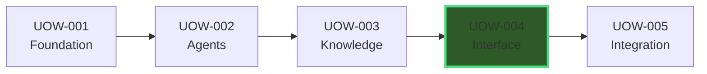
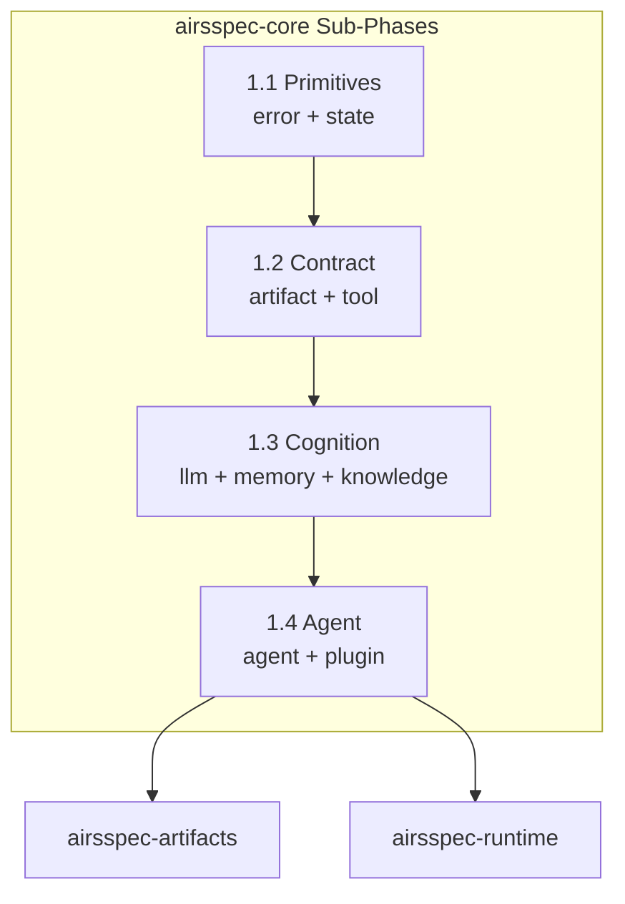

# AirsSpec Implementation Roadmap

**Version**: 1.0  
**Created**: 2026-01-10  
**Status**: Draft  
**Source of Truth**: [architecture.md](file:///Users/hiraq/Projects/airsstack/airsspec/.airsspec/knowledge/library/architecture.md)

---

## 1. Vision

Transform the AirsSpec specification documents into a working **Rust-based multi-agent orchestration framework** that implements the AI Development Lifecycle (AI-DLC). The framework will enable AI agents to build software through structured phases: Ingestion, Research, Inception, Design, Planning, and Construction.

### 1.1 Core Principles

| Principle | Description |
|-----------|-------------|
| **DIP (Dependency Inversion)** | All crates depend on abstractions in `airsspec-core`, not concrete implementations |
| **Filesystem as Truth** | All state is persisted to disk; TUI is just a view |
| **Sequential Execution** | One agent executes at a time (MVP) |
| **Spec-Driven Development** | Specifications are executable contracts that drive code generation |

### 1.2 MVP Definition

> [!IMPORTANT]
> **MVP = Phase 4 Complete**  
> Users can run `airsspec start` and interact with a working CLI/TUI wizard.

---

## 2. Implementation Phases

The roadmap follows a **5-phase progression**, each represented as a single Unit of Work (UOW).

```
┌─────────────────────────────────────────────────────────────────────────────┐
│                        IMPLEMENTATION TIMELINE                               │
├─────────────────────────────────────────────────────────────────────────────┤
│                                                                             │
│  UOW-001          UOW-002          UOW-003          UOW-004          UOW-005│
│  ┌──────┐         ┌──────┐         ┌──────┐         ┌──────┐         ┌──────┐│
│  │FOUND-│────────▶│AGENTS│────────▶│KNOWL-│────────▶│INTER-│────────▶│INTEG-││
│  │ATION │         │      │         │EDGE  │         │FACE  │         │RATION││
│  └──────┘         └──────┘         └──────┘         └──────┘         └──────┘│
│     │                                                   │                    │
│     │                                                   │                    │
│     └── Foundation Layer                                └── MVP ★            │
│                                                                             │
└─────────────────────────────────────────────────────────────────────────────┘
```

### 2.1 Dependency Chain



> [!NOTE]
> Phases are **strictly sequential** - each phase builds on the previous. No parallelization at the UOW level.

---

## 3. Phase Definitions

### UOW-001: Foundation

| Aspect | Description |
|--------|-------------|
| **Goal** | Establish the architectural foundation with zero external dependencies |
| **Crates** | `airsspec-core`, `airsspec-artifacts`, `airsspec-runtime` |
| **Outcome** | All traits defined, state machine working, artifacts persist to filesystem |
| **Dependency** | None (root phase) |

#### Sub-Phases (airsspec-core)

| Sub-Phase | Modules | Core Abstractions |
|-----------|---------|-------------------|
| **1.1 Primitives** | `error`, `state` | `AirsspecError`, `Phase`, `UowState`, `Transition` |
| **1.2 Contract** | `artifact`, `tool` | `ArtifactValidator`, `Tool`, `ToolRegistry` |
| **1.3 Cognition** | `llm`, `memory`, `knowledge` | `LLMProvider`, `HotMemory`, `KnowledgeStore` |
| **1.4 Agent** | `agent`, `plugin` | `Agent`, `AgentExecutor`, `PluginLoader` |



---

### UOW-002: Agent System

| Aspect | Description |
|--------|-------------|
| **Goal** | Create the first working agent that can reason and execute tools |
| **Crates** | `airsspec-llm`, `airsspec-tools`, `airsspec-agents` |
| **Outcome** | Researcher agent can analyze sources and produce `requirements.md` |
| **Dependency** | UOW-001 (requires core traits) |

#### Key Deliverables

- LLM provider integration (OpenAI first)
- Core tool implementations (`read_file`, `write_file`, `search`)
- First agent: **Researcher**
- Tool sandboxing and security

---

### UOW-003: Knowledge

| Aspect | Description |
|--------|-------------|
| **Goal** | Implement the 3-tier memory architecture for long-running context |
| **Crates** | `airsspec-knowledge` |
| **Outcome** | Agents can query vector store, context compression works |
| **Dependency** | UOW-002 (agents need to use knowledge) |

#### Key Deliverables

- LanceDB vector store integration
- Context compression (Hot → Warm → Cold tiers)
- Memory tier management
- RAG pipeline for knowledge retrieval

---

### UOW-004: Interface ★ MVP

| Aspect | Description |
|--------|-------------|
| **Goal** | Create user-facing interfaces for interaction |
| **Crates** | `airsspec-cli`, `airsspec-tui`, `airsspec-plugins` |
| **Outcome** | Users can run `airsspec start` and interact via TUI wizard |
| **Dependency** | UOW-003 (TUI displays knowledge/agent state) |

> [!IMPORTANT]
> This phase represents the **Minimum Viable Product (MVP)**. Upon completion, AirsSpec becomes usable for dogfooding.

#### Key Deliverables

- CLI commands: `init`, `start`, `status`, `fix`, `config`
- TUI wizard with Ratatui
- Plugin loader system
- Headless mode for CI/CD

---

### UOW-005: Integration

| Aspect | Description |
|--------|-------------|
| **Goal** | Enable external tool integration and multi-provider support |
| **Crates** | `airsspec-mcp`, additional LLM providers |
| **Outcome** | AirsSpec works as MCP server for AntiGravity/OpenCode |
| **Dependency** | UOW-004 (needs stable interface) |

> [!NOTE]
> This phase is **lower priority**. Focus on core features first.

#### Key Deliverables

- MCP server implementation
- Additional LLM providers (Anthropic, Ollama, Azure)
- External tool ecosystem connectivity

---

## 4. Crate-to-Phase Mapping

| Crate | Phase | Layer | Responsibility |
|-------|-------|-------|----------------|
| `airsspec-core` | 1 | Foundation | Traits, types, errors (zero implementations) |
| `airsspec-artifacts` | 1 | Foundation | JSON Schema + Rust validators, JSONL persistence |
| `airsspec-runtime` | 1 | Foundation | Orchestrator, state machine, memory manager |
| `airsspec-llm` | 2 | Agent System | LLM provider implementations |
| `airsspec-tools` | 2 | Agent System | Standard tool implementations |
| `airsspec-agents` | 2 | Agent System | All agent implementations |
| `airsspec-knowledge` | 3 | Knowledge | Lance vector store, context compression |
| `airsspec-cli` | 4 | Interface | Binary entry point |
| `airsspec-tui` | 4 | Interface | Ratatui wizard and dashboard |
| `airsspec-plugins` | 4 | Interface | Plugin loader |
| `airsspec-mcp` | 5 | Integration | MCP server for external tools |

---

## 5. Technology Stack

| Component | Library | Rationale |
|-----------|---------|-----------|
| CLI | `clap` | Industry standard, derive macros |
| TUI | `ratatui` | Modern, well-maintained |
| Async | `tokio` | Required for LLM streaming |
| LLM | `rig` (wrapped) | Multi-provider support |
| Vector Store | `lance` | Embedded, Rust-native |
| Serialization | `serde` + `serde_json` | Standard |
| Schema Validation | `jsonschema` | Frontmatter validation |
| Error Handling | `thiserror` + `anyhow` | Ergonomic errors |

---

## 6. Milestones

| Milestone | Phase | Description |
|-----------|-------|-------------|
| **M1: Core Traits** | 1 | All `airsspec-core` traits defined and documented |
| **M2: State Machine** | 1 | UOW lifecycle working with filesystem persistence |
| **M3: First Agent** | 2 | Researcher agent produces `requirements.md` |
| **M4: Memory Tiers** | 3 | Hot/Warm/Cold compression working |
| **M5: MVP** | 4 | `airsspec start` launches TUI, full workflow works |
| **M6: MCP Ready** | 5 | AirsSpec serves as MCP tool for external agents |

---

## 7. Notes

### Dogfooding Strategy

AirsSpec will begin to use its own AI-DLC workflows after **MVP (Phase 4)** is complete. Until then, development uses external tools (AntiGravity, OpenCode) following the specifications in this roadmap.

### Documentation Co-Evolution

As each phase progresses:
1. Update `architecture.md` with implementation discoveries
2. Create ADRs for architectural decisions
3. Update this roadmap with timeline actuals

---

**Maintained by**: AirsSpec Team  
**Last Updated**: 2026-01-10
