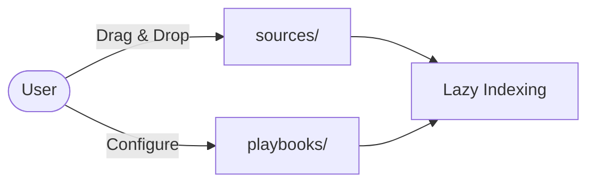
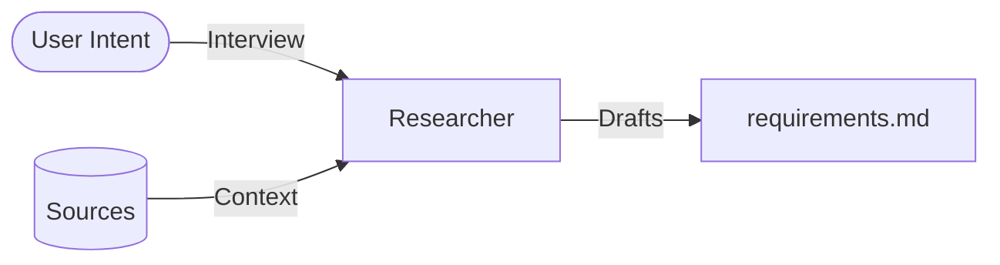
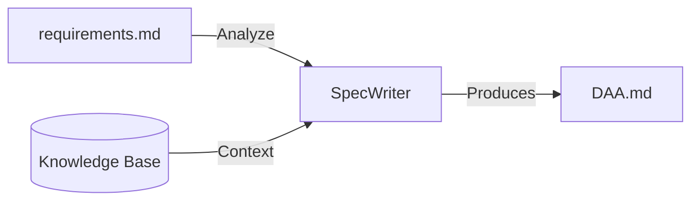
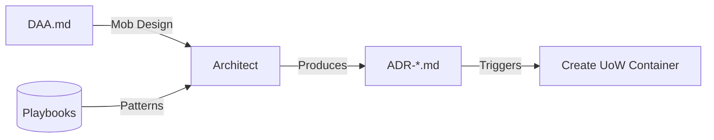
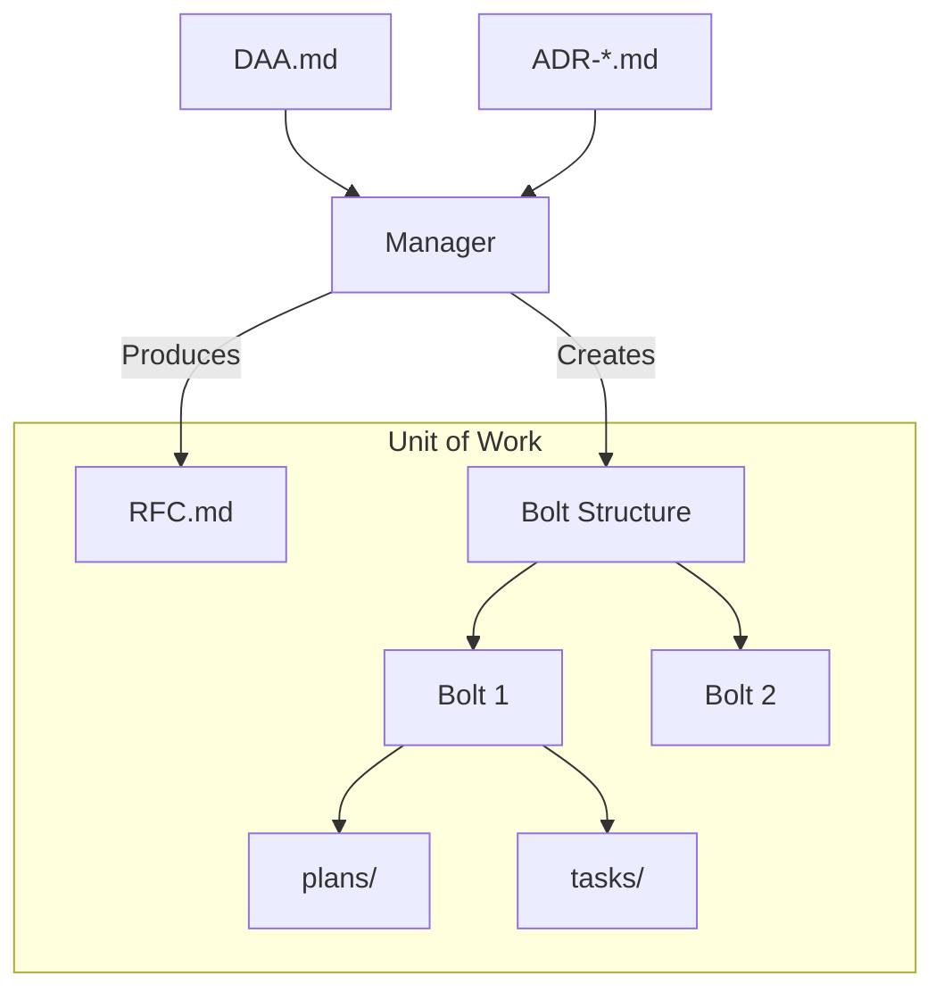
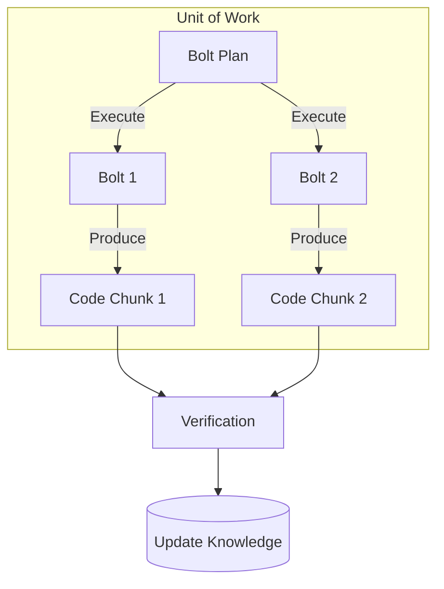

# AI-DLC Phase & Artifact Flow

**Core Concept**: The lifecycle moves from "Abstract Intent" to "Concrete Code" through a series of Validation Gates. This structure implements the **"Cognitive Cleanroom"** theory detailed in `researches/ai-dlc-analysis.md`.

---

## Phase Overview

The AI-DLC follows a **6-phase progression**:

| Phase | Name | Goal | Key Artifact |
|-------|------|------|--------------|
| 0 | **Ingestion** | Context Loading | Sources cataloged |
| 1 | **Research** | Define requirements | `requirements.md` (PRD) |
| 2 | **Inception** | Define domain model | `DAA.md` |
| 3 | **Design** | Define architecture | `ADR-*.md` |
| 4 | **Planning** | Define execution strategy | `RFC.md`, `bolts/` |
| 5 | **Construction** | Build & verify | Source code |

---

## Phase 0: Ingestion (The "LIBRARY")

**Goal**: Load knowledge sources into the system.

*   **Input**: Raw documents (PDFs, Markdown, code samples).
*   **Process**: User places files in `.airsspec/sources/`. System indexes when needed.
*   **Output**: Knowledge sources available for context.
*   **UoW Status**: **None** (Pre-workflow).

---

## Phase 1: Research (The "WHAT")

**Goal**: Transform vague user intent into clear product requirements.

*   **Input**:
    *   **User Intent**: "I want a feature to allow users to subscribe."
    *   **Sources**: Existing documentation, external references.
*   **Process (Recall Mode)**:
    *   If requirements are vague, AI enters Interview mode.
    *   Asks targeted questions to extract requirements.
*   **Output (Artifact)**: **`requirements.md`** (Product Requirements Document).
*   **UoW Status**: **Draft**.

---

## Phase 2: Inception (The "DOMAIN")

**Goal**: Transform requirements into a Domain Model.

*   **Input**:
    *   **requirements.md** (From Phase 1).
    *   **Knowledge Base**: Existing system rules.
*   **Process (Domain-Driven Design)**:
    *   Define Bounded Contexts & Ubiquitous Language.
    *   Identify Entities, Value Objects, Aggregates.
*   **Output (Artifact)**: **`DAA.md`** (Domain Architecture Analysis).
*   **Constraint**: Technology-agnostic. No implementation details.
*   **UoW Status**: **Draft**.

---

## Phase 3: Design (The "HOW")

**Goal**: Map the Domain Model to Technical Implementation.

*   **Input**:
    *   **DAA.md** (From Phase 2).
    *   **Architectural Playbooks**: "We use event-driven architecture."
*   **Process (Mob Design)**:
    *   Apply playbooks to domain model.
    *   Define API Contracts, Database schemas.
*   **Formula**: `ADR = DAA + (n × Playbooks)`.
*   **Output (Artifact)**: **`ADR-*.md`** (Architecture Decision Records).
*   **UoW Status**: **Planned**.

---

## Phase 4: Planning (The "STRATEGY")

**Goal**: Decompose architecture into executable work units.

*   **Input**:
    *   **DAA.md** + **ADR-*.md**.
*   **Process**:
    *   **Formula**: `RFC = DAA + Σ(ADRs)`.
    *   Decompose into Bolts (modules).
    *   Each Bolt contains Plans and Tasks.
*   **Output (Artifacts)**:
    *   **`RFC.md`**: Implementation strategy.
    *   **`bolts/{id}/plans/`**: How to execute.
    *   **`bolts/{id}/tasks/`**: Execution tracking.
*   **UoW Status**: **Planned** → **In Progress**.

---

## Phase 5: Construction (The "BUILD")

**Goal**: Execute the Design via atomic tasks.

**Theory**: Implements **Hierarchical Task Networks (HTN)**. The ADR (Goal) is decomposed into Bolts (Methods), then Plans (Primitives).

*   **Input**:
    *   **Bolt Plans** (From Phase 4).
    *   **UoW Container**.
*   **Process (Mob Construction)**:
    *   **Loop**:
        1.  **Select Bolt**: "Implement DB Migration."
        2.  **Execute**: AI writes code.
        3.  **Verify**: Human approves.
*   **Output (Artifacts)**:
    *   **Source Code**: The actual implementation.
    *   **Bolt Contexts**: Records of execution in `tasks/`.
*   **Verification**:
    *   **Audit**: Does the code trace back to the ADRs?
    *   **Integration**: Merge into main branch.
    *   **Learning**: Update Knowledge Base.
*   **UoW Status**: **In Progress** → **Completed** → **Archived**.

---

## Theoretical Alignment

This process is designed to mitigate **Context Pollution**:

1.  **Ingestion/Research/Inception**: Operates on "High Context/Low Code". The Spec is the Computer.
2.  **Design/Planning**: Bridges abstract to concrete.
3.  **Construction**: Operates on "Low Context/High Code". The UOW isolates the Agent so it only sees what is relevant.

---

## Gate Summary

| Gate | From | To | Condition |
|------|------|----|-----------|
| G1 | Ingestion | Research | `airsspec start` triggered |
| G2 | Research | Inception | `requirements.md` exists & approved |
| G3 | Inception | Design | `DAA.md` exists & approved |
| G4 | Design | Planning | `ADR-*.md` exist & approved |
| G5 | Planning | Construction | `RFC.md` + `bolts/` exist |
| G6 | Construction | Complete | All bolts validated |
