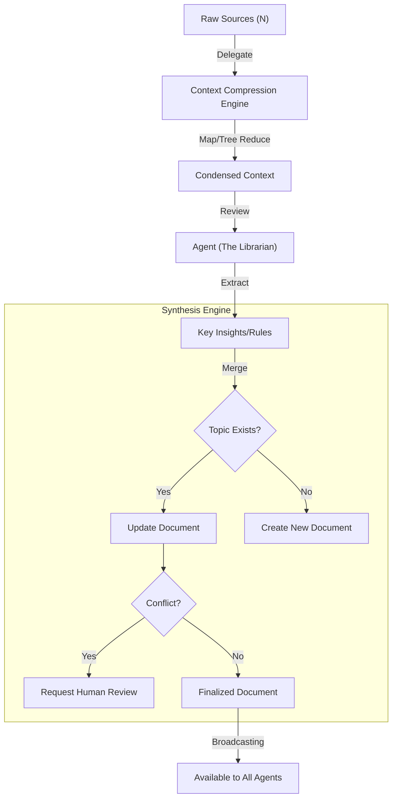
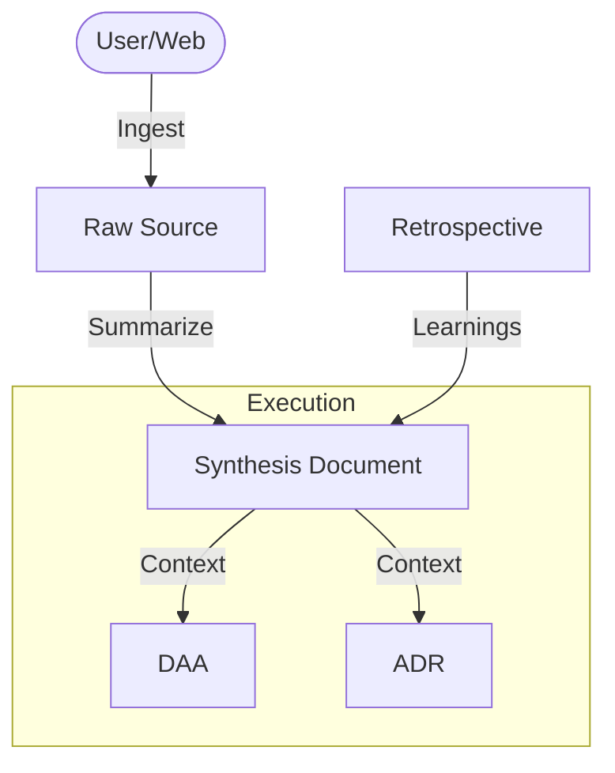

# The Knowledge Base Strategy

**Core Concept**: The "Second Brain" for your Project Agents.

In **AirSDLC**, agents are not allowed to "guess" or rely solely on their training data for domain-specific decisions. They must access a **Verified Knowledge Base** (KB) to make grounded decisions.

## 1. The Structure (Schema)

The KB is divided into **Raw Input** and **Processed Insight**.

```text
.airsspec/knowledge/
├── sources/               # RAW (The Library)
│   ├── stripe-api-v12.md
│   └── meeting-notes-2024-01.md
│
└── synthesis/             # PROCESSED (The Encyclopedia)
    ├── auth-patterns.md   # "How we handle Auth"
    ├── billing-rules.md   # "Our Stripe integration rules"
    └── tech-stack.md      # "Why we use Axum vs Actix"
```

## 2. The Artifact Map: What Goes Where?

A common question is: *"Where do the actual Specs and Code go?"*
AirSDLC separates **Truth (Context)** from **Work (Execution)**.

| Category | Directory | Description | Artifacts |
| :--- | :--- | :--- | :--- |
| **Brain** (Context) | `.airsspec/knowledge/` | The Source of Truth. Read-mostly. | `sources/`, `synthesis/` |
| **Plan** (Specs) | `.airsspec/specs/` | The Blueprints. | `daa/`, `adrs/` |
| **Work** (Execution) | `.airsspec/uow/` | The Active Construction Sites. | `active/`, `archived/`, `bolts/` |

**Rule**: `specs/` and `uow/` depend on `knowledge/`, but `knowledge/` never depends on them.

## 3. The Artifacts details

### 📥 Sources (`sources/`)
*   **What**: External documents converted to **Markdown**.
*   **Format Constraint**: Currently supports `.md` files only to ensuring clean parsing by agents.
*   **Role**: Passive Reference.
*   **Agent Access**: Read-Only (Indexer).

### 🧠 Synthesis Documents (`synthesis/`)
*   **What**: Verified, atomic markdown files, each covering a single **Topic**.
*   **Role**: The "Single Source of Truth" for that topic.
*   **Agent Access**: Read (Context) / Write (Evolution).
*   **Concept**: Unlike "Sources" (which are static/read-only), Synthesis Documents are **living**. They represent the project's *current understanding* of a subject.
    *   *Example*: `auth-patterns.md` might start saying "Use Basic Auth". Later, after reading a security blog (Source), it is updated to "Use OAuth2".
*   **Example Content**:
    > "For Authentication, we use Clerk. DO NOT roll your own JWT logic. See `ADR-004`."

    > "For Authentication, we use Clerk. DO NOT roll your own JWT logic. See `ADR-004`."

## 4. The Synthesis Flow (Deep Dive)

**Synthesis** is the process of converting "Noise" (Raw Sources) into "Signal" (Synthesis Cards). It is the most critical maintenance task in AirSDLC.

### The Flow Visualization



### The Context Processor (Compression Engine)

To handle large inputs (e.g., a 200k token API Schema), the Librarian uses **Context Compression Algorithms** (Map-Reduce / Tree-Reduce).

> **Detail**: See [Context Compression Strategy](context-compression-strategy.md) for the full algorithmic definition.

### The Process Steps

1.  **Compression & Aggregation (Delegated)**:
    *   The Librarian delegates massive raw sources to the **Context Compression Engine**.
    *   The Engine uses [Map-Reduce / Tree-Reduce](context-compression-strategy.md) to filter noise.
    *   *Result*: A manageable context block (e.g., 2k tokens) from a massive source (e.g., 200k tokens).
    *   *Example*: "Source A says we must use API v2."

2.  **Consolidation**:
    *   The Agent checks if `synthesis/api-standards.md` exists.
    *   If yes, it appends/refines the rule. "We use API v2 (Source A)."
    *   If the new source contradicts the old document, it raises a **Conflict Flag**.

3.  **Conflict Resolution**:
    *   "Source A says v2, but Source B says v3."
    *   The Agent pauses and asks the Human: *"Which version is the source of truth?"*
    *   This prevents "Hallucinated Consensus."

## 5. The Lifecycle Flow



### The Knowledge Flywheel

1.  **Ingest (Input)**: User adds raw data (PDFs, notes) or the Librarian scrapes the web.
2.  **Synthesize (Process)**: The **Context Compression Engine** filters and summarizes this into **Synthesis Documents** (Verified Truth).
3.  **Execute (Apply)**: Construction Agents (`@architect`, `@builder`) read these Documents to create **DAA** (Plans) and **ADR** (Designs).
    *   *Rule*: Agents never read Raw Sources directly during execution.
4.  **Retrospective (Learn)**: After a UoW is finished, we review what worked.
    *   *Update*: If we deviated from the Spec, we update the **Synthesis Document** to reflect the *new* reality. This closes the loop.


