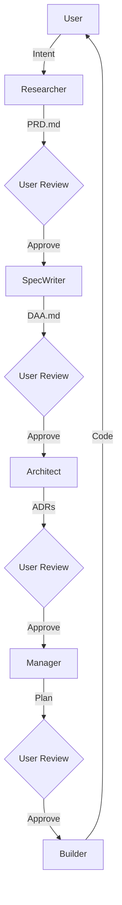
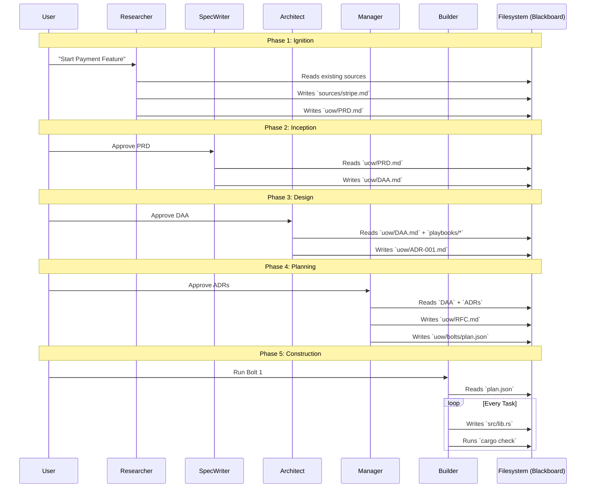
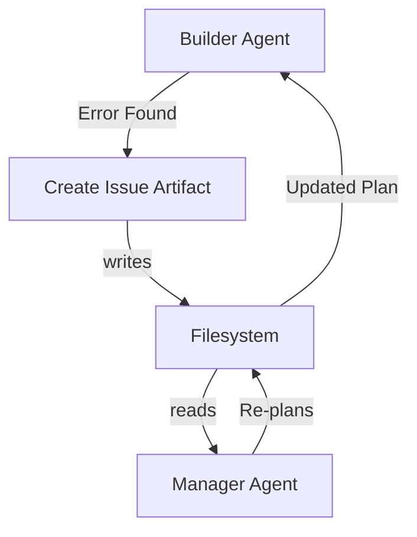
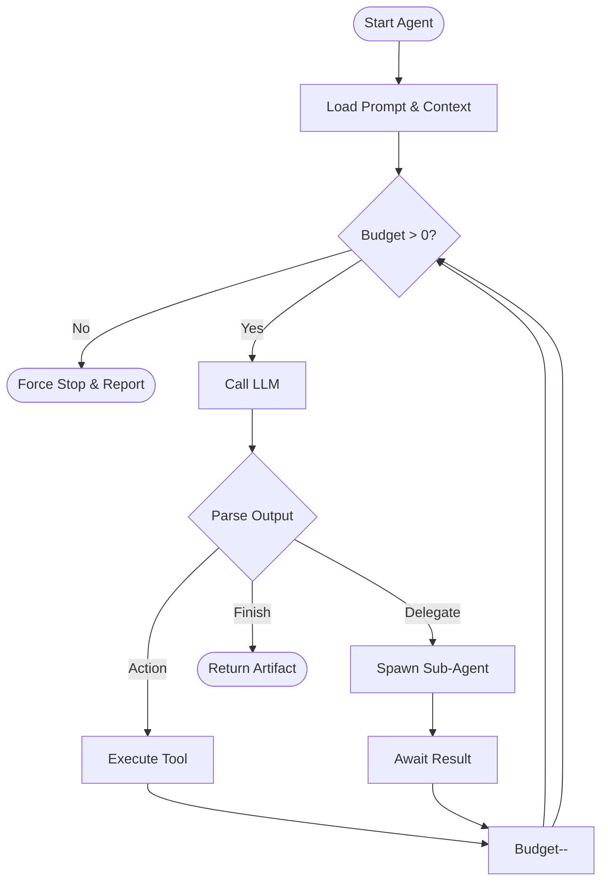
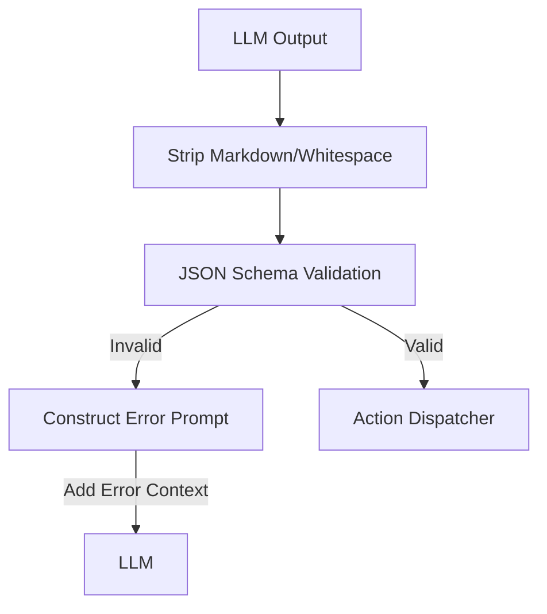
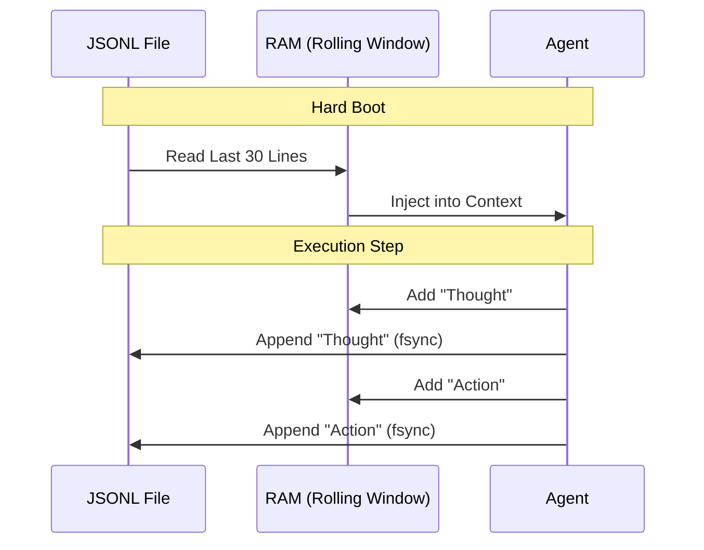
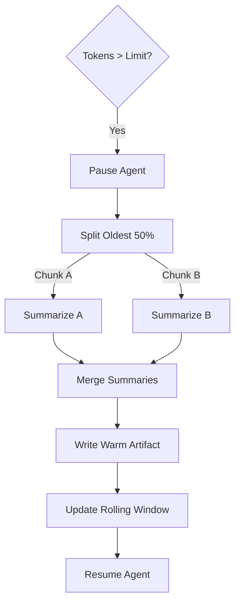

# AirsSpec Multi-Agent Architecture ("The Hive")

**Status**: Proposal
**Date**: 2026-01-04
**Context**: Replaces the monolithic "Phase-Locked State Machine" with a "Core Agent Orchestration" model.

## 1. Core Philosophy: "The Team in Your Terminal"

Instead of a single monolithic agent that changes "modes", AirsSpec orchestrates a team of specialized **Core Agents**. Each agent is an independent entity with its own personality, objectives, and constrained toolset.

### The "Filesystem Blackboard"
Communication between agents is **asynchronous and persistent**, occurring strictly through Artifacts (Files) on the disk.
*   **No Hidden State**: Agents do not talk via hidden RAM buffers.
*   **Transparency**: If the *Researcher* wants to tell the *Spec-Writer* something, it must be written in the `PRD.md` or a specific metadata file.
*   **User Omniscience**: The user acts as the "Manager of Managers," capable of seeing, editing, and vetoing any part of the communication flow because it's just files.

---

## 2. The Core Agents

These 5 agents live in `.airsspec/agent/core/{name}.md` as configurable definitions.

### 2.1 The Researcher (`core/researcher`)
*   **Phase**: Research (Ignition)
*   **Goal**: "Discover Truth." Minimize ambiguity.
*   **Input**: User Intent (`airsspec start "Stripe Specs"`)
*   **Output**: `sources/*`, `uow/PRD.md`
*   **Personality**: Curious, skeptical, thorough.
*   **Tools**: `search_web`, `read_file`, `write_file (sources/ only)`.

### 2.2 The Spec-Writer (`core/spec-writer`)
*   **Phase**: Inception
*   **Goal**: "Define Structure." Translate vague requirements into Domain Models.
*   **Input**: `PRD.md`
*   **Output**: `uow/DAA.md` (Domain Analysis Architecture)
*   **Personality**: Abstract, domain-driven, technology-agnostic.
*   **Tools**: `read_file`, `write_file (DAA.md only)`.

### 2.3 The Architect (`core/architect`)
*   **Phase**: Design
*   **Goal**: "Select Strategy." Map Domain Models to concrete Technologies.
*   **Input**: `uow/DAA.md`, `playbooks/*`
*   **Output**: `uow/ADR-*.md` (Architecture Decision Records)
*   **Personality**: Experienced, pragmatic, pattern-oriented.
*   **Tools**: `read_file`, `write_file (ADRs)`.

### 2.4 The Manager (`core/manager`)
*   **Phase**: Planning
*   **Goal**: "Plan Execution." Break big strategies into atomic tasks.
*   **Input**: `DAA.md`, `ADRs`
*   **Output**: `uow/RFC.md`, `uow/bolts/plan.json`
*   **Personality**: OCD, detail-oriented, risk-averse.
*   **Tools**: `read_file`, `write_file (Plans)`.

### 2.5 The Builder (`core/builder`)
*   **Phase**: Construction
*   **Goal**: "Make it Real."
*   **Composition**: A recursive agent that manages specific Sub-Agents:
    *   **Coder**: Generates code.
    *   **Reviewer**: Analyses code (Lints, Security, Best Practices).
*   **Input**: `Bolt Plan`
*   **Output**: Code (`src/*`), Tests, Validation Reports.
*   **Tools**: `write_code`, `run_command` (Restricted), `run_test`.

---

## 3. The Plugin System ("Markdown Overlays")

To allow extensibility without binary complexity, AirsSpec uses a **Configuration Overlay** model. Plugins are simply directories of Markdown instructions and schemas that `airsspec` "mounts" onto the core agents.

### 3.1 Plugin Structure
Plugins live in `.airsspec/plugins/{name}/`.

```text
.airsspec/plugins/security-audit/
├── airsspec-plugin.toml  (Metadata)
├── agent/
│   ├── system/
│   │   └── default.md    (Appended to Global System Prompt)
│   ├── core/
│   │   └── architect.md  (Appended to Architect Persona)
│   └── sub/
│       └── auditor.md    (New Sub-Agent Definition)
```

### 3.2 The Stacking Strategy (Multiple Plugins)
When multiple plugins are present, `airsspec` stacks them to form the final Context.

**Resolution Order (The Stack)**:
1.  **Core Defaults** (Base AirsSpec behavior)
2.  **Plugins** (In order defined in `airsspec.toml` or alphabetical)
3.  **User Overrides** (Local `.airsspec/agent/*` files)

**Composition Rule**:
*   **Markdown Files**: Concatenated.
    *   `Final_System_Prompt = [Core] + [Plugin A] + [Plugin B] + [User]`
*   **Capabilities**: Merged (Union).

### 3.3 Example: Handling Multiple Plugins
If you have a **Security Plugin** and a **Tailwind Plugin**:

*   **Security Plugin** adds: *"Generic Constraint: No SQL injection."*
*   **Tailwind Plugin** adds: *"Generic Constraint: Use utility classes."*

**Final Builder Prompt**:
> [CORE] You are the Builder. Write Rust code.
> [PLUGIN: SECURITY] Constraint: No SQL injection.
> [PLUGIN: TAILWIND] Constraint: Use utility classes.
> [USER] Constraint: Use ‘warp’ framework.

This allows AirsSpec to "learn" multiple skills simultaneously without conflicts.


## 4. Workflows & Gates

The "Human-in-the-Loop" remains critical. The User acts as the **Gatekeeper** between Core Agents.



## 5. Agent Communication Flows

### 5.1 The Filesystem Blackboard
Agents do not speak directly. They write **Artifacts** which serve as the "Packet" of communication.



### 5.2 Feedback Loops (Correction)
What happens if the Builder finds a logic error?



## 6. The Orchestrator ("AirsSpec Runtime")

`airsspec` acts as the **OS Kernel** for these agents. It is responsible for Lifecycle Management, Context Injection, and Safety Enforcement.

### 6.1 Executing an Agent
The user or system triggers an agent execution.

*   **Command**: `airsspec run <goal> --agent <id> --context <paths>`
*   **Internal Process**:
    1.  **Boot**: Load `.airsspec/agent/core/{id}.md`.
    2.  **Context Load**: Read input artifacts from disk.
    3.  **Envelope Construction**: Merge System Prompt + Agent Persona + Context.
    4.  **Loop Init**: Set Budget = `Constraints.MaxLoops` (default: 5).

### 6.2 The Execution Loop (Budgeted)
To prevent infinite loops/hallucinations, every agent runs within strictly budgeted cycles.



### 6.3 Prompt Construction ("The Stack")
The Prompt is dynamically assembled (Stacked) at runtime.

#### Layer 1: System Envelope (Global Rules)
*   **Source**: `.airsspec/agent/system/default.md`
*   **Content**:
    > "You are AirsSpec, an intelligent architecture assistant.
    > ALWAYS output JSON.
    > NEVER modify files outside your allowed scope."

#### Layer 2: Core Agent Role (Persona)
*   **Source**: `.airsspec/agent/core/builder.md`
*   **Content**:
    > "You are the Builder. Your goal is to implement Rust code.
    > You are detail-oriented and paranoid about compilation errors."

#### Layer 3: Runtime Context (Dynamic)
*   **Source**: `Context Envelope`
*   **Content**:
    > GOAL: "Implement Bolt #3"
    > ARTIFACTS:
    > - `uow/plan.json` (Content...)
    > - `uow/ADR-001.md` (Content...)
    > HISTORY: "Previous attempt failed with error: ..."

### 6.4 Inter-Agent Delegation
An agent can trigger another agent by returning a specific **Delegation Signal**.

*   **Scenario**: `Builder` fails to understand a requirement.
*   **Action**: `Builder` returns `DELEGATE("core/spec-writer", "Clarify Bolt #3 DoD")`.
*   **Orchestrator**:
    1.  Pauses `Builder`.
    2.  Spawns `Spec-Writer` with the query.
    3.  Feeds `Spec-Writer` output back to `Builder`.

## 7. Interaction Internals (LLM <-> AirsSpec)

This section details the low-level communication protocol between the Orchestrator and the LLM.

### 7.1 The "Thought-Action" Protocol
AirsSpec enforces a strict JSON-based protocol to ensure deterministic execution.

**System Instruction**:
> "You must output a single JSON object matching the `ActionResponse` schema. No preamble. No markdown."

**Schema**:
```json
{
  "thought": "Reasoning for why I am taking this action...",
  "action": {
    "tool_name": "write_file",
    "params": {
      "path": "docs/README.md",
      "content": "..."
    }
  }
}
```

### 7.2 The Response Handler (The Parser)
When the LLM returns text, the **Parser** manages the flow:



#### Error Correction Loop
If the LLM outputs invalid JSON or hallucinates a tool, `airsspec` does **not** crash. It feeds the error back to the LLM.

*   **Input**: `{"action": "write_code"}` (Missing params)
*   **Orchestrator Action**:
    *   Catch `ValidationError`.
    *   **New Input**: `SYSTEM: Error: Missing 'params' for 'write_code'. Schema is {...}. Try again.`
    *   **Budget**: Deducts 1 retry token (separate from Loop Budget).

### 7.3 Action Dispatcher
Once a valid Action is parsed, the Dispatcher executes it cleanly.

1.  **Permission Check**: Is `write_file` in `AgentContext.constraints.allowed_tools`?
2.  **Sandbox Check**: Is `path` within `allowed_paths`?
3.  **Execution**: Call internal Rust function or Standard IO Plugin.
4.  **Result Capture**: Capture `stdout`/`stderr` and return to Agent memory.

### 7.4 Context Window Management ("The Memory Stack")

To handle the "Context Overflow" problem, AirsSpec employs a multi-tiered memory architecture aligned with the **Context Compression Strategy** (`docs/context-compression-strategy.md`).

#### A. The Tiers of Memory

| Tier | Type | Storage | Usage | Strategy |
| :--- | :--- | :--- | :--- | :--- |
| **Hot** | Rolling Window | RAM (Persisted to JSONL) | Immediate Execution (Last ~30 msgs) | FIFO Buffer |
| **Warm** | Synthesized Context | `.airsspec/knowledge/library/` | High-level Summaries & Decisions | **Tree-Reduce** (Summarization) |
| **Cold** | Vector Index | `.airsspec/knowledge/vectors/` | Massive, Unstructured Search | **Map-Reduce** (Extraction) |
| **Frozen** | Raw Logs | `.airsspec/contexts/agent/{session_id}.jsonl` | Audit Trail & Replay | Append-Only |

#### A. Persistence & The Rolling Window (Algorithm)
We use a **Head-Truncated JSONL Buffer** to maintain short-term state.

*   **Persistence Path**: `.airsspec/contexts/agent/{session_id}.jsonl`
*   **Capacity ($N$)**: ~30 Interactions (configurable via `system/default.md`).

**The Load/Save Cycle**:
1.  **Boot Phase**:
    *   Open `session.jsonl` in Read Mode.
    *   Seek to end of file.
    *   Read backwards until $N$ valid JSON objects are collected.
    *   Load these lines into RAM as `Agent.history`.
2.  **Runtime Phase**:
    *   Receive User Input -> **Append** to JSONL.
    *   Agent Thought -> **Append** to JSONL.
    *   Tool Output -> **Append** to JSONL.
3.  **Crash Recovery**:
    *   Since every step is atomically appended *before* next execution, a hard crash loses zero data. Restarting simply re-runs the Boot sequence.



#### B. Recursive Summarization ("The Garbage Collector")
When `TokenCount(RAM) > MaxTokens * 0.8`, the **Warm Memory** strategy activates. We use a **Tree-Reduce** approach to preserve narrative structure.

**The Algorithm**:
1.  **Freeze**: Orchestrator pauses the main Agent.
2.  **Segment**:
    *   Take the oldest 50% of messages from RAM ($M_{old}$).
    *   Split $M_{old}$ into chunks of 10 messages ($C_1, C_2...$).
3.  **Compress (Tree-Reduce)**:
    *   *Leaf Level*: Summarize each chunk $C_i$ into a paragraph $S_i$.
    *   *Root Level*: Combine $S_1 + S_2 ...$ into a master summary $S_{final}$.
4.  **Inject**:
    *   Create artifact `.airsspec/knowledge/library/history-{seq}.md` containing $S_{final}$.
    *   Update RAM: `[History Link: history-{seq}.md] + [Remaining 50% Raw Messages]`.
5.  **Resume**: Unpause main Agent.



#### C. Queryable Memory (Cold Memory)
Agents can actively query the past using the `query_memory` tool, which searches the Vector Store and synthesized Library.

*   **Scenario**: Builder forgets a decision made 3 weeks ago.
*   **Action**:
    ```json
    {
      "thought": "I need to recall the auth decision.",
      "action": { 
        "tool_name": "query_memory", 
        "params": { "query": "Authentication ADR decision" } 
      }
    }
    ```
*   **System Action**: Performs semantic search on `.airsspec/knowledge/` and returns relevant excerpts.

## 8. Interaction Examples

### Scenario A: Happy Path (Researcher)
**Goal**: "Create PRD for Stripe Feature"

1.  **Orchestrator** sends:
    ```text
    SYSTEM: [Envelope Rules...]
    AGENT: You are the Researcher.
    CONTEXT: Goal="Stripe integration".
    ```
2.  **LLM** responds:
    ```json
    {
      "thought": "I need to check if we have any existing docs on Stripe.",
      "action": {
        "tool_name": "find_by_name",
        "params": { "pattern": "*stripe*", "search_path": ".airsspec/sources" }
      }
    }
    ```
3.  **Orchestrator** parses, validates, and runs `find_by_name`.
4.  **Orchestrator** sends result:
    ```text
    OBSERVATION: Found 0 files.
    ```
5.  **LLM** responds:
    ```json
    {
      "thought": "No local docs. I will search the web.",
      "action": { "tool_name": "search_web", "params": { "query": "Stripe Intent API" } }
    }
    ```

### Scenario B: Error Correction (The "Bounce")
**Goal**: Builder tries to run `npm install` but forgets arguments.

1.  **LLM** responds:
    ```json
    {
      "thought": "Installing dependencies.",
      "action": { "tool_name": "run_command" }
    }
    ```
2.  **Orchestrator** (Parser) detects `ValidationError`: `Missing required field 'params'`.
3.  **Orchestrator** sends (without executing):
    ```text
    SYSTEM ERROR: Invalid JSON for 'run_command'. Missing 'params'. 
    Schema: { "command": string, "allow_auto": boolean }.
    Please correct and retry.
    ```
4.  **LLM** corrects itself:
    ```json
    {
      "thought": "Ah, I missed the params.",
      "action": { 
        "tool_name": "run_command", 
        "params": { "command": "npm install" } 
      }
    }
    ```


