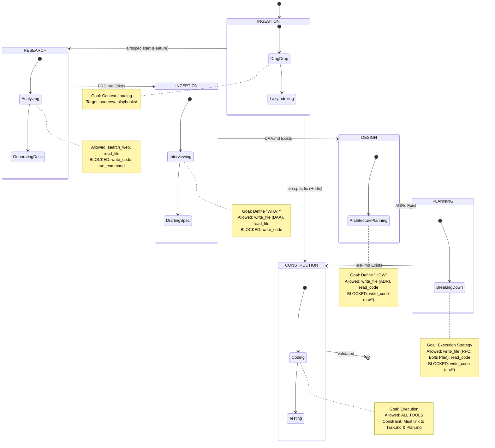
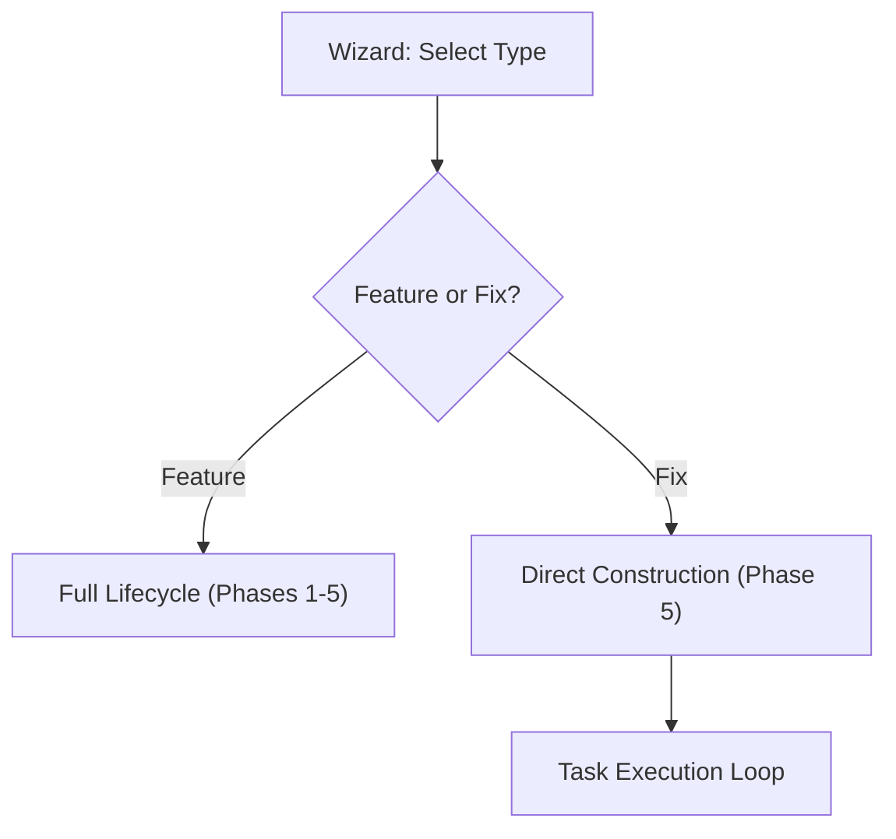

# AirsSpec User Journey & Workflow Definition

- **Date**: 2026-01-04
- **Status**: Proposal / Draft
- **Context**: Defines the "Active Agentic" workflow that distinguishes AirsSpec from passive tools. Focuses on minimal prompting, clean TUI, and "Filesystem as Truth".

---

## 1. Core Philosophy: "Convention over Conversation"

AirsSpec reduces cognitive load by assuming reasonable defaults and enforcing strict artifact conventions. It moves away from "Command Fatigue" (running many small commands) to "Streamlined Sessions" (one interactive flow).

### 1.1 The "Lazy & Smart" Principles
1.  **Passive Ingestion**: Don't ask the computer to move files. The user uses the OS (Drag & Drop). The Agent "lazily" detects changes.
2.  **The Wizard**: Don't make the user memorize flags. `airsspec start` launches an interactive TUI to gather intent.
3.  **Strict Compliance**: The Agent refuses to guess. If a required Artifact (e.g., `PRD.md`) is missing, it halts and asks the user to either **Create** or **Generate**.
4.  **Filesystem is Truth**: The state is always on disk. The TUI is just a view into the directories.

---

## 2. The Unified Workflow: "The Wizard's Path"

### 2.1 The Flow Visualization

```mermaid
sequenceDiagram
    participant User
    participant OS as Filesystem
    participant CLI as AirsSpec Wizard
    participant Agent as Core Agent
    
    Note over User, Agent: Phase 0: Setup (Lazy Ingestion)
    User->>OS: Drag & drop PDF/MD into `.airsspec/sources/`
    
    Note over User, Agent: Phase 1: Initiation
    User->>CLI: `airsspec start`
    CLI->>CLI: Scans `sources/` (Lazy Load)
    
    rect rgb(20, 20, 20)
        Note right of CLI: TUI Wizard
        CLI-->>User: "Name of UOW?" (e.g., payment-feature)
        CLI-->>User: "Description?" (e.g., Stripe Integration)
        CLI-->>User: "Select Sources [ ]?" (Checkbox List)
    end
    
    User->>CLI: CONFIRM
    CLI->>OS: initialized `uow/payment-feature/`
    
    Note over User, Agent: Phase 2: Compliance Check
    CLI->>OS: Checks for `PRD.md`
    alt File Missing
        CLI-->>User: "STOP: PRD.md missing."
        CLI-->>User: "[1] Edit Manually  [2] Generate?"
        
        opt Generate (AI)
            User->>CLI: Selects "Generate"
            CLI-->>User: "Provide High-Level Instructions?"
            User->>CLI: "Support 3D Secure..."
            CLI->>Agent: "Draft PRD using [Selected Sources] + [Instructions]"
            Agent->>OS: Writes `PRD.md`
        end
    end
    
    Note over User, Agent: Phase 3: The Build Loop
    CLI->>Agent: "Start Phase Inception"
    Agent->>OS: Writes `DAA.md`...
```



---

## 3. The Phase-Locked State Machine ("The Guardrails")

To enforce the **"Cognitive Cleanroom"** (preventing hallucination and context pollution), AirsSpec implements a strict State Machine. The Agent's capabilities (Available Tools) are restricted based on the current Phase.

### Safe Transitions

Transitions between phases are **Gated**. The Agent cannot proceed until the artifacts of the previous phase are present and valid.



---

## 4. Phase Details

> **Note**: The Wizard will guide you through these phases. At each transition, if a required artifact is missing, the "Compliance Check" triggers.

### Phase 0: INGESTION (The Librarian)
*   **Trigger**: Manual Interaction (OS Filesystem).
*   **Locations**:
    *   `.airsspec/sources/`: Project-specific context (PDFs, Docs, Code).
    *   `.airsspec/knowledge/playbooks/`: Reusable Architecture Patterns (e.g., `postgresql.md`, `react-query.md`).
*   **Action**: User places files. System "lazily" indexes them when selected in the Wizard.

### Phase 1: RESEARCH (The Curiosity Engine)
*   **Trigger**: User runs `airsspec start`.
*   **Artifact**: `.airsspec/uow/[id]/PRD.md` (Product Requirement Document).
*   **Agent Behavior**: If the PRD is missing, the Agent asks for high-level instructions (e.g., "I need a payment flow"). It then uses the selected Sources to draft the PRD.
*   **Constraint**: The Agent cannot write technical specs or code until the PRD is approved.

### Phase 2: INCEPTION (The Spec Writer)
*   **Trigger**: `PRD.md` exists.
*   **Artifact**: `.airsspec/uow/[id]/DAA.md` (Domain Analysis Architecture).
*   **Action**: Translates product/business requirements from PRD into a **Domain Analysis Architecture**.
*   **Content**: Focuses on DDD (Domain Driven Design):
    *   Bounded Context & Ubiquitous Language.
    *   Entities, Value Objects, Aggregates.
*   **Constraint**: No implementation details. Technology agnostic.

### Phase 3: DESIGN (The Architect)
*   **Trigger**: `DAA.md` exists.
*   **Interaction**: Agent presents a **Multi-Select Menu** of available Playbooks (`.airsspec/knowledge/playbooks/`).
    *   *User Selection*: `[x] Modulith`, `[x] Postgres`, `[ ] Redis`.
*   **Formula**: `ADR = DAA + (n × Playbooks)`.
    *   The Architect applies *every* selected Playbook to the Domain Model.
*   **Artifacts**: Multiple `ADR-*.md` (Architecture Decision Records).
*   **Example Output**: `ADR-001-Architecture-Modulith.md`, `ADR-002-Database-Postgres.md`.

### Phase 4: PLANNING (The Manager)
*   **Trigger**: `ADRs` exist.
*   **Formula**: `RFC = DAA + Σ(ADRs)`.
    *   The Strategy (RFC) merges the Domain Model with the Technical Decisions to create a concrete implementation plan.
*   **Artifacts**: 
    1.  `.airsspec/uow/[id]/RFC.md` (Strategy).
    2.  `.airsspec/uow/[id]/bolts/[bolt-id]/tasks/TASK-[001].md` (The Objective).
    3.  `.airsspec/uow/[id]/bolts/[bolt-id]/plans/PLAN-[001].md` (The Steps).
*   **Action**: Decomposes the RFC into **Bolts** and **Tasks**.
    *   **Structure**: `Task.md` defines *What* to do. `Plan.md` defines *How* to do it.
    *   **Linkage**: `Task.md` contains a link to `../plans/PLAN-[id].md`.

### Phase 5: CONSTRUCTION (The Builder)
*   **Trigger**: Task Markdown files exist.
*   **Action**: Iterates through `bolts/**/tasks/*.md`.
*   **Constraint**: Can only modify files relevant to the active Bolt.

---

## 5. Workflows & Rituals

### 5.1 "Just Drop It" (Ingestion)
We removed specific ingestion commands.
*   **Old Way**: `airsspec add ./docs/stripe.pdf --ingest`
*   **New Way**:
    *   User drags `stripe.pdf` into `.airsspec/sources/`.
    *   Next time `airsspec start` runs, it notices the new file and indexes it silently.

### 5.2 The Compliance Check (Pre-Flight)
Before starting any phase (e.g., writing the Technical Spec), AirsSpec checks for the **Prerequisites**.
*   **Scenario**: User wants to generate Architecture (Phase 3).
*   **Check**: Does `uow/.../DAA.md` exist?
*   **Failure**: If NO, the system **Halts**.
*   **Recovery**:
    1.  **Manual**: Opens the default editor for the user to write it.
    2.  **AI**: Asks for instructions ("What should this Architecture cover?") and generates it using the linked Sources.


---

## 6. Command Interface

We aim for **Zero-Memorization**. The CLI is the entry point, not the control panel.

*   `airsspec init`: One-time setup. Scans the current directory to create `WORKSPACE.md` and the `.airsspec` folder structure.
*   `airsspec start`: The **Main Entry Point**. Launches the TUI Wizard to create or resume a Unit of Work.
*   `airsspec status`: A passive dashboard showing the state of all UOWs and any missing compliance artifacts.

*Note: `config` is still available for API keys, but rarely used.*

---

## 7. Scenario: Day 1 - The Payment Gateway

**Context**: User wants to start a project in `~/Projects/payment-builder/`.

### Step 1: Bootstrap
```bash
$ cd ~/Projects/payment-builder/
$ airsspec init
```
*   **System**: Scans `README.md`, detects "Rust/Axum", generates `.airsspec/WORKSPACE.md`.

### Step 2: Lazy Ingestion
User has a PDF about Stripe API.
*   **User Action**: Drags `stripe-api.pdf` into `~/Projects/payment-builder/.airsspec/sources/`.
*   **System Action**: None. The file sits there raw.

### Step 3: The Wizard (`airsspec start`)
```bash
$ airsspec start
```
**TUI Session Starts:**
1.  **Prompt**: "Starting new Unit of Work. Name?"
    *   **User**: `feature-stripe-payments`
2.  **Prompt**: "Description?"
    *   **User**: `Implement one-time payments.`
3.  **Prompt**: "Select Context Sources for this UOW:"
    *   The system lists all files in `sources/`.
    *   `[x] stripe-api.pdf (Not Indexed)`
    *   `[ ] legacy-auth.md (Indexed)`
    *   **User**: Selects Stripe and hits `Enter`.

**System Action (Just-in-Time Indexing)**:
*   "You selected `stripe-api.pdf`. This file is new."
*   "Indexing `stripe-api.pdf` now... Done."
*   "Binding Context..."

### Step 4: The Compliance Check (Phase 1)
**System**: "Initializing Phase 1 (Research). Checking Requirements..."
**System**: "MISSING: `PRD.md` is required to proceed."
**Prompt**:
```text
How do you want to provide the PRD?
[1] Open Editor (Write Manually)
[2] Generate with AI
```
*   **User**: Selects `[2]`.
*   **System**: "Please provide high-level instructions:"
    *   **User**: "Must support Credit Cards and Apple Pay. No subscriptions yet."

### Step 5: Automatic Execution
**System**: 
*   **Input**: User Instructions + `stripe-api.pdf`.
*   **Agent**: Writes `.airsspec/uow/feature-stripe-payments/PRD.md`.
*   **System**: "PRD Generated. Opening for Review..."

(User reviews and saves).

**System**: "PRD Detected. Proceed to Phase 2 (Inception)?"
*   **User**: `Yes`.

*The loop continues...*

---

## 8. Scenario: Maintenance & Refactoring ("The Fast Track")

**Context**: Defines how to handle bug fixes, refactors, or optimizations where a full PRD/DAA/RFC cycle is unnecessary.

### 8.1 The "Bolt Injection" Pattern
Instead of restarting the entire lifecycle, the user "injects" a Bolt into a Unit of Work.



### 8.2 In the Wizard
When running `airsspec start`, the Wizard asks for the **Mode**.

1.  **Prompt**: "Select Mode:"
    *   `[1] Feature (Full Architecture Cycle)`
    *   `[2] Hotfix / Refactor (Direct to Code)`
    *   **User**: `[2]`
2.  **Prompt**: "Context?"
    *   **User**: `Fix race condition in payment webhook.`
3.  **Action**:
    *   System creates a transient UOW.
    *   **Phase**: Skips directly to **Phase 5 (Construction)**.
    *   **Agent**: "I'm ready. I have read the code. What is the fix plan?"

### 8.3 Option: The "Quick Fix" Command
For power users who want to skip the Wizard entirely for small tasks:

```bash
$ airsspec fix "Fix potential panic in auth_middleware.rs"
```
*   **System**: Instantly spawns a Phase 5 Agent focused on the provided instruction.
*   **Context**: Automatically limited to the relevant files mentioned in the prompt.
