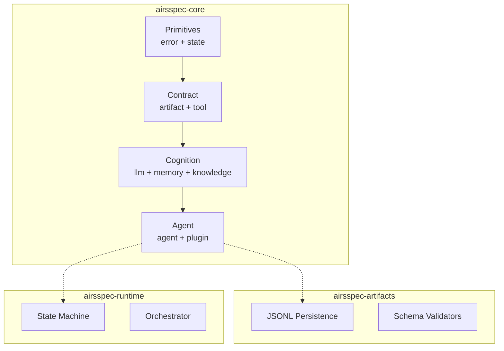
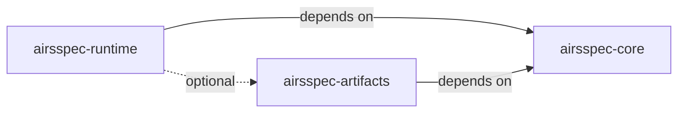

# Domain Architecture Analysis: Foundation Layer

## 1. Domain Overview

The Foundation Layer establishes the **architectural bedrock** for AirsSpec. It defines all abstractions that higher layers depend upon, following the **Dependency Inversion Principle (DIP)**.

### 1.1 Core Responsibility

> Zero external implementations. Only traits, types, and errors that define contracts.

---

## 2. Domain Model

### 2.1 Bounded Contexts



### 2.2 Module Breakdown

| Domain | Module | Core Types | Traits |
|--------|--------|------------|--------|
| **Primitives** | `error` | `AirsspecError`, `ErrorKind` | — |
| | `state` | `Phase`, `UowState`, `Transition` | `StatePersistence` |
| **Contract** | `artifact` | `ArtifactType`, `ValidationResult` | `ArtifactValidator`, `ArtifactStore` |
| | `tool` | `ToolId`, `ToolInput`, `ToolOutput` | `Tool`, `ToolRegistry` |
| **Cognition** | `llm` | `CompletionRequest`, `TokenUsage` | `LLMProvider`, `StreamHandler` |
| | `memory` | `MemoryFragment`, `CompressionConfig` | `HotMemory`, `WarmMemory`, `ColdMemory` |
| | `knowledge` | `Document`, `Embedding`, `SearchResult` | `KnowledgeStore`, `Compressor`, `VectorStore` |
| **Agent** | `agent` | `AgentId`, `AgentConfig`, `Budget` | `Agent`, `AgentExecutor` |
| | `plugin` | `PluginManifest`, `ResolutionOrder` | `PluginLoader`, `PromptOverlay` |

---

## 3. Key Architectural Decisions

### 3.1 Trait-First Design

All modules in `airsspec-core` define **traits before types**. Implementations live in separate crates.

```rust
// airsspec-core: defines contract
pub trait LLMProvider: Send + Sync {
    async fn complete(&self, req: CompletionRequest) -> Result<String>;
}

// airsspec-llm (Phase 2): implements contract
pub struct OpenAIProvider { ... }
impl LLMProvider for OpenAIProvider { ... }
```

### 3.2 Error Taxonomy

Single error enum per module with `thiserror` derives:

```rust
#[derive(Debug, thiserror::Error)]
pub enum AirsspecError {
    #[error("State transition failed: {0}")]
    StateError(#[from] StateError),
    
    #[error("Artifact validation failed: {0}")]
    ArtifactError(#[from] ArtifactError),
    
    // ...
}
```

### 3.3 JSONL Persistence

All artifacts persist to JSONL format with frontmatter validation:

```
{header_json}
{content_line_1}
{content_line_2}
...
```

---

## 4. Interface Boundaries

### 4.1 Public API Surface

| Crate | Public Exports |
|-------|----------------|
| `airsspec-core` | All traits, all types, `AirsspecError` |
| `airsspec-artifacts` | `JsonlPersistence`, `SchemaValidator` |
| `airsspec-runtime` | `Orchestrator`, `StateMachine`, `UowLifecycle` |

### 4.2 Internal Dependencies



---

## 5. Implementation Strategy

### 5.1 Sub-Phase Ordering

| Order | Sub-Phase | Why First? |
|-------|-----------|------------|
| 1 | Primitives | All other modules depend on `error` and `state` types |
| 2 | Contract | Agents and runtime need artifact/tool abstractions |
| 3 | Cognition | Agent execution requires LLM and memory traits |
| 4 | Agent | Final integration point before runtime |

### 5.2 Crate Build Order

1. `airsspec-core` (must succeed first)
2. `airsspec-artifacts` (depends on core)
3. `airsspec-runtime` (depends on core, optional artifacts)

---

## 6. Risk Analysis

| Risk | Mitigation |
|------|------------|
| Trait design mismatch with future implementations | Review against `rig` library patterns |
| Over-abstraction in MVP | Keep traits minimal; add methods when needed |
| Missing async boundaries | All traits use `async_trait` from start |

---

## 7. Validation Criteria

- [ ] All `airsspec-core` modules compile with `cargo build`
- [ ] All traits have `Send + Sync` bounds where needed
- [ ] All public items have doc comments
- [ ] `cargo clippy` passes with zero warnings
- [ ] Unit tests for type construction exist

---

**Next**: Design phase → Create ADRs for each sub-phase
