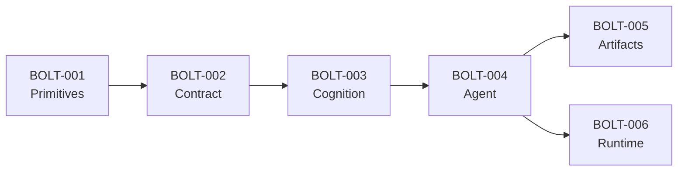

# RFC: Foundation Layer Implementation

## 1. Summary

This RFC defines the implementation plan for UOW-001 Foundation Layer, which establishes all core abstractions for AirsSpec.

---

## 2. Motivation

AirsSpec requires a solid foundation before any agent, LLM, or tool implementations can be built. Following DIP (Dependency Inversion Principle), all crates must depend on abstractions defined in `airsspec-core`.

---

## 3. Implementation Plan

### 3.1 Bolt Overview

| Bolt | Sub-Phase | Crate | Deliverables |
|------|-----------|-------|--------------|
| BOLT-001 | 1.1 Primitives | `airsspec-core` | `error.rs`, `state/` module |
| BOLT-002 | 1.2 Contract | `airsspec-core` | `artifact/`, `tool/` modules |
| BOLT-003 | 1.3 Cognition | `airsspec-core` | `llm/`, `memory/`, `knowledge/` modules |
| BOLT-004 | 1.4 Agent | `airsspec-core` | `agent/`, `plugin/` modules |
| BOLT-005 | — | `airsspec-artifacts` | JSONL persistence, validators |
| BOLT-006 | — | `airsspec-runtime` | Orchestrator skeleton, state machine |

### 3.2 Dependency Graph

---

## 4. Bolt Specifications

### BOLT-001: Primitives

**Scope**: Error types and state management

| File | Contents |
|------|----------|
| `src/error.rs` | `AirsspecError`, `StateError`, `ArtifactError`, `ToolError`, `LlmError` |
| `src/state/mod.rs` | Module exports |
| `src/state/types.rs` | `Phase`, `UowState`, `Transition` |
| `src/state/traits.rs` | `StatePersistence` trait |

**Acceptance Criteria**:
- [ ] All error types derive `thiserror::Error`
- [ ] `Phase` enum covers all AI-DLC phases
- [ ] `cargo build` passes

---

### BOLT-002: Contract

**Scope**: Artifact validation and tool abstractions

| File | Contents |
|------|----------|
| `src/artifact/mod.rs` | Module exports |
| `src/artifact/types.rs` | `ArtifactType`, `ValidationResult`, `ValidationError` |
| `src/artifact/traits.rs` | `ArtifactValidator`, `ArtifactStore` |
| `src/tool/mod.rs` | Module exports |
| `src/tool/types.rs` | `ToolId`, `ToolInput`, `ToolOutput` |
| `src/tool/traits.rs` | `Tool`, `ToolRegistry` |

**Acceptance Criteria**:
- [ ] All traits have `Send + Sync` bounds
- [ ] `ArtifactType` covers all UOW artifacts
- [ ] `cargo build` passes

---

### BOLT-003: Cognition

**Scope**: LLM, memory, and knowledge abstractions

| File | Contents |
|------|----------|
| `src/llm/types.rs` | `CompletionRequest`, `Message`, `Role`, `TokenUsage` |
| `src/llm/traits.rs` | `LLMProvider`, `StreamHandler` |
| `src/memory/types.rs` | `MemoryFragment`, `CompressionConfig` |
| `src/memory/traits.rs` | `HotMemory`, `WarmMemory`, `ColdMemory` |
| `src/knowledge/types.rs` | `Document`, `Embedding`, `SearchResult` |
| `src/knowledge/traits.rs` | `KnowledgeStore`, `Compressor`, `VectorStore` |

**Acceptance Criteria**:
- [ ] 3-tier memory model implemented
- [ ] All async traits use `async_trait`
- [ ] `cargo build` passes

---

### BOLT-004: Agent

**Scope**: Agent execution and plugin system

| File | Contents |
|------|----------|
| `src/agent/types.rs` | `AgentId`, `AgentConfig`, `Budget`, `DelegationSignal` |
| `src/agent/traits.rs` | `Agent`, `AgentExecutor`, `AgentContext`, `AgentOutput` |
| `src/plugin/types.rs` | `PluginManifest`, `OverlaySpec`, `ResolutionOrder` |
| `src/plugin/traits.rs` | `PluginLoader`, `PromptOverlay` |

**Acceptance Criteria**:
- [ ] `Agent` trait defines complete interface
- [ ] Delegation signals are explicit
- [ ] `cargo build` passes

---

### BOLT-005: Artifacts Crate

**Scope**: JSONL persistence and schema validation

| File | Contents |
|------|----------|
| `src/lib.rs` | Crate exports |
| `src/persistence.rs` | `JsonlPersistence` implementation |
| `src/validators.rs` | Schema validators for each artifact type |

**Acceptance Criteria**:
- [ ] JSONL read/write works
- [ ] Frontmatter validation with `jsonschema`
- [ ] `cargo build` passes

---

### BOLT-006: Runtime Crate

**Scope**: Orchestrator skeleton and state machine

| File | Contents |
|------|----------|
| `src/lib.rs` | Crate exports |
| `src/orchestrator.rs` | `Orchestrator` struct (skeleton) |
| `src/state_machine.rs` | Phase transition logic |

**Acceptance Criteria**:
- [ ] State transitions follow DAA rules
- [ ] `cargo build` passes

---

## 5. Verification Plan

| Check | Command | Expected |
|-------|---------|----------|
| Build | `cargo build --workspace` | Success |
| Lint | `cargo clippy --workspace` | 0 warnings |
| Format | `cargo fmt --check` | No changes needed |
| Docs | `cargo doc --no-deps` | All public items documented |

---

## 6. Risk Assessment

| Risk | Impact | Mitigation |
|------|--------|------------|
| Trait design needs revision | Medium | Keep traits minimal, add methods later |
| Missing async boundaries | High | All I/O traits are async from start |
| Crate dependency issues | Low | Strict DIP: only core has no deps |

---

## 7. Timeline

| Bolt | Estimated Effort |
|------|------------------|
| BOLT-001 | 1 session |
| BOLT-002 | 1 session |
| BOLT-003 | 1-2 sessions |
| BOLT-004 | 1 session |
| BOLT-005 | 1 session |
| BOLT-006 | 1 session |

**Total**: ~6-7 sessions for complete Foundation Layer

---

**Next**: Approve RFC → Proceed to Construction phase with BOLT-001
