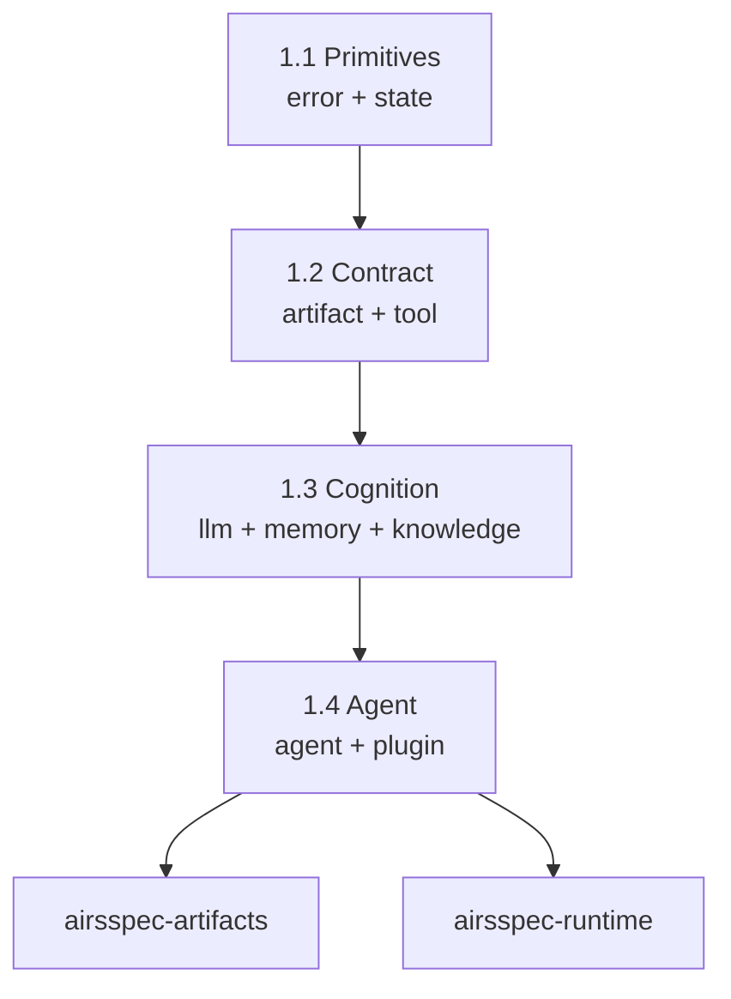

# UOW-001: Foundation Layer

**Goal**: Establish the architectural foundation with zero external dependencies.

---

## Problem Statement

AirsSpec requires a robust foundation layer that defines all core abstractions, traits, and types before any concrete implementations can be built. Without this foundation, subsequent phases (Agent System, Knowledge, Interface) cannot follow the **Dependency Inversion Principle (DIP)**.

The foundation must:
1. Define traits that all higher-level crates depend upon
2. Establish artifact persistence with JSONL format
3. Implement a working state machine for UOW lifecycle
4. Remain implementation-agnostic (zero external LLM/tool dependencies)

---

## Success Criteria

1. All `airsspec-core` traits are defined and documented
2. `airsspec-artifacts` can persist and validate JSONL artifacts
3. `airsspec-runtime` state machine handles phase transitions
4. `cargo build` succeeds with zero errors
5. `cargo clippy` passes with zero warnings
6. All public APIs have documentation comments
7. Unit tests cover core type construction and basic operations

---

## Scope

### In Scope

| Crate | Modules | Abstractions |
|-------|---------|--------------|
| `airsspec-core` | `error`, `state`, `artifact`, `tool`, `llm`, `memory`, `knowledge`, `agent`, `plugin` | All traits and types per architecture.md |
| `airsspec-artifacts` | `persistence`, `validators` | JSONL I/O, JSON Schema frontmatter validation |
| `airsspec-runtime` | `orchestrator`, `state_machine` | Phase transitions, UOW state management |

### Out of Scope

- LLM provider implementations (Phase 2: UOW-002)
- Tool implementations (Phase 2: UOW-002)
- Agent implementations (Phase 2: UOW-002)
- Knowledge/vector store (Phase 3: UOW-003)
- CLI/TUI interfaces (Phase 4: UOW-004)

---

## Sub-Phases

Based on `ROADMAP.md` section 3.1, the Foundation phase consists of 4 sub-phases:

| Sub-Phase | Modules | Core Abstractions |
|-----------|---------|-------------------|
| **1.1 Primitives** | `error`, `state` | `AirsspecError`, `Phase`, `UowState`, `Transition` |
| **1.2 Contract** | `artifact`, `tool` | `ArtifactValidator`, `Tool`, `ToolRegistry` |
| **1.3 Cognition** | `llm`, `memory`, `knowledge` | `LLMProvider`, `HotMemory`, `KnowledgeStore` |
| **1.4 Agent** | `agent`, `plugin` | `Agent`, `AgentExecutor`, `PluginLoader` |

### Dependency Graph

---

## Source References

| Source | Relevance |
|--------|-----------|
| [ROADMAP.md](file:///Users/hiraq/Projects/airsstack/airsspec/.airsspec/ROADMAP.md) | UOW-001 definition, sub-phases, milestones |
| [architecture.md](file:///Users/hiraq/Projects/airsstack/airsspec/.airsspec/knowledge/library/architecture.md) | Crate structure, trait designs, implementation priorities |
| [ai-dlc-analysis.md](file:///Users/hiraq/Projects/airsstack/airsspec/.airsspec/sources/ai-dlc-analysis.md) | UOW as transactional memory, HTN patterns |
| [spec-framework-analysis.md](file:///Users/hiraq/Projects/airsstack/airsspec/.airsspec/sources/spec-framework-analysis.md) | Spec-driven development, executable specifications |

---

## Technology Constraints

| Component | Choice | Source |
|-----------|--------|--------|
| Rust Edition | 2024 | Cargo.toml |
| MSRV | 1.85+ | Cargo.toml |
| Error Handling | `thiserror` + `anyhow` | architecture.md |
| Serialization | `serde` + `serde_json` | architecture.md |
| Async Runtime | `tokio` | architecture.md |
| Schema Validation | `jsonschema` | architecture.md |

---

## Milestones

| Milestone | Description | Validates |
|-----------|-------------|-----------|
| **M1: Core Traits** | All `airsspec-core` traits defined and documented | Sub-phases 1.1-1.4 |
| **M2: State Machine** | UOW lifecycle working with filesystem persistence | `airsspec-runtime` |

---

## Open Questions

*None at this time.*

---

**Next Phase**: UOW-002 Agent System (requires core traits from UOW-001)
