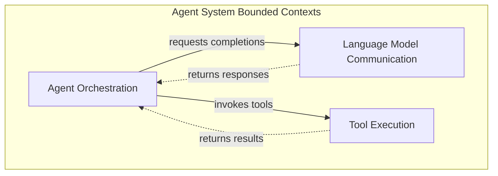

# DAA: Agent System

## Overview

The Agent System domain enables autonomous AI actors to analyze context, reason about problems, and produce artifacts. This domain bridges the Foundation Layer abstractions with executable behavior — transforming passive trait definitions into active agents that can accomplish tasks.

**Derived from**: [requirements.md](./requirements.md) — Problem Statement

---

## Bounded Contexts

### Context: Agent Orchestration

**Purpose**: Manages the lifecycle of agents executing tasks — creating, configuring, running, and completing agent sessions.

**Entities**:
- `Agent`: An autonomous actor with unique identity, configuration, and capabilities. Persists across multiple sessions. *Derived from: requirements.md — "Researcher agent"*
- `Session`: A single execution instance of an agent working on a task. Has lifecycle (pending → running → completed/failed). *Derived from: requirements.md — "agent → tool → LLM flow"*

**Value Objects**:
- `AgentConfig`: Immutable configuration (model, preamble, tool allowlist). *Derived from: requirements.md — agent configuration needs*
- `Prompt`: Immutable input instruction. *Derived from: requirements.md — user intent*
- `Budget`: Immutable constraints (max tokens, timeout). *Derived from: requirements.md — security boundaries*

**Aggregates**:
- `AgentAggregate`: Root is `Agent`. Contains `AgentConfig` and `Capabilities[]`. All agent modifications go through this root.
- `SessionAggregate`: Root is `Session`. Contains execution `Steps[]` and produces `Artifacts[]`. The session controls all state changes during execution.

**Domain Events**:
- `AgentCreated`: New agent registered in system.
- `SessionStarted`: Agent begins executing a task.
- `SessionCompleted`: Agent successfully finished task.
- `SessionFailed`: Agent encountered unrecoverable error.
- `ArtifactProduced`: Agent wrote output file. *Derived from: requirements.md — "produce requirements.md artifact"*

---

### Context: Language Model Communication

**Purpose**: Handles all interaction with language models — sending prompts, receiving completions, managing streaming responses.

**Entities**:
- `Provider`: A configured LLM service connection with unique identity. *Derived from: requirements.md — "OpenRouter integration"*

**Value Objects**:
- `CompletionRequest`: Immutable request (prompt, model, temperature). *Derived from: requirements.md — LLM calls*
- `CompletionResponse`: Immutable response content and metadata.
- `TokenUsage`: Immutable record of consumed tokens (input, output, total).
- `ModelId`: Immutable model identifier (e.g., "anthropic/claude-opus-4.5"). *Derived from: requirements.md — "200+ models"*
- `StreamChunk`: Immutable fragment of streaming response. *Derived from: requirements.md — "streaming response handling"*

**Aggregates**:
- `ProviderAggregate`: Root is `Provider`. Encapsulates connection state, retry logic, and fallback behavior.

**Domain Events**:
- `CompletionRequested`: Prompt sent to provider.
- `CompletionReceived`: Response received from provider.
- `ProviderFailed`: Provider returned error (rate limit, timeout).
- `ProviderFallback`: System switched to alternate provider.

---

### Context: Tool Execution

**Purpose**: Manages the invocation of tools with security validation and sandbox enforcement.

**Entities**:
- `ToolRegistry`: Collection of available tools, queryable by name. *Derived from: requirements.md — "tool implementations"*

**Value Objects**:
- `ToolDefinition`: Immutable tool metadata (name, description, parameter schema). *Derived from: requirements.md — "read_file, write_file, search"*
- `ToolInput`: Immutable arguments for tool invocation.
- `ToolOutput`: Immutable result from tool execution.
- `SandboxPolicy`: Immutable security rules (allowed paths, blocked operations). *Derived from: requirements.md — "sandboxing for filesystem access"*

**Aggregates**:
- `ToolExecutionAggregate`: Root is a single tool invocation. Contains `ToolInput`, `SandboxPolicy`, produces `ToolOutput`. Ensures all executions validate against security policy before running.

**Domain Events**:
- `ToolInvoked`: Agent requested tool execution.
- `SecurityValidationPassed`: Execution cleared sandbox checks.
- `SecurityValidationFailed`: Execution blocked by sandbox. *Derived from: requirements.md — security boundaries*
- `ToolExecutionCompleted`: Tool finished successfully.
- `ToolExecutionFailed`: Tool encountered error.

---

## Context Map

**Relationships**:
- **Agent Orchestration → Language Model Communication**: Upstream/Downstream — Orchestration requests completions, LMC provides responses
- **Agent Orchestration → Tool Execution**: Upstream/Downstream — Orchestration invokes tools, TE returns results
- Both LMC and TE are **suppliers** — they provide services without awareness of orchestration logic

---

## Ubiquitous Language

| Term | Definition |
|------|------------|
| Agent | An autonomous actor that reasons with LLMs and executes tools to accomplish tasks |
| Session | A single execution run of an agent from initial prompt to final output |
| Provider | A configured connection to an LLM service (e.g., OpenRouter) |
| Completion | A response from an LLM to a given prompt |
| Tool | A named capability the agent can invoke to perform side-effects |
| Registry | A collection that stores and retrieves tools by name |
| Sandbox | Security boundary constraining what tools can access |
| Artifact | A persistent output produced by an agent (e.g., requirements.md) |
| Budget | Resource constraints limiting agent execution (tokens, time) |

*All terms derived from requirements.md nouns and domain concepts*

---

## Domain Rules

1. **Agent Identity Persistence**: Each agent must have a unique identifier that persists across sessions.
   *Source: Agents are reusable entities, not ephemeral*

2. **Session Isolation**: Failed sessions must not corrupt agent state. Each session is independent.
   *Source: requirements.md — robust error handling implied*

3. **Tool Security First**: All tool executions must pass sandbox validation before running.
   *Source: requirements.md — "sandboxing for filesystem access"*

4. **Budget Enforcement**: Agents cannot exceed their configured token or time budgets.
   *Source: requirements.md — security boundaries*

5. **Artifact Traceability**: Every artifact produced must link back to the session and agent that created it.
   *Source: AI-DLC principle — "Filesystem as Truth"*

6. **Provider Abstraction**: Agents interact with a provider abstraction, never directly with LLM APIs.
   *Source: requirements.md — "LLMProvider trait"*

---

## References

- Requirements: [requirements.md](./requirements.md)
- DDD Principles: [ddd-principles.md](file:///Users/hiraq/Projects/airsstack/airsspec/researches/ddd-principles.md)
