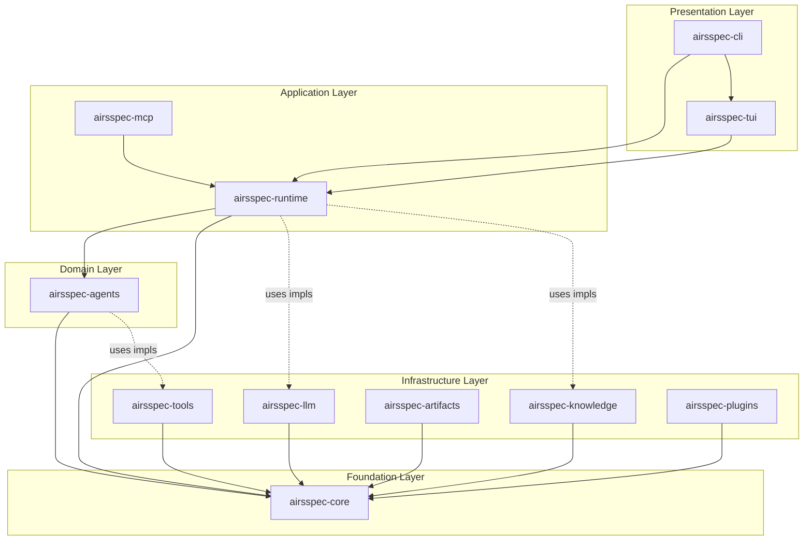
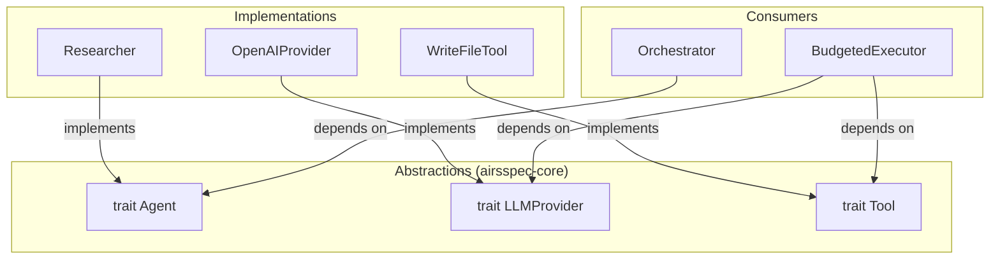
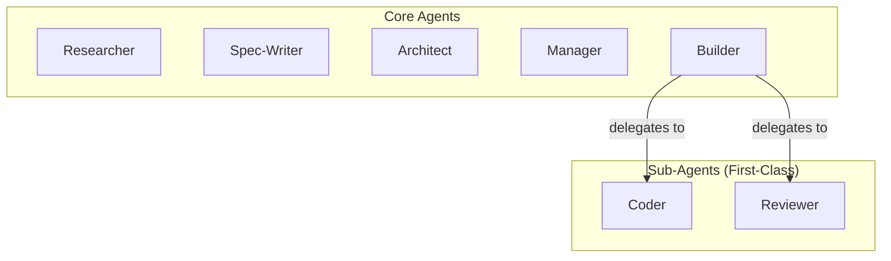
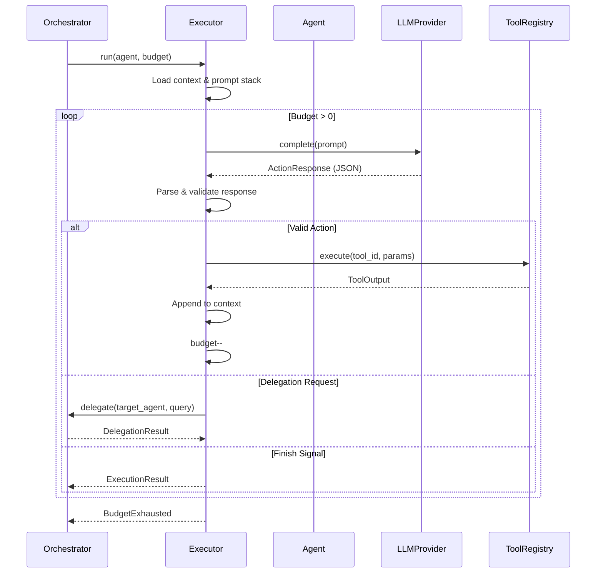
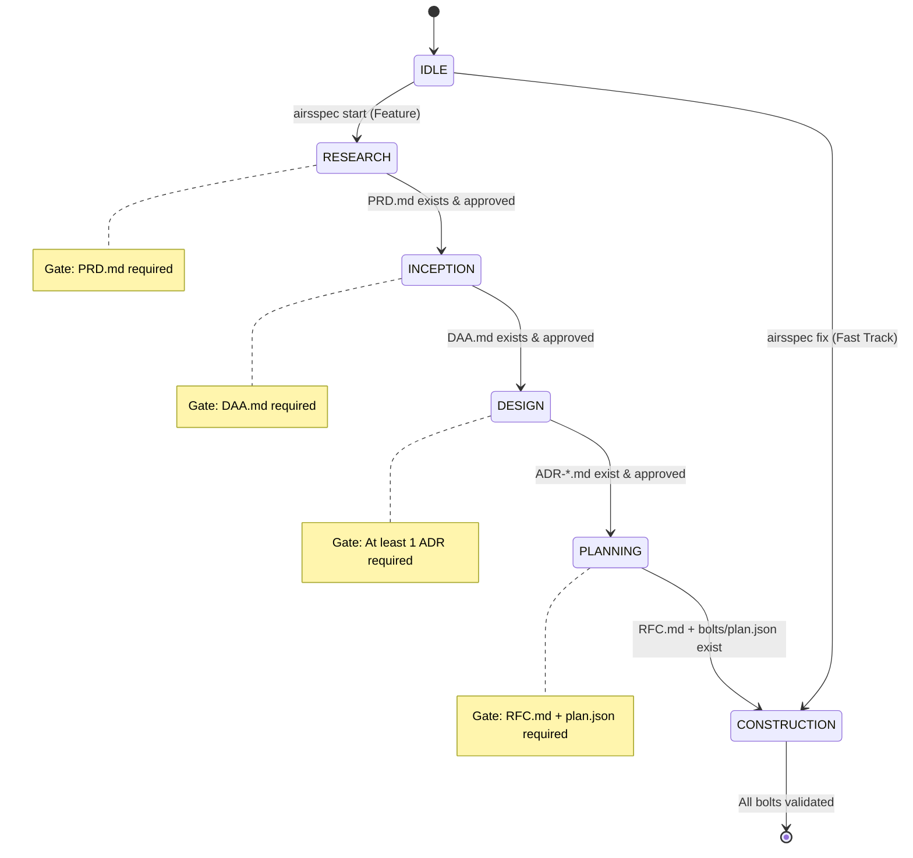
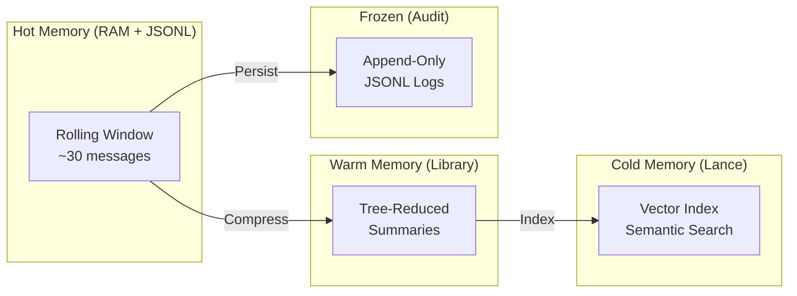
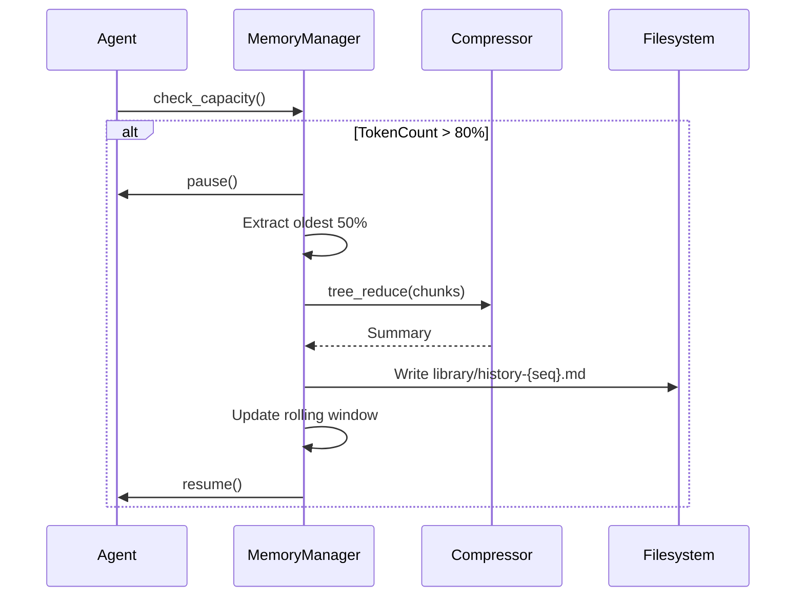
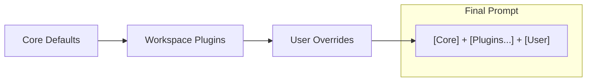
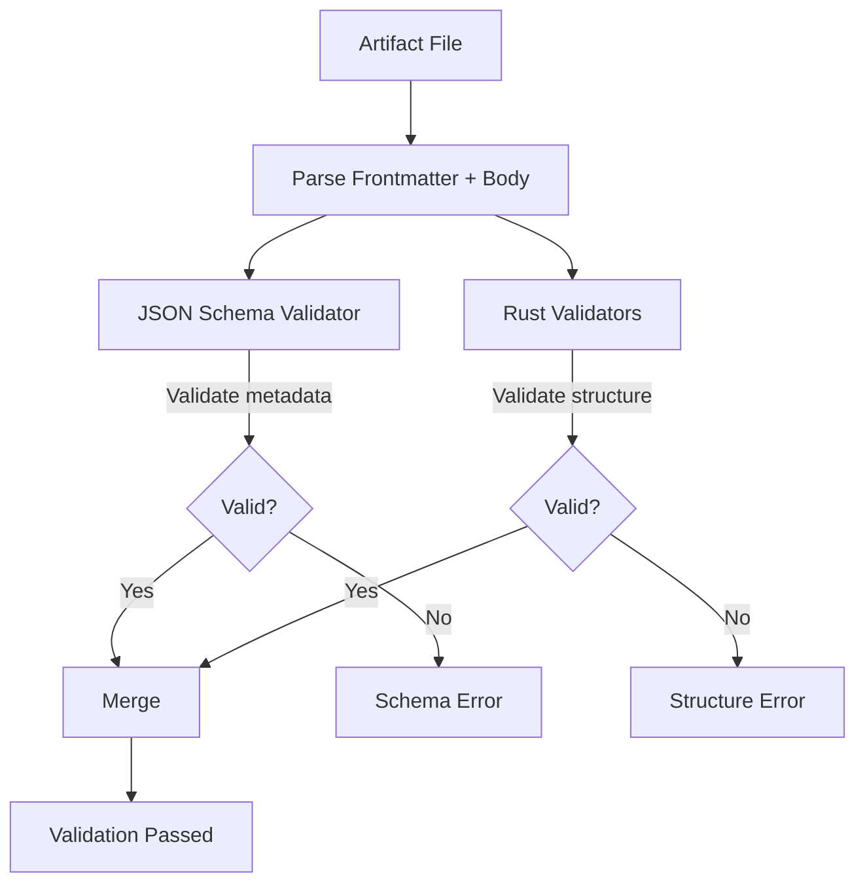
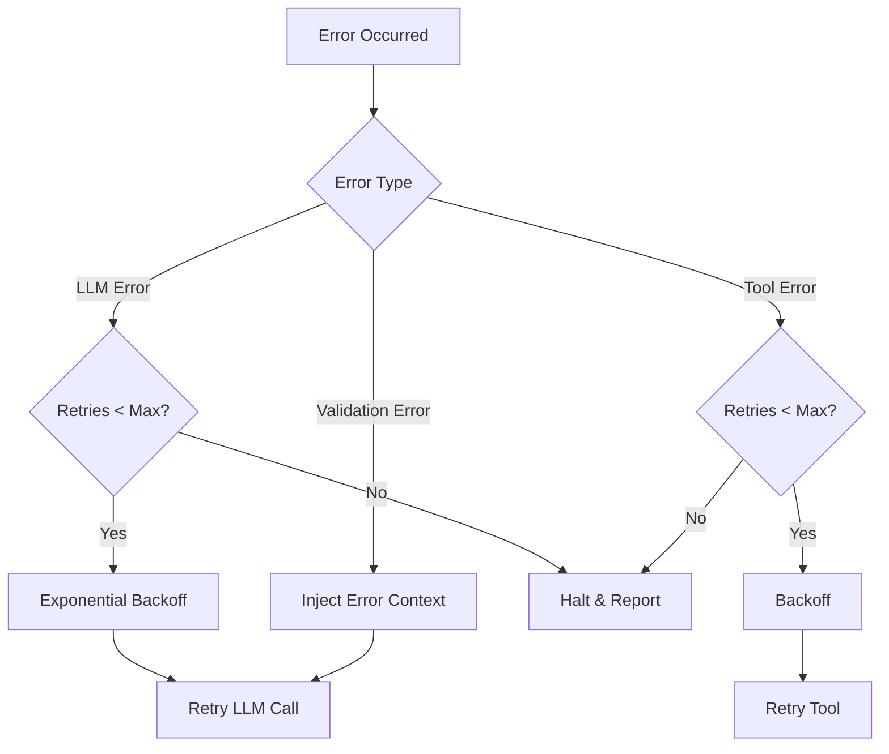

# AirsSpec System Architecture

**Status**: Proposal  
**Date**: 2026-01-05  
**Context**: Technical architecture for the AirsSpec multi-agent framework.

---

## 1. Overview

AirsSpec is a **Rust-based multi-agent orchestration framework** that implements the AirSDLC methodology. It uses a **Filesystem Blackboard** pattern where agents communicate through artifacts on disk, ensuring transparency and auditability.

### 1.1 Core Principles

| Principle | Description |
|-----------|-------------|
| **DIP (Dependency Inversion)** | All crates depend on abstractions in `airsspec-core`, not concrete implementations |
| **Filesystem as Truth** | All state is persisted to disk; TUI is just a view |
| **Sequential Execution** | One agent executes at a time (MVP) |
| **Per-Agent Budgets** | Each agent has isolated execution limits |
| **Trust-Based Plugins** | Plugin content is trusted (MVP) |

---

## 2. Crate Architecture

### 2.1 Layer Diagram



### 2.2 Crate Responsibilities

| Crate | Layer | Dependencies | Responsibility |
|-------|-------|--------------|----------------|
| `airsspec-core` | Foundation | None | Traits, types, errors (zero implementations) |
| `airsspec-llm` | Infrastructure | `core` | LLM provider implementations (OpenAI, Anthropic, Ollama) |
| `airsspec-knowledge` | Infrastructure | `core` | Lance vector store, context compression |
| `airsspec-artifacts` | Infrastructure | `core` | JSON Schema + Rust validators |
| `airsspec-tools` | Infrastructure | `core` | Standard tool implementations |
| `airsspec-plugins` | Infrastructure | `core` | Plugin loader (path-order resolution) |
| `airsspec-agents` | Domain | `core` | All agent implementations (core + sub-agents) |
| `airsspec-runtime` | Application | `core` | Orchestrator, state machine, memory manager |
| `airsspec-tui` | Presentation | `core`, `runtime` | Ratatui wizard and dashboard |
| `airsspec-cli` | Presentation | All | Binary entry point, wires implementations |
| `airsspec-mcp` | Application | `core`, `runtime` | MCP server for external integrations |

### 2.3 Core Crate Structure

```
airsspec-core/src/
├── lib.rs
├── agent/
│   ├── traits.rs      # Agent, AgentExecutor
│   └── types.rs       # AgentId, AgentConfig, Budget, DelegationSignal
├── llm/
│   ├── traits.rs      # LLMProvider, StreamHandler
│   └── types.rs       # CompletionRequest, TokenUsage
├── knowledge/
│   ├── traits.rs      # KnowledgeStore, Compressor, VectorStore
│   └── types.rs       # Document, Embedding, SearchResult
├── artifact/
│   ├── traits.rs      # ArtifactValidator, ArtifactStore
│   └── types.rs       # ArtifactType, ValidationResult
├── tool/
│   ├── traits.rs      # Tool, ToolRegistry
│   └── types.rs       # ToolId, ToolInput, ToolOutput
├── state/
│   ├── traits.rs      # StatePersistence, ComplianceGate
│   └── types.rs       # Phase, UowState, Transition
├── plugin/
│   ├── traits.rs      # PluginLoader, PromptOverlay
│   └── types.rs       # PluginManifest, ResolutionOrder
├── memory/
│   ├── traits.rs      # HotMemory, WarmMemory, ColdMemory
│   └── types.rs       # MemoryFragment, CompressionConfig
└── error.rs           # Shared error types
```

---

## 3. Dependency Inversion Pattern

### 3.1 Dependency Flow



### 3.2 Example: Agent Trait

```rust
// airsspec-core/src/agent/traits.rs
#[async_trait]
pub trait Agent: Send + Sync {
    fn id(&self) -> &AgentId;
    fn config(&self) -> &AgentConfig;
    fn allowed_tools(&self) -> &[ToolId];
    fn allowed_paths(&self) -> &[PathBuf];
    
    async fn execute(
        &self, 
        context: AgentContext
    ) -> Result<AgentOutput, AgentError>;
}

#[async_trait]
pub trait AgentExecutor: Send + Sync {
    async fn run(
        &self, 
        agent: &dyn Agent, 
        budget: Budget
    ) -> Result<ExecutionResult, ExecutionError>;
}
```

---

## 4. Agent System

### 4.1 Agent Hierarchy



### 4.2 Agent Responsibilities

| Agent | Phase | Input | Output | Allowed Tools |
|-------|-------|-------|--------|---------------|
| Researcher | Research | User Intent | `PRD.md`, `sources/*` | `search_web`, `read_file`, `write_file` (sources only) |
| Spec-Writer | Inception | `PRD.md` | `DAA.md` | `read_file`, `write_file` (DAA only) |
| Architect | Design | `DAA.md`, playbooks | `ADR-*.md` | `read_file`, `write_file` (ADRs only) |
| Manager | Planning | `DAA.md`, ADRs | `RFC.md`, `bolts/plan.json` | `read_file`, `write_file` (plans only) |
| Builder | Construction | Bolt Plan | `src/*`, tests | All tools |
| Coder | Construction | Task | Code implementation | `write_code`, `run_command` |
| Reviewer | Construction | Code | Review report | `read_file`, `run_lint`, `run_test` |

### 4.3 Agent Execution Flow



---

## 5. State Machine

### 5.1 Phase Transitions



### 5.2 UOW State Persistence

Each Unit of Work maintains its own state file:

```
.airsspec/uow/{uow-id}/
├── state.json          # Current phase, transitions, timestamps
├── PRD.md
├── DAA.md
├── ADR-001.md
├── RFC.md
└── bolts/
    └── {bolt-id}/
        ├── tasks/
        └── plans/
```

**State Schema**:
```json
{
  "id": "feature-stripe-payments",
  "phase": "DESIGN",
  "created_at": "2026-01-05T20:00:00Z",
  "updated_at": "2026-01-05T20:15:00Z",
  "transitions": [
    { "from": "IDLE", "to": "RESEARCH", "at": "..." },
    { "from": "RESEARCH", "to": "INCEPTION", "at": "..." }
  ],
  "artifacts": {
    "prd": { "path": "PRD.md", "status": "approved" },
    "daa": { "path": "DAA.md", "status": "draft" }
  }
}
```

---

## 6. Memory Architecture

### 6.1 Memory Tiers



### 6.2 Memory Flow

| Tier | Storage | Capacity | Trigger | Strategy |
|------|---------|----------|---------|----------|
| Hot | RAM + `.airsspec/contexts/agent/{session}.jsonl` | ~30 messages | Always active | FIFO Rolling Window |
| Warm | `.airsspec/knowledge/library/` | Unlimited | TokenCount > 80% limit | Tree-Reduce |
| Cold | `.airsspec/knowledge/vectors/` (Lance) | Unlimited | On ingestion | Map-Reduce + Embed |
| Frozen | `.airsspec/contexts/agent/{session}.jsonl` | Unlimited | Every action | Append-Only |

### 6.3 Context Compression (Sync)



---

## 7. Plugin System

### 7.1 Resolution Order



### 7.2 Plugin Structure

```
.airsspec/plugins/{name}/
├── airsspec-plugin.toml     # Manifest
├── agent/
│   ├── system/
│   │   └── default.md       # Appended to system prompt
│   ├── core/
│   │   └── {agent}.md       # Appended to agent persona
│   └── sub/
│       └── {name}.md        # New sub-agent definition
└── schemas/
    └── custom-artifact.json # Additional artifact schemas
```

### 7.3 Stacking Algorithm

```rust
fn stack_prompts(agent_id: &AgentId, workspace: &Workspace) -> String {
    let mut layers = Vec::new();
    
    // Layer 1: Core defaults
    layers.push(load_core_prompt(agent_id));
    
    // Layer 2: Plugins (directory order)
    for plugin in workspace.plugins_ordered() {
        if let Some(overlay) = plugin.get_overlay(agent_id) {
            layers.push(overlay);
        }
    }
    
    // Layer 3: User overrides
    if let Some(user) = workspace.user_override(agent_id) {
        layers.push(user);
    }
    
    layers.join("\n\n---\n\n")
}
```

---

## 8. Artifact Validation (Hybrid)

### 8.1 Validation Strategy



### 8.2 Artifact Frontmatter Schema

```yaml
# Example: PRD.md
---
version: "1.0"
status: draft | review | approved
author: researcher
created_at: 2026-01-05
features:
  - name: payment-integration
    priority: high | medium | low
---
```

### 8.3 Body Structure Validation (Rust)

```rust
fn validate_prd_body(body: &str) -> Result<(), ValidationError> {
    ensure_heading("## Problem Statement", body)?;
    ensure_heading("## Success Criteria", body)?;
    ensure_heading("## Scope", body)?;
    Ok(())
}
```

---

## 9. CLI & TUI

### 9.1 Output Modes

| Mode | Trigger | Use Case |
|------|---------|----------|
| TUI (default) | `airsspec start` | Interactive wizard |
| Headless | `--headless` | CI/CD pipelines |
| JSON | `--json` | Programmatic integration |

### 9.2 Command Structure

```
airsspec
├── init                    # Bootstrap workspace
├── start [--mode feature|fix]  # Launch wizard
├── status                  # Dashboard view
├── fix "<instruction>"     # Fast track to Construction
└── config                  # API keys, settings
```

---

## 10. Error Recovery

### 10.1 Retry Strategy



### 10.2 Configuration

```toml
# airsspec.toml
[retry]
max_llm_retries = 3
max_tool_retries = 2
backoff_base_ms = 500
backoff_max_ms = 5000
```

---

## 11. Workspace Structure

```
project/
├── .airsspec/
│   ├── WORKSPACE.md              # Workspace metadata
│   ├── airsspec.toml             # Configuration
│   │
│   ├── agent/                    # User overrides
│   │   ├── system/
│   │   │   └── default.md
│   │   └── core/
│   │       └── builder.md
│   │
│   ├── plugins/                  # Installed plugins
│   │   └── security-audit/
│   │
│   ├── sources/                  # Raw knowledge sources
│   │   └── stripe-api.pdf
│   │
│   ├── knowledge/
│   │   ├── library/              # Synthesized documents (Warm)
│   │   ├── vectors/              # Lance index (Cold)
│   │   └── playbooks/            # Reusable patterns
│   │
│   ├── contexts/
│   │   └── agent/                # Session logs (Frozen)
│   │       └── {session}.jsonl
│   │
│   └── uow/                      # Units of Work
│       └── {uow-id}/
│           ├── state.json
│           ├── PRD.md
│           ├── DAA.md
│           ├── ADR-*.md
│           ├── RFC.md
│           └── bolts/
│               └── {bolt-id}/
│                   ├── tasks/
│                   └── plans/
│
└── src/                          # Project source code
```

---

## 12. Technology Stack

| Component | Library | Rationale |
|-----------|---------|-----------|
| CLI | `clap` | Industry standard, derive macros |
| TUI | `ratatui` | Modern, well-maintained |
| Async | `tokio` | Required for LLM streaming |
| LLM | `rig` (wrapped) | Multi-provider support |
| Vector Store | `lance` | Embedded, Rust-native |
| Serialization | `serde` + `serde_json` | Standard |
| Schema Validation | `jsonschema` | Frontmatter validation |
| Error Handling | `thiserror` + `anyhow` | Ergonomic errors |

---

## 13. Implementation Priorities

### Phase 1: Foundation
1. `airsspec-core` — All traits and types
2. `airsspec-artifacts` — JSONL persistence + validators
3. `airsspec-runtime` — State machine + orchestrator skeleton

### Phase 2: Agent System
4. `airsspec-llm` — OpenAI provider (single provider first)
5. `airsspec-tools` — Core tools (read/write/search)
6. `airsspec-agents` — Researcher agent (first agent)

### Phase 3: Knowledge
7. `airsspec-knowledge` — Lance integration + compression

### Phase 4: Interface
8. `airsspec-cli` — Headless mode first
9. `airsspec-tui` — Interactive wizard
10. `airsspec-plugins` — Plugin loader

### Phase 5: Integration
11. `airsspec-mcp` — MCP server
12. Additional LLM providers
