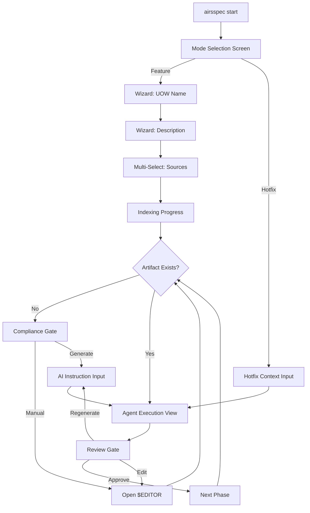

# AirsSpec CLI/TUI Design Specification

- **Date**: 2026-01-07
- **Status**: Proposal / Draft
- **Context**: Defines the visual and interaction design for the AirsSpec Terminal User Interface, built with Ratatui.rs.

---

## 1. Design Philosophy

### 1.1 Core Principles

| Principle | Description |
|-----------|-------------|
| **Simple** | Single-pane focus layout. No complex split panels or dashboards. Each screen does one thing well. |
| **Clean** | Typography-first with generous whitespace. Monochrome base with strategic accent colors for status. |
| **Elegant** | Smooth transitions, clear hierarchy, and intuitive navigation that feels native to the terminal. |

### 1.2 Design Constraints

- **No ASCII Art**: Avoid decorative ASCII banners or logos.
- **No Busy Borders**: Use minimal box-drawing characters.
- **No Color Overload**: Maximum 3 colors visible at any time (excluding text).
- **Progressive Disclosure**: Show only what's relevant to the current action.

---

## 2. Layout Architecture

### 2.1 The Single-Pane Layout

AirsSpec uses a **single-pane wizard flow** to maintain focus and reduce cognitive load. The layout consists of three fixed zones:

```
┌─────────────────────────────────────────────────────────────┐
│  [Status Bar]                                    Height: 1  │
├─────────────────────────────────────────────────────────────┤
│                                                             │
│                    [Primary Content]             Flex: 1    │
│                                                             │
│                                                             │
├─────────────────────────────────────────────────────────────┤
│  [Action Bar]                                    Height: 1  │
└─────────────────────────────────────────────────────────────┘
```

### 2.2 Zone Specifications

#### Status Bar (Top)
- **Height**: Fixed 1 line
- **Purpose**: Persistent context indicator
- **Content Pattern**:
  ```
  ◉ {PHASE} │ {UOW_NAME} │ ⟫ {CURRENT_ARTIFACT}
  ```
- **Example**:
  ```
  ◉ DESIGN │ payment-feature │ ⟫ ADR-001.md
  ```

#### Primary Content (Center)
- **Height**: Flexible (fills remaining space)
- **Purpose**: Main interaction area
- **Behavior**: Content changes based on current context/mode
- **Padding**: 2 characters horizontal, 1 line vertical

#### Action Bar (Bottom)
- **Height**: Fixed 1 line
- **Purpose**: Contextual keyboard hints
- **Alignment**: Left-aligned, space-separated
- **Example**:
  ```
  ↑↓ Navigate   ↵ Select   ⎋ Cancel   ? Help
  ```

---

## 3. Color System

### 3.1 Base Palette

| Token | Color Code | Usage |
|-------|------------|-------|
| `fg-primary` | `Gray 250` | Primary text |
| `fg-muted` | `Gray 100` | Secondary text, hints |
| `fg-dim` | `Gray 60` | Disabled items, borders |
| `bg-default` | Terminal default | Background |
| `bg-selected` | `Gray 20` | Highlighted/selected items |

### 3.2 Phase Colors

Each phase has a distinct accent color for the status indicator:

| Phase | Color | Hex (approx) | Semantic |
|-------|-------|--------------|----------|
| INGESTION | `White` | `#FFFFFF` | Neutral, passive |
| RESEARCH | `Blue` | `#5C9DFF` | Cold, investigative |
| INCEPTION | `Cyan` | `#5CECC6` | Abstract, conceptual |
| DESIGN | `Magenta` | `#C792EA` | Creative, architectural |
| PLANNING | `Yellow` | `#FFCB6B` | Caution, detailed |
| CONSTRUCTION | `Green` | `#C3E88D` | Active, building |

### 3.3 Semantic Colors

| Token | Color | Usage |
|-------|-------|-------|
| `status-success` | `Green` | Completed, validated |
| `status-warning` | `Yellow` | Compliance warning, attention needed |
| `status-error` | `Red` | Blocked, failed, compliance failure |
| `status-info` | `Blue` | Informational, in-progress |

### 3.4 Color Usage Rules

1. **Phase color** appears ONLY in the status bar phase indicator (◉)
2. **Semantic colors** appear in content area for status badges
3. **Text remains monochrome** — never colorize body text
4. **Borders are always `fg-dim`** — subtle, not prominent

---

## 4. Typography & Symbols

### 4.1 Unicode Symbols

AirsSpec uses a curated set of Unicode symbols for consistency:

| Symbol | Unicode | Usage |
|--------|---------|-------|
| `◉` | U+25C9 | Active phase indicator (filled) |
| `○` | U+25CB | Inactive phase indicator (empty) |
| `▸` | U+25B8 | Current selection / active item |
| `│` | U+2502 | Separator |
| `⟫` | U+27EB | Breadcrumb arrow |
| `┊` | U+250A | Log line prefix (streaming) |
| `▌` | U+258C | Cursor / typing indicator |
| `✓` | U+2713 | Success, completed, checked |
| `⚠` | U+26A0 | Warning, attention |
| `•` | U+2022 | Bullet point, minor indicator |
| `↵` | U+21B5 | Enter key |
| `⎋` | U+238B | Escape key |
| `↑` `↓` | U+2191/93 | Arrow keys |

### 4.2 Text Hierarchy

| Level | Style | Usage |
|-------|-------|-------|
| **Heading** | Bold, `fg-primary` | Section titles, prompts |
| **Body** | Regular, `fg-primary` | Content, options |
| **Caption** | Regular, `fg-muted` | Hints, secondary info |
| **Disabled** | Regular, `fg-dim` | Unavailable options |

---

## 5. Component Specifications

### 5.1 Wizard Prompt

Used during `airsspec start` for step-by-step input gathering.

```
┌─────────────────────────────────────────────────────────────┐
│                                                             │
│   ◎ {PROMPT_LABEL}                                          │
│                                                             │
│   ┌───────────────────────────────────────────────────────┐ │
│   │ {USER_INPUT}▌                                         │ │
│   └───────────────────────────────────────────────────────┘ │
│                                                             │
│   {HINT_TEXT}                                               │
│                                                             │
└─────────────────────────────────────────────────────────────┘
```

**Specifications**:
- Input border: Single-line box (`─`, `│`, `┌`, `┐`, `└`, `┘`)
- Border color: `fg-dim`
- Input text: `fg-primary`
- Cursor: `▌` blinking (if terminal supports)
- Hint text: `fg-muted`, aligned below input

**Example**:
```
   ◎ Name your Unit of Work

   ┌─────────────────────────────────────────────────────────┐
   │ payment-stripe▌                                         │
   └─────────────────────────────────────────────────────────┘

   Use lowercase with hyphens (e.g., feature-auth)
```

---

### 5.2 Selection List

Used for single-select menus (mode selection, compliance gate).

```
┌─────────────────────────────────────────────────────────────┐
│                                                             │
│   {TITLE}                                                   │
│                                                             │
│   ┌───────────────────────────────────────────────────────┐ │
│   │  {N} ▸ {OPTION_LABEL}                    {BADGE}      │ │ ← Selected
│   │  {N}   {OPTION_LABEL}                    {BADGE}      │ │
│   │  {N}   {OPTION_LABEL}                    {BADGE}      │ │
│   └───────────────────────────────────────────────────────┘ │
│                                                             │
└─────────────────────────────────────────────────────────────┘
```

**Specifications**:
- Selection indicator: `▸` for selected, ` ` (space) for unselected
- Number prefix: Optional, for quick keyboard selection
- Badge: Right-aligned, `fg-muted`
- Selected row: Background `bg-selected`
- Navigation: `↑` `↓` to move, `↵` to confirm

**Example**:
```
   Select Mode:

   ┌───────────────────────────────────────────────────────┐
   │  1 ▸ Feature (Full Architecture Cycle)                │
   │  2   Hotfix / Refactor (Direct to Code)               │
   └───────────────────────────────────────────────────────┘
```

---

### 5.3 Multi-Select List

Used for selecting sources or playbooks.

```
┌─────────────────────────────────────────────────────────────┐
│                                                             │
│   {TITLE}                                                   │
│                                                             │
│   [{CHECKBOX}] {ITEM_LABEL}                    {STATUS}     │
│   [{CHECKBOX}] {ITEM_LABEL}                    {STATUS}     │
│   [{CHECKBOX}] {ITEM_LABEL}                    {STATUS}     │
│                                                             │
└─────────────────────────────────────────────────────────────┘
```

**Specifications**:
- Checkbox: `[x]` checked, `[ ]` unchecked
- Currently focused row: `▸` prefix or `bg-selected`
- Status badge: Right-aligned
  - `✓ Indexed` — `fg-muted`
  - `• Not indexed` — `fg-dim`
- Navigation: `↑` `↓` to move, `Space` to toggle, `↵` to confirm

**Example**:
```
   Select Sources for this UOW:

   ▸ [x] stripe-api.pdf                        • Not indexed
     [ ] legacy-auth.md                        ✓ Indexed
     [ ] payment-flows.md                      ✓ Indexed

   ↑↓ Move   Space Toggle   ↵ Confirm
```

---

### 5.4 Compliance Gate

Displayed when a required artifact is missing.

```
┌─────────────────────────────────────────────────────────────┐
│                                                             │
│   ⚠ {ARTIFACT_NAME} is required to proceed                  │
│                                                             │
│   ┌───────────────────────────────────────────────────────┐ │
│   │  1 ▸ Edit Manually                                    │ │
│   │  2   Generate with AI                                 │ │
│   └───────────────────────────────────────────────────────┘ │
│                                                             │
└─────────────────────────────────────────────────────────────┘
```

**Specifications**:
- Warning icon: `⚠` in `status-warning` color
- Title: Bold, `fg-primary`
- Uses Selection List component for options

---

### 5.5 AI Instruction Input

Displayed when user chooses "Generate with AI" at a compliance gate.

```
┌─────────────────────────────────────────────────────────────┐
│                                                             │
│   Provide instructions for AI generation:                   │
│                                                             │
│   ┌───────────────────────────────────────────────────────┐ │
│   │ {MULTILINE_INPUT}                                     │ │
│   │ ▌                                                     │ │
│   │                                                       │ │
│   │                                                       │ │
│   └───────────────────────────────────────────────────────┘ │
│                                                             │
│   Ctrl+D to submit   ⎋ Cancel                               │
│                                                             │
└─────────────────────────────────────────────────────────────┘
```

**Specifications**:
- Multiline input area: 4-6 lines minimum height
- Submit: `Ctrl+D` (common for multiline input)
- Cancel: `⎋` Escape

---

### 5.6 Agent Execution View

Displayed while an agent is running.

```
┌─────────────────────────────────────────────────────────────┐
│                                                             │
│   ◉ {AGENT_NAME}                                            │
│                                                             │
│   ┊ {LOG_LINE_1}                                            │
│   ┊ {LOG_LINE_2}                                            │
│   ┊ {LOG_LINE_3}                                            │
│   ▌                                                         │
│                                                             │
│                                                             │
│                                                             │
│   Loop {N}/{MAX}   {PROGRESS_DOTS}                          │
│                                                             │
└─────────────────────────────────────────────────────────────┘
```

**Specifications**:
- Agent name: Phase color for `◉`, bold text
- Log prefix: `┊` in `fg-dim`
- Log text: `fg-primary`, append-only (scroll if overflow)
- Cursor: `▌` on last line to indicate streaming
- Progress: `●●●○○` filled/empty dots, or `Loop 2/5`
- No cancel option during critical operations (or show if safe)

**Example**:
```
   ◉ Researcher

   ┊ Reading stripe-api.pdf...
   ┊ Extracting key concepts: payments, intents, webhooks
   ┊ Searching for existing authentication patterns...
   ┊ Drafting PRD.md...
   ▌

   Loop 2/5   ●●○○○
```

---

### 5.7 Review Gate

Displayed after an agent completes its output.

```
┌─────────────────────────────────────────────────────────────┐
│                                                             │
│   ✓ {ARTIFACT_NAME} generated                               │
│                                                             │
│   {ARTIFACT_PREVIEW_LINES}                                  │
│   ...                                                       │
│                                                             │
│   ┌───────────────────────────────────────────────────────┐ │
│   │  1 ▸ Approve & Continue                               │ │
│   │  2   Open in Editor                                   │ │
│   │  3   Regenerate                                       │ │
│   │  4   Cancel                                           │ │
│   └───────────────────────────────────────────────────────┘ │
│                                                             │
└─────────────────────────────────────────────────────────────┘
```

**Specifications**:
- Success icon: `✓` in `status-success` color
- Preview: First 5-10 lines of artifact, `fg-muted`
- Truncation: `...` if content exceeds preview
- Uses Selection List for actions

---

### 5.8 Status Dashboard

Displayed for `airsspec status` command.

```
┌─────────────────────────────────────────────────────────────┐
│  airsspec status                                            │
├─────────────────────────────────────────────────────────────┤
│                                                             │
│  Units of Work                                              │
│  ───────────────────────────────────────────────────────────│
│                                                             │
│  ◉ {UOW_NAME}                {PHASE}   ▸ {CURRENT_ARTIFACT} │
│  ◉ {UOW_NAME}                {STATUS}  ⚠ {BLOCKED_REASON}   │
│  ○ {UOW_NAME}                DONE      ✓ Completed          │
│                                                             │
│                                                             │
└─────────────────────────────────────────────────────────────┘
```

**Specifications**:
- Title: Left-aligned, bold
- Separator: `─` repeated, `fg-dim`
- Active UOW: `◉` with phase color
- Completed UOW: `○` in `fg-dim`
- Blocked: `⚠` in `status-warning`
- Navigation: `↑` `↓` to select UOW, `↵` to resume
- Read-only: No editing from this view

**Example**:
```
  airsspec status
  ─────────────────────────────────────────────────────────────

  Units of Work

  ◉ payment-feature            DESIGN   ▸ ADR-001.md
  ◉ auth-refactor              BLOCKED  ⚠ Missing DAA.md
  ○ onboarding-flow            DONE     ✓ Completed

  ↵ Resume   q Quit
```

---

## 6. Interaction Patterns

### 6.1 Navigation Keys

| Key | Action |
|-----|--------|
| `↑` `k` | Move up |
| `↓` `j` | Move down |
| `↵` Enter | Confirm / Select |
| `Space` | Toggle (multi-select) |
| `⎋` Esc | Cancel / Back |
| `q` | Quit (dashboard only) |
| `?` | Help overlay |
| `1-9` | Quick select (numbered items) |

### 6.2 Input Validation

- **Invalid input**: Border flashes `status-error`, hint text shows error
- **Empty required field**: Prevent confirmation, show hint
- **No visual shake or aggressive feedback** — just color hints

### 6.3 Screen Transitions

- **No animations** (terminal limitations)
- **Instant clear and redraw** between screens
- **Maintain scroll position** when returning to previous screen

---

## 7. Ratatui Implementation Notes

### 7.1 Required Widgets

| Widget | Ratatui Equivalent | Usage |
|--------|-------------------|-------|
| Status Bar | `Paragraph` | Single-line status |
| Primary Content | `Block` + children | Container |
| Action Bar | `Paragraph` | Single-line hints |
| Selection List | `List` | Menus, options |
| Multi-Select | `List` with custom render | Sources, playbooks |
| Text Input | `tui-input` crate | Wizard prompts |
| Multiline Input | `tui-textarea` crate | AI instructions |
| Log Viewer | `Paragraph` with scroll | Agent execution |

### 7.2 Recommended Crates

```toml
[dependencies]
ratatui = "0.28"
crossterm = "0.28"        # Terminal backend
tui-input = "0.10"        # Single-line input
tui-textarea = "0.6"      # Multiline input
```

### 7.3 Layout Code Pattern

```rust
use ratatui::prelude::*;

fn ui(frame: &mut Frame, app: &App) {
    let chunks = Layout::default()
        .direction(Direction::Vertical)
        .constraints([
            Constraint::Length(1),  // Status bar
            Constraint::Min(0),     // Primary content
            Constraint::Length(1),  // Action bar
        ])
        .split(frame.area());

    render_status_bar(frame, chunks[0], app);
    render_content(frame, chunks[1], app);
    render_action_bar(frame, chunks[2], app);
}
```

### 7.4 Color Definition Pattern

```rust
use ratatui::style::Color;

pub struct Theme {
    pub fg_primary: Color,
    pub fg_muted: Color,
    pub fg_dim: Color,
    pub phase_research: Color,
    pub phase_inception: Color,
    pub phase_design: Color,
    pub phase_planning: Color,
    pub phase_construction: Color,
    pub status_success: Color,
    pub status_warning: Color,
    pub status_error: Color,
}

impl Default for Theme {
    fn default() -> Self {
        Self {
            fg_primary: Color::Gray,
            fg_muted: Color::DarkGray,
            fg_dim: Color::Rgb(60, 60, 60),
            phase_research: Color::Rgb(92, 157, 255),
            phase_inception: Color::Rgb(92, 236, 198),
            phase_design: Color::Rgb(199, 146, 234),
            phase_planning: Color::Rgb(255, 203, 107),
            phase_construction: Color::Rgb(195, 232, 141),
            status_success: Color::Green,
            status_warning: Color::Yellow,
            status_error: Color::Red,
        }
    }
}
```

---

## 8. Screen Flow Summary



---

## 9. Terminal Animations

Simple, purposeful animations provide visual feedback without being distracting. All animations should be subtle and serve a functional purpose.

### 9.1 Design Principles for Animation

| Principle | Description |
|-----------|-------------|
| **Purposeful** | Every animation must indicate state or progress |
| **Subtle** | No flashy effects — terminal-native feel |
| **Interruptible** | Animations never block user input |
| **Fallback-Safe** | Graceful degradation if terminal doesn't support |

---

### 9.2 Spinner Variants

Used during loading, indexing, or waiting for external processes.

#### Braille Dots Spinner (Recommended)
Smooth, minimal footprint — single character width.

```
Frames: ⠋ ⠙ ⠹ ⠸ ⠼ ⠴ ⠦ ⠧ ⠇ ⠏
Speed:  80ms per frame
```

**Usage Example**:
```
⠹ Indexing stripe-api.pdf...
```

#### Bounce Dots Spinner
Three-character width, rhythmic feel.

```
Frames: ⠁ ⠂ ⠄ ⡀ ⢀ ⠠ ⠐ ⠈
        or: ·  ·· ··· ·· ·
Speed:  120ms per frame
```

#### Simple Line Spinner (Fallback)
For terminals with limited Unicode support.

```
Frames: | / - \
Speed:  100ms per frame
```

---

### 9.3 Progress Indicators

#### Determinate Progress (Known Length)
Used when total work is known (e.g., processing N files).

```
Indexing sources ████████░░░░░░░░ 52%
```

**Specifications**:
- Bar characters: `█` filled, `░` empty
- Width: Adaptive (min 10, max 30 characters)
- Percentage: Right-aligned, `fg-muted`
- Update frequency: Every 2-5% change (avoid flicker)

#### Indeterminate Progress (Unknown Length)
Used during AI generation or network requests.

**Bouncing Ball**:
```
Frame 1: [●    ]
Frame 2: [ ●   ]
Frame 3: [  ●  ]
Frame 4: [   ● ]
Frame 5: [    ●]
Frame 6: [   ● ]
... (reverse)
```
Speed: 150ms per frame

**Pulsing Dots** (Alternative):
```
Frame 1: ○ ○ ○
Frame 2: ● ○ ○
Frame 3: ● ● ○
Frame 4: ● ● ●
Frame 5: ○ ● ●
Frame 6: ○ ○ ●
Frame 7: ○ ○ ○
```
Speed: 200ms per frame

---

### 9.4 Agent Execution Animations

#### Streaming Text Effect
For agent thought/action logs, simulate typing for a natural feel.

```
Rendering speed: 10-20ms per character
Pause on punctuation: 50ms after . , ; :
```

**Example Flow**:
```
┊ Analyzing stripe-api.pdf...        ← Appears character-by-character
┊ Found 3 key concepts               ← Next line after previous completes
▌                                    ← Blinking cursor indicates "thinking"
```

#### Thinking Indicator
While waiting for LLM response (before streaming begins).

```
◉ Researcher
                                     
  Thinking ⠹                         ← Spinner next to "Thinking"

--- or ---

◉ Researcher

  ▌                                  ← Just blinking cursor
```

---

### 9.5 Status Transitions

When phase or status changes, use a brief visual cue.

#### Phase Change Flash
When transitioning between phases (e.g., RESEARCH → INCEPTION):

1. Current phase indicator dims: `◉` → `○`
2. Brief pause (200ms)
3. New phase indicator appears bright: `○` → `◉`

**Timeline**:
```
T+0ms:   ◉ RESEARCH  (current)
T+200ms: ○ RESEARCH  (dim)
T+400ms: ◉ INCEPTION (new, bright)
```

#### Success/Error Flash
Brief color flash when operation completes.

- **Success**: Green `✓` appears, stays for 1s, then transitions
- **Error**: Red `✗` appears with error message

---

### 9.6 Cursor Animations

#### Blinking Cursor
Standard terminal cursor blink for input fields.

```
Blink rate: 530ms on, 530ms off (standard terminal rate)
Character: ▌ or │
```

#### Typing Indicator (Agent)
When the agent is "writing" to a file:

```
Writing PRD.md ▌     ← Blinks while writing
Writing PRD.md ✓     ← Solid checkmark when done
```

---

### 9.7 Implementation Patterns (Ratatui)

#### Spinner Component

```rust
pub struct Spinner {
    frames: &'static [char],
    current: usize,
    interval: Duration,
    last_tick: Instant,
}

impl Spinner {
    pub fn braille() -> Self {
        Self {
            frames: &['⠋', '⠙', '⠹', '⠸', '⠼', '⠴', '⠦', '⠧', '⠇', '⠏'],
            current: 0,
            interval: Duration::from_millis(80),
            last_tick: Instant::now(),
        }
    }

    pub fn tick(&mut self) -> char {
        if self.last_tick.elapsed() >= self.interval {
            self.current = (self.current + 1) % self.frames.len();
            self.last_tick = Instant::now();
        }
        self.frames[self.current]
    }
}
```

#### Animation Tick Rate

```rust
// Main loop should tick at ~60fps for smooth animation
let tick_rate = Duration::from_millis(16);

loop {
    terminal.draw(|f| ui(f, &mut app))?;
    
    if crossterm::event::poll(tick_rate)? {
        // Handle input
    }
    
    // Update animations
    app.spinner.tick();
    app.progress.tick();
}
```

#### Recommended Crate

```toml
[dependencies]
# For more complex animations
indicatif = "0.17"  # Optional: standalone progress bars
```

---

### 9.8 Animation Configuration

Allow users to disable animations for accessibility or performance:

```toml
# airsspec.toml
[ui]
animations = true        # Master toggle
spinner_style = "braille" # braille, dots, line
typing_effect = true     # Streaming text effect
```

**Runtime Check**:
```rust
if app.config.ui.animations {
    render_animated_spinner(frame, area);
} else {
    render_static_indicator(frame, area);  // Just "..."
}
```

---

## 10. Accessibility Considerations

1. **High Contrast Support**: All colors should work on both dark and light terminal backgrounds
2. **Screen Reader Friendly**: Avoid relying solely on color — use symbols (`✓`, `⚠`, `▸`)
3. **Keyboard-Only Navigation**: Full functionality without mouse
4. **No Flashing**: Avoid rapid color changes that could trigger photosensitivity

---

## 10. Future Considerations

- **Mouse support**: Click-to-select in lists (optional enhancement)
- **Resize handling**: Graceful content reflow on terminal resize
- **Themes**: User-configurable color schemes via `airsspec.toml`
- **Compact mode**: For smaller terminal windows (remove padding)
