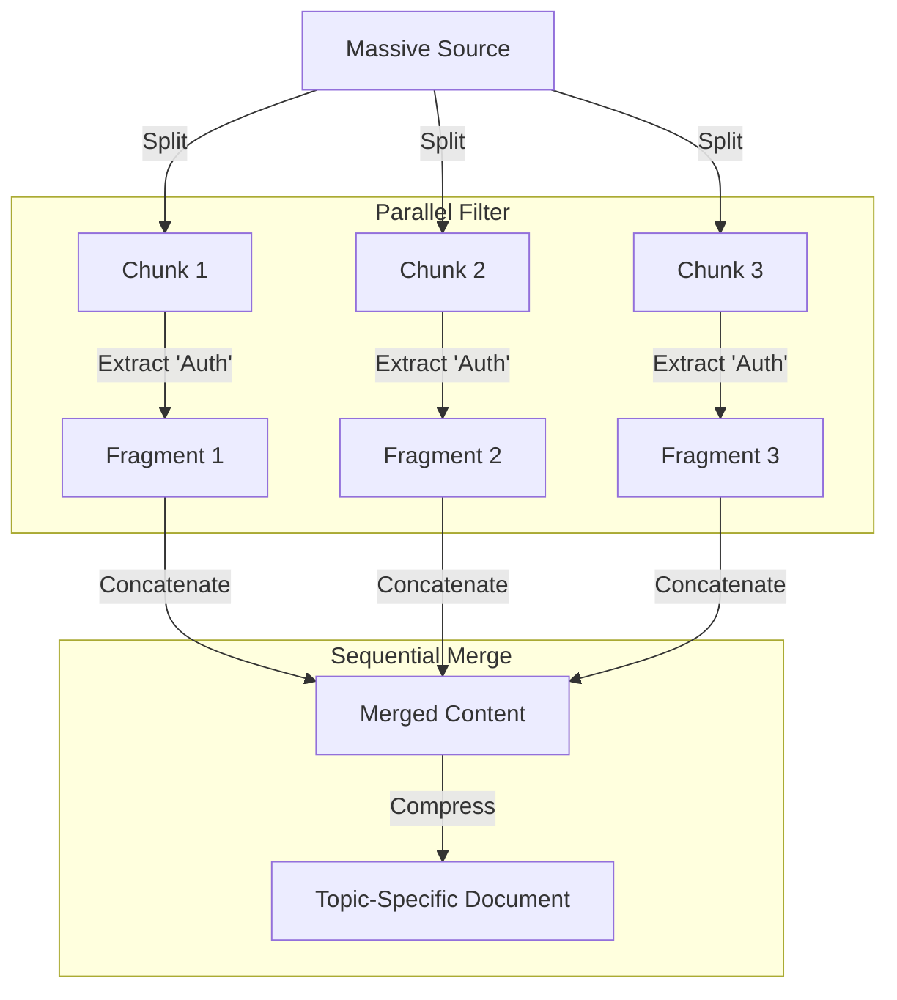
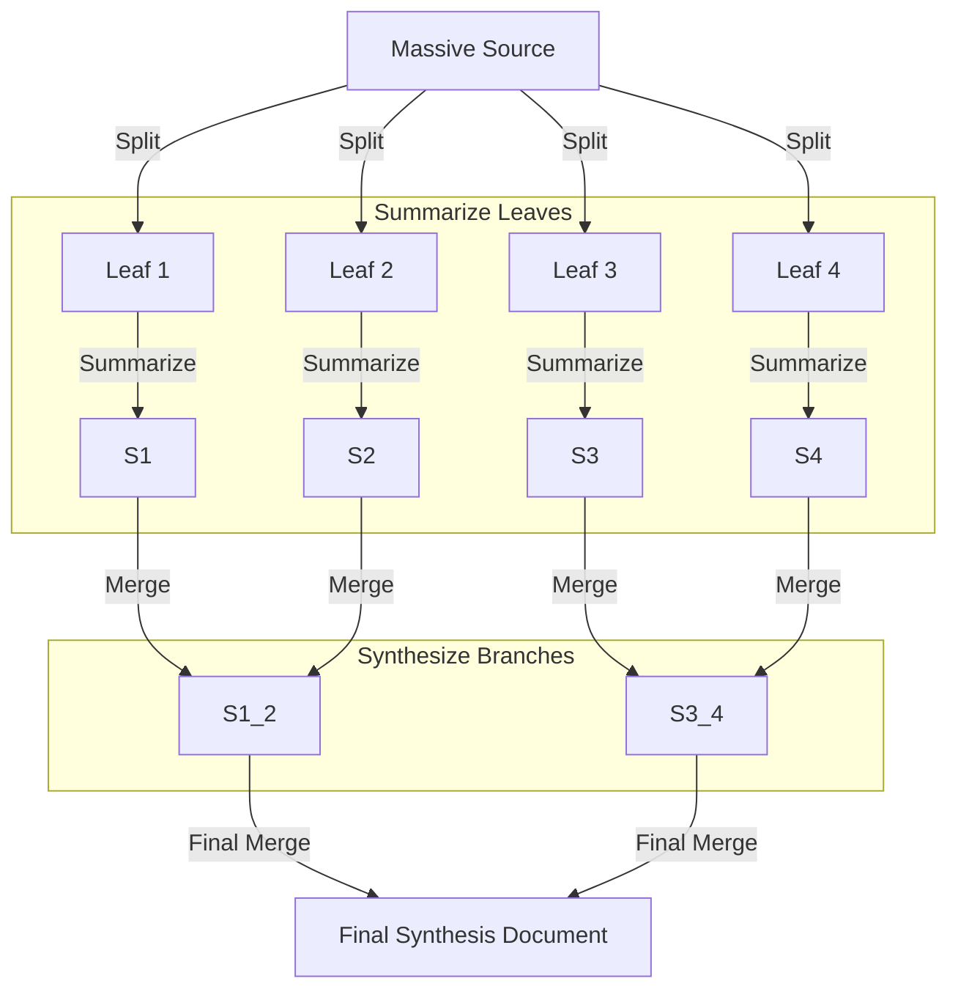
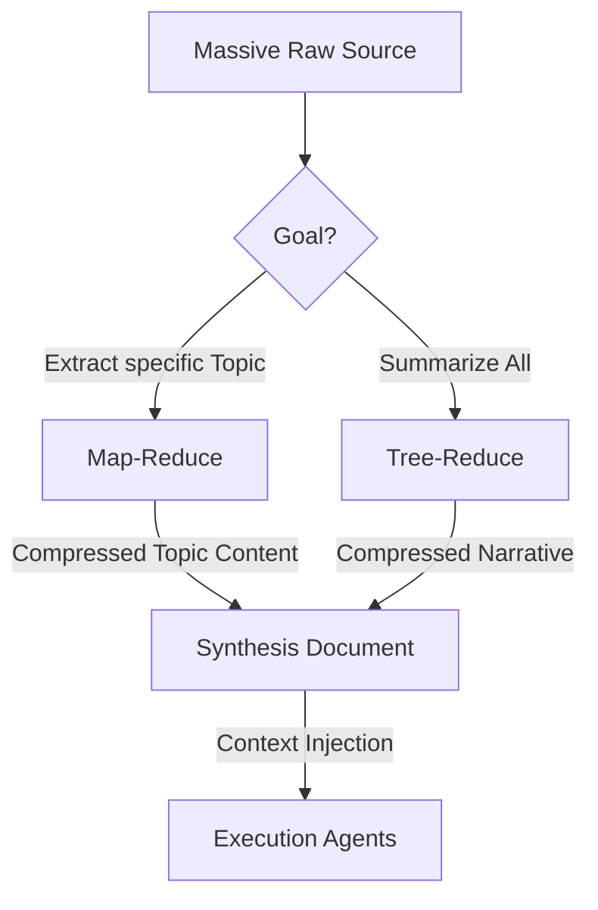

# Context Compression Strategy

**Core Concept**: Maximizing the "Signal-to-Token" ratio.

As the Knowledge Base grows, it produces more tokens than any single Agent's context window can handle (the "Context Overflow" problem). The **Context Processor** acts as a middleware engine that compresses massive raw inputs into concise, actionable context.

## 1. The Algorithms

We employ two primary algorithms, chosen based on the nature of the query.

### A. Map-Reduce (Selective Compression)
**Best For**: Creating **Focused Context Layers** from massive noise. It compresses by *filtering* irrelevant information.

*   **Example**: *"Create a focused 'Billing Guide' from the 500-page General API documentation."*
*   **The Workflow**:
    1.  **Split**: Divide the massive source into $N$ small chunks.
    2.  **Map (Filter)**: Process each chunk to generic "Fragments" containing only relevant data.
        *   *Prompt*: "Extract only sections related to Billing. Discard the rest."
    3.  **Reduce (Merge)**: Concatenate fragments into a single, high-density document.
*   **Pros**:
    *   **High Signal-to-Noise**: Removes 90% of unrelated text.
    *   **Artifact Generation**: Produces a reusable `synthesis/billing.md`.
*   **Cons**:
    *   **Fragmentation**: Narrative flow between chunks might be severed.

### B. Tree-Reduce (The "High-Level" Summarizer)
**Best For**: Holistic summarization where we need the "Big Picture" from massive data. It preserves narrative structure better than Map-Reduce.

*   **Example**: *"Synthesize a manifesto based on these 50 disconnected meeting notes."*
*   **The Workflow**:
    1.  **Split**: Divide source into $N$ chunks (Leaves).
    2.  **Level 1 Summary (Parallel)**: Summarize each leaf chunk.
        *   *Input*: 20 chunks @ 2k tokens = 40k tokens.
        *   *Output*: 20 summaries @ 200 tokens = 4k tokens.
    3.  **Level 2 Synthesis**: Group Level 1 summaries and summarize them again.
        *   *Input*: 4k tokens.
        *   *Output*: 1 Master Summary @ 500 tokens.
    4.  **Root**: The final node is the **Synthesis Document**.
*   **Pros**:
    *   **Context Preservation**: Higher levels "see" the relationship between lower levels.
    *   **Coherence**: Produces a unified narrative rather than a list of facts.
*   **Cons**:
    *   **Latency**: It requires multiple "hops" (Level 1 -> Level 2 -> Root), so it cannot be fully parallelized.

## 2. When to Use Which?

| Feature | Map-Reduce | Tree-Reduce |
| :--- | :--- | :--- |
| **Logic** | **Selective Filter** (Keep X, Drop Y) | **Holistic Summary** (Compress All) |
| **Goal** | Create Topic-Specific Specs | Create High-Level Overviews |
| **Output** | Dense, Fact-Heavy Document | Narrative, Abstract Document |
| **Use Case** | *"Extract all Error Codes"* | *"Summarize the Project Vision"* |

## 3. Integration with Synthesis Engine

The Librarian Agent uses these algorithms to **Produce Artifacts**:

## References & Further Reading
*   **LangChain Map-Reduce**: Scalable summarization pattern.
*   **LlamaIndex Tree Summarize**: Recursive reduction for response synthesis.
*   **Parse Trees Guided Compression**: Linguistically-driven prompt reduction.
