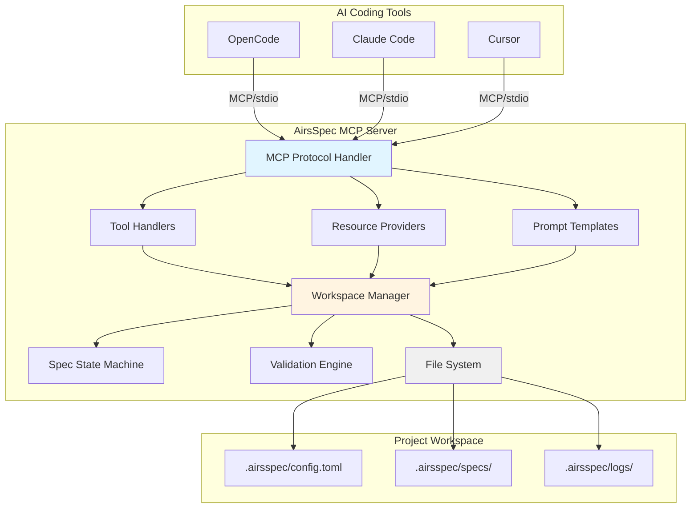
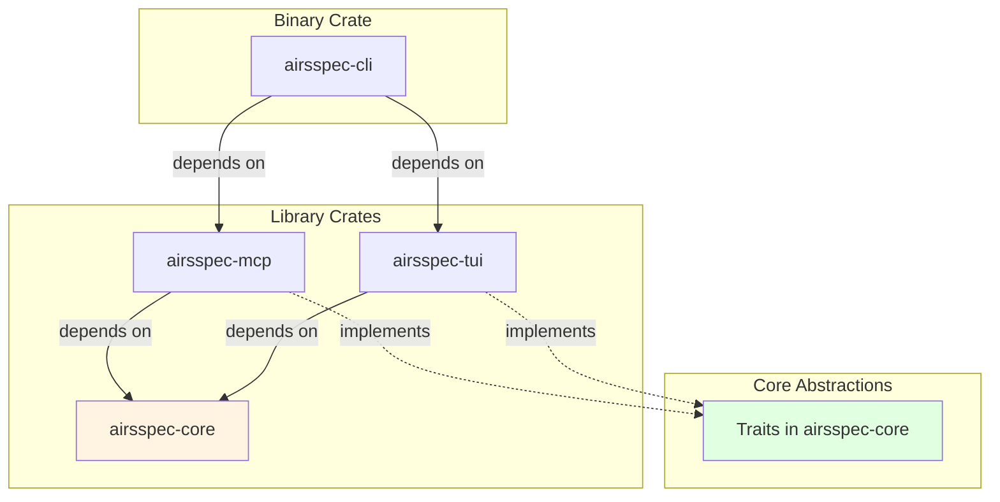
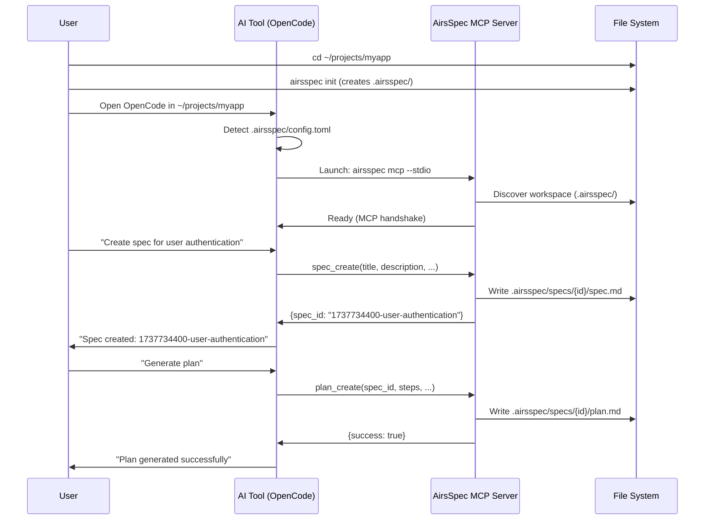
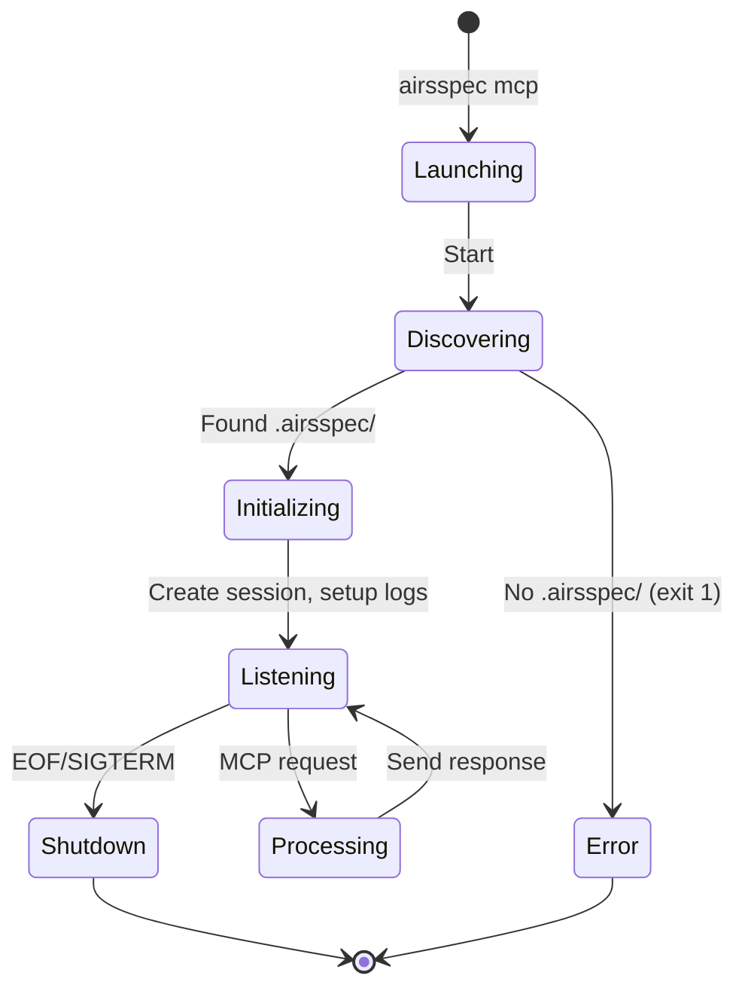
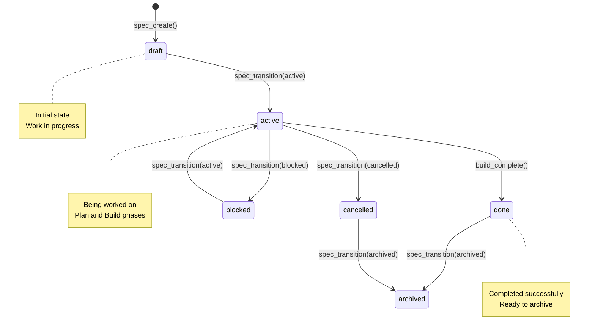

# AirsSpec Architecture Overview

**Version:** 1.0  
**Date:** 2026-01-24  
**Status:** Draft - Pending Review

---

## Executive Summary

AirsSpec is reimagined as an **MCP-first spec-driven development framework**. Instead of a standalone CLI tool with AI integrations, AirsSpec provides an MCP (Model Context Protocol) server that exposes spec workflow primitives to any agentic AI tool.

### Core Philosophy

> **"Simple by default, powerful when needed."**

- **Simplicity**: 3-phase workflow (Spec -> Plan -> Build) covers 90% of tasks
- **Extensibility**: Plugin system adds ceremony only when needed
- **MCP-Native**: Works with any MCP-compatible AI tool (OpenCode, Claude Code, Cursor, etc.)

---

## High-Level Architecture



---

## Project Structure

```
airsspec/
├── Cargo.toml                  # Workspace root
├── README.md
├── LICENSE-MIT
├── LICENSE-APACHE
├── plans/                      # Architecture & implementation plans
│   ├── 01-architecture-overview.md
│   ├── 02-crate-breakdown.md
│   ├── 03-domain-models.md
│   ├── 04-mcp-server.md
│   └── 05-implementation-roadmap.md
├── notebooks/                  # Developer journals
└── crates/
    ├── airsspec-core/          # Core domain logic
    ├── airsspec-mcp/           # MCP server implementation
    ├── airsspec-tui/           # TUI components (ratatui)
    └── airsspec-cli/           # Binary entry point
```

---

## Crate Responsibilities

### `airsspec-core` (Library)

**Purpose:** Domain logic, abstractions, and core types

**Key Principles:**
- Zero I/O operations (pure domain logic)
- Trait-based abstractions (no concrete implementations in public API)
- No external dependencies on tokio, serde_json, etc. in abstractions
- All domain rules and invariants enforced here

**Contents:**
- Domain models (Spec, Plan, State)
- State machine (lifecycle transitions)
- Validation logic (traits + implementations)
- Workspace abstraction

### `airsspec-mcp` (Library)

**Purpose:** MCP server implementation using `airsprotocols-mcp`

**Key Principles:**
- Implements MCP protocol via stdio transport
- Depends on `airsspec-core` for domain logic
- Handles MCP tool calls, resources, prompts
- Manages logging (JSONL format)

**Contents:**
- MCP server setup
- Tool handlers (spec_create, plan_generate, etc.)
- Resource providers (airsspec:/// URIs)
- Prompt templates
- Session logging

### `airsspec-tui` (Library)

**Purpose:** Interactive TUI components using ratatui

**Key Principles:**
- Stateless rendering logic
- Event-driven architecture
- Reusable widgets

**Contents:**
- Init wizard (project setup)
- Validation reporter (pretty error display)
- Shared UI components

### `airsspec-cli` (Binary)

**Purpose:** CLI entry point and command routing

**Key Principles:**
- Thin orchestration layer
- No business logic (delegates to crates)
- Handles process management

**Contents:**
- CLI argument parsing (clap)
- Command implementations (init, mcp, validate)
- Process lifecycle management

---

## Dependency Flow (Following DIP)



**Key Points:**
- `airsspec-core` has **no dependencies** on other airsspec crates
- `airsspec-mcp` and `airsspec-tui` depend on `airsspec-core` abstractions
- `airsspec-cli` orchestrates all components
- Follows Dependency Inversion Principle (DIP)

---

## MCP Integration Model

### User Workflow



### MCP Server Lifecycle



---

## Spec Lifecycle State Machine



---

## Directory Structure

### Workspace Layout

```
~/projects/myapp/
├── .airsspec/
│   ├── config.toml                  # Project configuration
│   ├── specs/
│   │   └── {timestamp}-{slug}/
│   │       ├── state.toon           # Workflow state (TOON format)
│   │       ├── spec.md              # What & Why
│   │       └── plan.md              # How & Steps
│   └── logs/
│       ├── 2026-01-24.jsonl         # Daily rotation
│       └── session-{uuid}.jsonl     # Per-session logs
└── src/
    └── main.rs                      # User's project code
```

### Spec ID Format

**Format:** `{unix-timestamp}-{title-slug}`

**Examples:**
- `1737734400-user-authentication-system`
- `1737820800-payment-integration`
- `1737907200-dark-mode-toggle`

**Rules:**
- Unix timestamp (10 digits) for sortability and uniqueness
- Slug: lowercase, hyphens, max 50 chars
- Generated automatically from spec title

---

## File Formats

| Purpose | Format | File | Rationale |
|---------|--------|------|-----------|
| Project config | TOML | `config.toml` | Human-readable, Rust-native |
| Spec metadata | YAML frontmatter | `spec.md`, `plan.md` | Developer-familiar, clean separation |
| Workflow state | TOON | `state.toon` | Token-efficient (~40% smaller than JSON) |
| MCP logs | JSONL | `*.jsonl` | Structured, streamable, line-by-line |

---

## Design Principles

### 1. **Zero-Config for Users**
- `airsspec init` creates everything
- AI tool auto-discovers via `.airsspec/config.toml`
- No background servers to manage

### 2. **100% Through AI Tool**
- No direct CLI interaction after init
- All spec/plan/build operations via MCP
- AI tool controls process lifecycle

### 3. **Single Tool, Single Project**
- MCP process launched per AI tool session
- Scoped to current working directory
- No cross-project concerns

### 4. **Permissive Error Handling**
- Collect all errors during validation
- Report everything at once (not fail-fast)
- TUI displays pretty error reports

### 5. **Following Rust Guidelines**
- DIP/DI patterns (traits as abstractions)
- Builder pattern for complex construction
- No `unsafe` code (unless absolutely necessary)
- Comprehensive testing (unit + integration)

---

## Technology Stack

| Layer | Technology | Version | Purpose |
|-------|-----------|---------|---------|
| **Protocol** | `airsprotocols-mcp` | 1.0.0-rc.1 | MCP implementation |
| **Runtime** | `tokio` | 1.x | Async runtime |
| **CLI** | `clap` | 4.x | Argument parsing |
| **TUI** | `ratatui` | 0.29 | Terminal UI |
| **Terminal** | `crossterm` | 0.28 | Terminal manipulation |
| **Serialization** | `serde` | 1.x | Data serialization |
| **Config** | `toml` | 0.8 | TOML parsing |
| **Frontmatter** | `serde_yaml` | 0.9 | YAML parsing |
| **State** | `toon-rust` | TBD | TOON format |
| **Errors** | `thiserror` | 1.x | Error types |
| **Logging** | `tracing` | 0.1 | Structured logging |

---

## Next Steps

1. Review this architecture document
2. Review detailed crate breakdown -> `02-crate-breakdown.md`
3. Review domain models design -> `03-domain-models.md`
4. Review MCP server implementation -> `04-mcp-server.md`
5. Review implementation roadmap -> `05-implementation-roadmap.md`

---

## Questions for Review

1. **Architecture Clarity**: Is the MCP-first approach clearly communicated?
2. **Crate Boundaries**: Are responsibilities well-separated between crates?
3. **Dependency Flow**: Does the dependency graph follow DIP correctly?
4. **User Experience**: Is the zero-config workflow achievable?
5. **Scalability**: Can this architecture handle future plugin system?

---

## Approval

- [ ] Architecture approved by project owner
- [ ] Ready to proceed with detailed design
- [ ] Implementation can begin

**Reviewer:** _________________  
**Date:** _________________  
**Notes:** _________________
