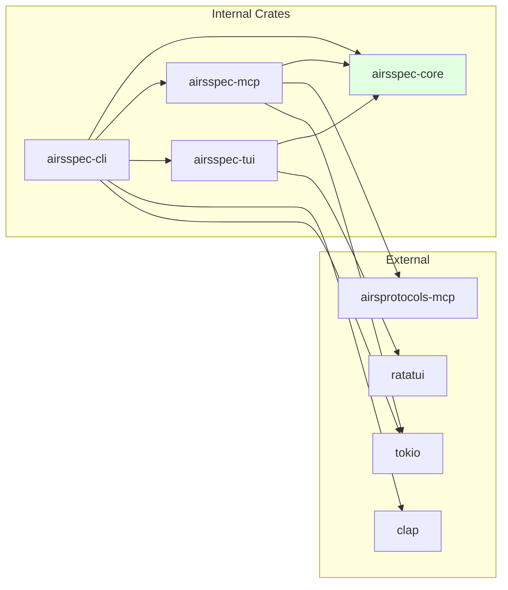

# AirsSpec Crate Breakdown

**Version:** 1.0  
**Date:** 2026-01-24  
**Status:** Draft - Pending Review

---

## Overview

This document details the structure, responsibilities, and module organization for each AirsSpec crate. All designs follow the Rust guidelines specified in `.aiassisted/guidelines/rust/`.

---

## Workspace Configuration

### Root `Cargo.toml`

```toml
[workspace]
resolver = "2"
members = [
    "crates/airsspec-core",
    "crates/airsspec-mcp",
    "crates/airsspec-tui",
    "crates/airsspec-cli",
]

[workspace.package]
version = "0.1.0"
edition = "2024"
authors = ["AirS Stack <hello@airs.dev>"]
license = "MIT OR Apache-2.0"
repository = "https://github.com/airsstack/airsspec"
rust-version = "1.83"

[workspace.dependencies]
# Internal crates
airsspec-core = { path = "crates/airsspec-core" }
airsspec-mcp = { path = "crates/airsspec-mcp" }
airsspec-tui = { path = "crates/airsspec-tui" }

# MCP Protocol
airsprotocols-mcp = "1.0.0-rc.1"

# Async runtime
tokio = { version = "1", features = ["full"] }

# Serialization
serde = { version = "1", features = ["derive"] }
serde_json = "1"
toml = "0.8"
serde_yaml = "0.9"

# CLI & TUI
clap = { version = "4", features = ["derive"] }
ratatui = "0.29"
crossterm = "0.28"

# Utilities
thiserror = "1"
anyhow = "1"
tracing = "0.1"
tracing-subscriber = { version = "0.3", features = ["json"] }
uuid = { version = "1", features = ["v4"] }
chrono = { version = "0.4", features = ["serde"] }
slug = "0.1"

# Allocator (for CLI binary)
mimalloc = "0.1"

[workspace.lints.rust]
ambiguous_negative_literals = "warn"
missing_debug_implementations = "warn"
redundant_imports = "warn"
redundant_lifetimes = "warn"
trivial_numeric_casts = "warn"
unsafe_op_in_unsafe_fn = "warn"
unused_lifetimes = "warn"

[workspace.lints.clippy]
cargo = { level = "warn", priority = -1 }
complexity = { level = "warn", priority = -1 }
correctness = { level = "warn", priority = -1 }
pedantic = { level = "warn", priority = -1 }
perf = { level = "warn", priority = -1 }
style = { level = "warn", priority = -1 }
suspicious = { level = "warn", priority = -1 }

# Restriction lints
allow_attributes_without_reason = "warn"
clone_on_ref_ptr = "warn"
deref_by_slicing = "warn"
empty_drop = "warn"
empty_enum_variants_with_brackets = "warn"
empty_structs_with_brackets = "warn"
map_err_ignore = "warn"
redundant_type_annotations = "warn"
string_to_string = "warn"
undocumented_unsafe_blocks = "warn"
unused_result_ok = "warn"
```

---

## Crate 1: `airsspec-core`

### Purpose

Core domain logic, abstractions, and types. This crate contains **zero I/O operations** and defines all traits that other crates implement.

### Design Principles

Following DIP (Dependency Inversion Principle):
- **All abstractions (traits) live here**
- No external runtime dependencies (tokio, etc.) in public API
- Other crates depend on these abstractions
- Implementations may exist here but are not required

### Module Structure

```
crates/airsspec-core/
├── Cargo.toml
└── src/
    ├── lib.rs                    # Crate root with module exports
    ├── models/                   # Domain models
    │   ├── mod.rs
    │   ├── spec.rs               # Spec, SpecId, SpecMetadata
    │   ├── plan.rs               # Plan, PlanStep
    │   ├── state.rs              # WorkflowState, LifecycleState
    │   ├── config.rs             # ProjectConfig
    │   └── dependency.rs         # Dependency, DependencyKind
    ├── traits/                   # Abstraction traits
    │   ├── mod.rs
    │   ├── workspace.rs          # WorkspaceProvider trait
    │   ├── storage.rs            # SpecStorage, StateStorage traits
    │   ├── validation.rs         # Validator trait
    │   └── id_generator.rs       # IdGenerator trait
    ├── state/                    # Lifecycle state machine
    │   ├── mod.rs
    │   └── machine.rs        # Transition rules
    ├── validation/               # Validation implementations
    │   ├── mod.rs
    │   ├── report.rs             # ValidationReport, ValidationError
    │   ├── structure.rs          # DirectoryStructureValidator
    │   ├── content.rs            # SpecContentValidator
    │   ├── dependencies.rs       # DependencyValidator
    │   └── state.rs              # StateTransitionValidator
    ├── utils/                    # Utility functions
    │   ├── mod.rs
    │   ├── slug.rs               # Slug generation
    │   └── id.rs                 # SpecId generation
    └── error.rs                  # Core error types
```

### `Cargo.toml`

```toml
[package]
name = "airsspec-core"
version.workspace = true
edition.workspace = true
license.workspace = true
repository.workspace = true
rust-version.workspace = true
description = "Core domain logic and abstractions for AirsSpec"

[dependencies]
# Minimal dependencies - only what's needed for core domain
serde = { workspace = true }
thiserror = { workspace = true }
chrono = { workspace = true }

[dev-dependencies]
# Testing utilities
```

### Key Types

```rust
// models/spec.rs
/// Unique identifier for a specification.
/// Format: {unix-timestamp}-{title-slug}
#[derive(Debug, Clone, PartialEq, Eq, Hash)]
pub struct SpecId(String);

/// A specification document with metadata.
#[derive(Debug, Clone)]
pub struct Spec {
    pub id: SpecId,
    pub metadata: SpecMetadata,
    pub content: String,
}

// models/state.rs
/// Lifecycle states for a specification.
#[derive(Debug, Clone, Copy, PartialEq, Eq)]
pub enum LifecycleState {
    Draft,
    Active,
    Done,
    Blocked,
    Cancelled,
    Archived,
}
```

### Key Traits

```rust
// traits/workspace.rs
/// Abstraction for workspace operations.
pub trait WorkspaceProvider: Send + Sync {
    /// Discover workspace from a starting path.
    fn discover(&self, start_path: &Path) -> Result<WorkspaceInfo, WorkspaceError>;
    
    /// Initialize a new workspace.
    fn initialize(&self, path: &Path, config: &ProjectConfig) -> Result<(), WorkspaceError>;
}

// traits/storage.rs
/// Abstraction for spec persistence.
pub trait SpecStorage: Send + Sync {
    fn load_spec(&self, id: &SpecId) -> Result<Option<Spec>, StorageError>;
    fn save_spec(&self, spec: &Spec) -> Result<(), StorageError>;
    fn list_specs(&self) -> Result<Vec<SpecId>, StorageError>;
    fn delete_spec(&self, id: &SpecId) -> Result<(), StorageError>;
}

// traits/validation.rs
/// Abstraction for validation logic.
pub trait Validator: Send + Sync {
    /// Validate and return a report (permissive - collects all errors).
    fn validate(&self, context: &ValidationContext) -> ValidationReport;
}
```

---

## Crate 2: `airsspec-mcp`

### Purpose

MCP server implementation using the `airsprotocols-mcp` crate. Handles all MCP protocol communication via stdio transport.

### Design Principles

- Implements core traits from `airsspec-core`
- Uses constructor injection for dependencies
- Builder pattern for complex construction
- All MCP requests/responses logged to JSONL

### Module Structure

```
crates/airsspec-mcp/
├── Cargo.toml
└── src/
    ├── lib.rs                    # Crate root
    ├── server/                   # MCP server setup
    │   ├── mod.rs
    │   ├── builder.rs            # ServerBuilder
    │   └── handler.rs            # Message handler
    ├── tools/                    # MCP tool implementations
    │   ├── mod.rs
    │   ├── registry.rs           # Tool registry
    │   ├── spec/                 # Spec tools
    │   │   ├── mod.rs
    │   │   ├── create.rs         # spec_create
    │   │   ├── update.rs         # spec_update
    │   │   ├── transition.rs     # spec_transition
    │   │   ├── list.rs           # spec_list
    │   │   ├── status.rs         # spec_status
    │   │   └── dependencies.rs   # spec_check_dependencies
    │   ├── plan/                 # Plan tools
    │   │   ├── mod.rs
    │   │   ├── create.rs         # plan_create
    │   │   ├── update.rs         # plan_update
    │   │   └── step_complete.rs  # plan_step_complete
    │   └── build/                # Build tools
    │       ├── mod.rs
    │       ├── start.rs          # build_start
    │       ├── update.rs         # build_update
    │       └── complete.rs       # build_complete
    ├── resources/                # MCP resource providers
    │   ├── mod.rs
    │   ├── provider.rs           # ResourceProvider
    │   ├── spec.rs               # airsspec:///{id}/spec
    │   ├── plan.rs               # airsspec:///{id}/plan
    │   ├── state.rs              # airsspec:///{id}/state
    │   └── config.rs             # airsspec:///config
    ├── prompts/                  # MCP prompt templates
    │   ├── mod.rs
    │   ├── registry.rs           # PromptRegistry
    │   ├── write_spec.rs
    │   ├── create_plan.rs
    │   ├── review_spec.rs
    │   ├── validate_plan.rs
    │   └── check_progress.rs
    ├── storage/                  # Storage implementations
    │   ├── mod.rs
    │   ├── filesystem.rs         # FileSystemStorage (implements SpecStorage)
    │   └── state.rs              # ToonStateStorage
    ├── logging/                  # JSONL logging
    │   ├── mod.rs
    │   ├── session.rs            # SessionLogger
    │   └── entry.rs              # LogEntry types
    └── error.rs                  # MCP-specific errors
```

### `Cargo.toml`

```toml
[package]
name = "airsspec-mcp"
version.workspace = true
edition.workspace = true
license.workspace = true
repository.workspace = true
rust-version.workspace = true
description = "MCP server implementation for AirsSpec"

[dependencies]
airsspec-core = { workspace = true }
airsprotocols-mcp = { workspace = true }
tokio = { workspace = true }
serde = { workspace = true }
serde_json = { workspace = true }
toml = { workspace = true }
serde_yaml = { workspace = true }
thiserror = { workspace = true }
tracing = { workspace = true }
uuid = { workspace = true }
chrono = { workspace = true }

[dev-dependencies]
tokio-test = "0.4"
```

### Key Types

```rust
// server/builder.rs
/// Builder for constructing the MCP server.
pub struct McpServerBuilder {
    workspace_path: Option<PathBuf>,
    debug: bool,
    storage: Option<Arc<dyn SpecStorage>>,
}

impl McpServerBuilder {
    pub fn new() -> Self { ... }
    
    pub fn with_workspace(mut self, path: PathBuf) -> Self { ... }
    
    pub fn with_debug(mut self, debug: bool) -> Self { ... }
    
    pub fn with_storage(mut self, storage: Arc<dyn SpecStorage>) -> Self { ... }
    
    pub async fn build(self) -> Result<McpServer, ServerError> { ... }
}

// server/handler.rs
/// Main MCP server that handles requests.
pub struct McpServer {
    storage: Arc<dyn SpecStorage>,
    state_machine: StateMachine,
    logger: SessionLogger,
    tool_registry: ToolRegistry,
    resource_provider: ResourceProvider,
    prompt_registry: PromptRegistry,
}

impl McpServer {
    pub async fn run(self) -> Result<(), ServerError> {
        // Main stdio loop
    }
}
```

---

## Crate 3: `airsspec-tui`

### Purpose

Interactive terminal UI components using ratatui. Provides wizards and reporters for CLI commands.

### Design Principles

- Stateless rendering (state passed in, not stored)
- Event-driven architecture
- Reusable widget components
- Clear separation between UI and logic

### Module Structure

```
crates/airsspec-tui/
├── Cargo.toml
└── src/
    ├── lib.rs                    # Crate root
    ├── wizard/                   # Interactive wizards
    │   ├── mod.rs
    │   ├── init.rs               # InitWizard
    │   └── state.rs              # Wizard state management
    ├── reporter/                 # Report displays
    │   ├── mod.rs
    │   └── validation.rs         # ValidationReporter
    ├── widgets/                  # Reusable widgets
    │   ├── mod.rs
    │   ├── input.rs              # Text input widget
    │   ├── select.rs             # Selection widget
    │   └── progress.rs           # Progress indicator
    ├── theme/                    # Theming
    │   ├── mod.rs
    │   └── colors.rs             # Color definitions
    └── error.rs                  # TUI-specific errors
```

### `Cargo.toml`

```toml
[package]
name = "airsspec-tui"
version.workspace = true
edition.workspace = true
license.workspace = true
repository.workspace = true
rust-version.workspace = true
description = "Terminal UI components for AirsSpec"

[dependencies]
airsspec-core = { workspace = true }
ratatui = { workspace = true }
crossterm = { workspace = true }
thiserror = { workspace = true }

[dev-dependencies]
```

### Key Types

```rust
// wizard/init.rs
/// Interactive wizard for initializing a new AirsSpec workspace.
pub struct InitWizard {
    current_step: WizardStep,
    project_name: String,
    project_description: String,
}

impl InitWizard {
    pub fn new() -> Self { ... }
    
    /// Run the wizard and return the configured ProjectConfig.
    pub fn run(&mut self, terminal: &mut Terminal<impl Backend>) 
        -> Result<ProjectConfig, WizardError> { ... }
}

// reporter/validation.rs
/// Pretty-prints validation results with colors and formatting.
pub struct ValidationReporter<'a> {
    report: &'a ValidationReport,
}

impl<'a> ValidationReporter<'a> {
    pub fn new(report: &'a ValidationReport) -> Self { ... }
    
    /// Display the validation report in the terminal.
    pub fn display(&self, terminal: &mut Terminal<impl Backend>) 
        -> Result<(), ReporterError> { ... }
}
```

---

## Crate 4: `airsspec-cli`

### Purpose

Binary entry point that orchestrates all other crates. Handles CLI argument parsing and command routing.

### Design Principles

- Thin orchestration layer
- No business logic (delegates to library crates)
- Uses mimalloc for performance (M-MIMALLOC-APPS)
- Clear command structure

### Module Structure

```
crates/airsspec-cli/
├── Cargo.toml
└── src/
    ├── main.rs                   # Entry point with global allocator
    ├── cli.rs                    # CLI argument definitions
    └── commands/                 # Command implementations
        ├── mod.rs
        ├── init.rs               # airsspec init
        ├── mcp.rs                # airsspec mcp
        └── validate.rs           # airsspec validate
```

### `Cargo.toml`

```toml
[package]
name = "airsspec"
version.workspace = true
edition.workspace = true
license.workspace = true
repository.workspace = true
rust-version.workspace = true
description = "Lightweight Spec-Driven Development Framework"

[[bin]]
name = "airsspec"
path = "src/main.rs"

[dependencies]
airsspec-core = { workspace = true }
airsspec-mcp = { workspace = true }
airsspec-tui = { workspace = true }
clap = { workspace = true }
tokio = { workspace = true }
anyhow = { workspace = true }
tracing = { workspace = true }
tracing-subscriber = { workspace = true }
mimalloc = { workspace = true }

[dev-dependencies]
```

### Key Code

```rust
// main.rs
use mimalloc::MiMalloc;

#[global_allocator]
static GLOBAL: MiMalloc = MiMalloc;

#[tokio::main]
async fn main() -> anyhow::Result<()> {
    let cli = Cli::parse();
    
    match cli.command {
        Commands::Init => commands::init::run().await,
        Commands::Mcp { debug } => commands::mcp::run(debug).await,
        Commands::Validate => commands::validate::run().await,
    }
}

// cli.rs
use clap::{Parser, Subcommand};

#[derive(Parser)]
#[command(name = "airsspec")]
#[command(about = "Lightweight Spec-Driven Development Framework")]
#[command(version)]
pub struct Cli {
    #[command(subcommand)]
    pub command: Commands,
}

#[derive(Subcommand)]
pub enum Commands {
    /// Initialize .airsspec/ in current directory
    Init,
    
    /// Start MCP server (stdio mode)
    Mcp {
        /// Enable debug logging
        #[arg(long)]
        debug: bool,
    },
    
    /// Validate .airsspec/ artifacts
    Validate,
}
```

---

## Dependency Graph Summary



---

## Verification Checklist

Before implementation, verify:

- [ ] `airsspec-core` has no dependencies on other airsspec crates
- [ ] All traits are defined in `airsspec-core`
- [ ] `airsspec-mcp` and `airsspec-tui` only depend on `airsspec-core`
- [ ] `airsspec-cli` is the only binary crate
- [ ] No circular dependencies between crates
- [ ] All public types implement `Debug` (M-PUBLIC-DEBUG)
- [ ] All modules have documentation (M-MODULE-DOCS)
- [ ] Constructor injection used for dependencies (DIP)
- [ ] Builder pattern used for complex construction

---

## Approval

- [ ] Crate breakdown approved by project owner
- [ ] Module structure is clear and logical
- [ ] Ready to proceed with domain models design

**Reviewer:** _________________  
**Date:** _________________  
**Notes:** _________________
