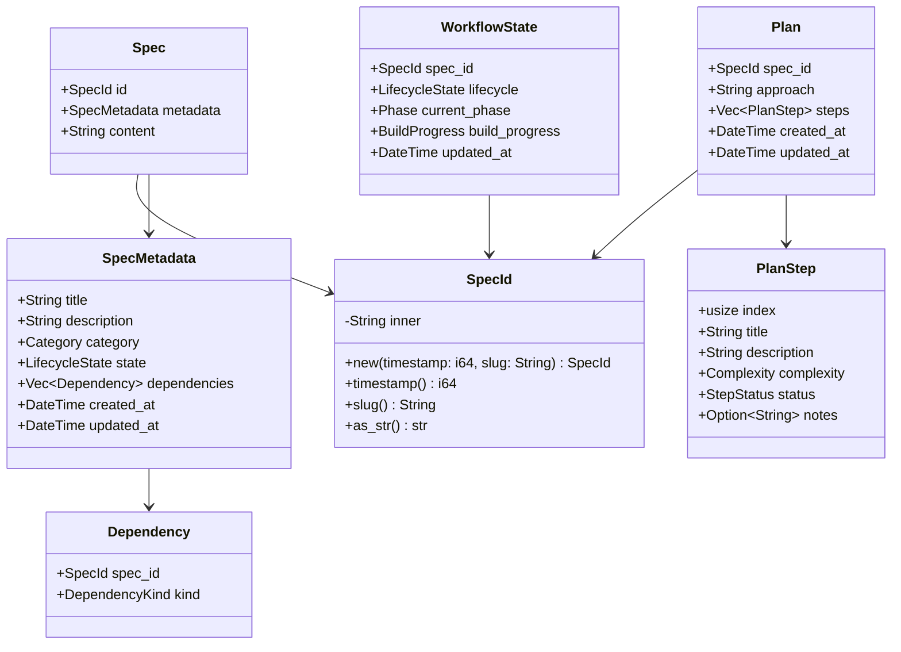

# AirsSpec Domain Models

**Version:** 1.0  
**Date:** 2026-01-24  
**Status:** Draft - Pending Review

---

## Overview

This document details all domain models, traits, and core types in `airsspec-core`. These types form the foundation of the entire AirsSpec system.

All designs follow:
- Dependency Inversion Principle (DIP)
- Rust API Guidelines (C-COMMON-TRAITS, C-NEWTYPE, etc.)
- AirS Stack Rust Guidelines

---

## Domain Model Diagram



---

## Core Types

### SpecId

Unique identifier for specifications. Follows the newtype pattern (C-NEWTYPE).

```rust
use std::fmt::{self, Display, Formatter};

/// Unique identifier for a specification.
/// 
/// Format: `{unix-timestamp}-{title-slug}`
/// 
/// # Examples
/// 
/// ```
/// use airsspec_core::SpecId;
/// 
/// let id = SpecId::new(1737734400, "user-authentication".to_string());
/// assert_eq!(id.as_str(), "1737734400-user-authentication");
/// assert_eq!(id.timestamp(), 1737734400);
/// assert_eq!(id.slug(), "user-authentication");
/// ```
#[derive(Debug, Clone, PartialEq, Eq, Hash)]
pub struct SpecId(String);

impl SpecId {
    /// Maximum length for the slug portion.
    pub const MAX_SLUG_LENGTH: usize = 50;
    
    /// Creates a new SpecId from timestamp and slug.
    /// 
    /// # Panics
    /// 
    /// Panics if slug is empty or exceeds MAX_SLUG_LENGTH.
    pub fn new(timestamp: i64, slug: String) -> Self {
        assert!(!slug.is_empty(), "slug cannot be empty");
        assert!(
            slug.len() <= Self::MAX_SLUG_LENGTH,
            "slug exceeds maximum length of {} characters",
            Self::MAX_SLUG_LENGTH
        );
        Self(format!("{}-{}", timestamp, slug))
    }
    
    /// Parses a SpecId from a string.
    pub fn parse(s: &str) -> Result<Self, SpecIdParseError> {
        let parts: Vec<&str> = s.splitn(2, '-').collect();
        if parts.len() != 2 {
            return Err(SpecIdParseError::InvalidFormat);
        }
        
        let timestamp: i64 = parts[0]
            .parse()
            .map_err(|_| SpecIdParseError::InvalidTimestamp)?;
        
        let slug = parts[1].to_string();
        if slug.is_empty() {
            return Err(SpecIdParseError::EmptySlug);
        }
        if slug.len() > Self::MAX_SLUG_LENGTH {
            return Err(SpecIdParseError::SlugTooLong);
        }
        
        Ok(Self(s.to_string()))
    }
    
    /// Returns the unix timestamp portion.
    pub fn timestamp(&self) -> i64 {
        self.0
            .split('-')
            .next()
            .and_then(|s| s.parse().ok())
            .unwrap_or(0)
    }
    
    /// Returns the slug portion.
    pub fn slug(&self) -> &str {
        self.0.splitn(2, '-').nth(1).unwrap_or("")
    }
    
    /// Returns the full ID as a string slice.
    pub fn as_str(&self) -> &str {
        &self.0
    }
}

impl Display for SpecId {
    fn fmt(&self, f: &mut Formatter<'_>) -> fmt::Result {
        write!(f, "{}", self.0)
    }
}

impl AsRef<str> for SpecId {
    fn as_ref(&self) -> &str {
        &self.0
    }
}

/// Error when parsing a SpecId.
#[derive(Debug, Clone, PartialEq, Eq, thiserror::Error)]
pub enum SpecIdParseError {
    #[error("invalid spec ID format, expected {{timestamp}}-{{slug}}")]
    InvalidFormat,
    #[error("invalid timestamp in spec ID")]
    InvalidTimestamp,
    #[error("slug portion is empty")]
    EmptySlug,
    #[error("slug exceeds maximum length")]
    SlugTooLong,
}
```

### Category

Category type for specifications.

```rust
use serde::{Deserialize, Serialize};

/// Category of a specification.
#[derive(Debug, Clone, Copy, PartialEq, Eq, Hash, Serialize, Deserialize)]
#[serde(rename_all = "lowercase")]
pub enum Category {
    /// New feature implementation
    Feature,
    /// Bug fix
    Bugfix,
    /// Code refactoring
    Refactor,
    /// Documentation changes
    Docs,
    /// Other changes
    Other,
}

impl Default for Category {
    fn default() -> Self {
        Self::Feature
    }
}

impl std::fmt::Display for Category {
    fn fmt(&self, f: &mut std::fmt::Formatter<'_>) -> std::fmt::Result {
        match self {
            Self::Feature => write!(f, "feature"),
            Self::Bugfix => write!(f, "bugfix"),
            Self::Refactor => write!(f, "refactor"),
            Self::Docs => write!(f, "docs"),
            Self::Other => write!(f, "other"),
        }
    }
}
```

### LifecycleState

Lifecycle states for specifications.

```rust
use serde::{Deserialize, Serialize};

/// Lifecycle state of a specification.
/// 
/// State transitions are managed by the state machine.
/// See `StateMachine::can_transition` for valid transitions.
#[derive(Debug, Clone, Copy, PartialEq, Eq, Hash, Serialize, Deserialize)]
#[serde(rename_all = "lowercase")]
pub enum LifecycleState {
    /// Work in progress, not ready for implementation
    Draft,
    /// Being actively worked on
    Active,
    /// Successfully completed
    Done,
    /// Waiting on external dependencies
    Blocked,
    /// Abandoned or no longer needed
    Cancelled,
    /// Preserved for historical reference
    Archived,
}

impl Default for LifecycleState {
    fn default() -> Self {
        Self::Draft
    }
}

impl std::fmt::Display for LifecycleState {
    fn fmt(&self, f: &mut std::fmt::Formatter<'_>) -> std::fmt::Result {
        match self {
            Self::Draft => write!(f, "draft"),
            Self::Active => write!(f, "active"),
            Self::Done => write!(f, "done"),
            Self::Blocked => write!(f, "blocked"),
            Self::Cancelled => write!(f, "cancelled"),
            Self::Archived => write!(f, "archived"),
        }
    }
}
```

### Dependency

Dependency between specifications.

```rust
use serde::{Deserialize, Serialize};

/// A dependency on another specification.
#[derive(Debug, Clone, PartialEq, Eq, Serialize, Deserialize)]
pub struct Dependency {
    /// ID of the spec this depends on
    pub spec_id: SpecId,
    /// Kind of dependency
    pub kind: DependencyKind,
}

/// Kind of dependency relationship.
#[derive(Debug, Clone, Copy, PartialEq, Eq, Hash, Serialize, Deserialize)]
#[serde(rename_all = "lowercase")]
pub enum DependencyKind {
    /// Hard dependency - blocks progression until resolved
    Hard,
    /// Soft dependency - informational only, doesn't block
    Soft,
}

impl Default for DependencyKind {
    fn default() -> Self {
        Self::Soft
    }
}
```

### Spec

The main specification document.

```rust
use chrono::{DateTime, Utc};
use serde::{Deserialize, Serialize};

/// Metadata for a specification.
#[derive(Debug, Clone, Serialize, Deserialize)]
pub struct SpecMetadata {
    /// Human-readable title
    pub title: String,
    /// Detailed description of what and why
    pub description: String,
    /// Category of change
    #[serde(default)]
    pub category: Category,
    /// Current lifecycle state
    #[serde(default)]
    pub state: LifecycleState,
    /// Dependencies on other specs
    #[serde(default)]
    pub dependencies: Vec<Dependency>,
    /// When the spec was created
    pub created_at: DateTime<Utc>,
    /// When the spec was last updated
    pub updated_at: DateTime<Utc>,
}

/// A complete specification document.
#[derive(Debug, Clone)]
pub struct Spec {
    /// Unique identifier
    pub id: SpecId,
    /// Spec metadata (stored in YAML frontmatter)
    pub metadata: SpecMetadata,
    /// Markdown content (body of spec.md)
    pub content: String,
}

impl Spec {
    /// Creates a new spec with the given parameters.
    pub fn new(id: SpecId, title: String, description: String, category: Category) -> Self {
        let now = Utc::now();
        Self {
            id,
            metadata: SpecMetadata {
                title,
                description,
                category,
                state: LifecycleState::Draft,
                dependencies: Vec::new(),
                created_at: now,
                updated_at: now,
            },
            content: String::new(),
        }
    }
    
    /// Updates the spec content and timestamp.
    pub fn update_content(&mut self, content: String) {
        self.content = content;
        self.metadata.updated_at = Utc::now();
    }
    
    /// Adds a dependency to this spec.
    pub fn add_dependency(&mut self, dep: Dependency) {
        self.metadata.dependencies.push(dep);
        self.metadata.updated_at = Utc::now();
    }
}
```

### Plan

Implementation plan for a specification.

```rust
use chrono::{DateTime, Utc};
use serde::{Deserialize, Serialize};

/// Complexity estimate for a plan step.
#[derive(Debug, Clone, Copy, PartialEq, Eq, Hash, Serialize, Deserialize)]
#[serde(rename_all = "lowercase")]
pub enum Complexity {
    Trivial,
    Simple,
    Moderate,
    Complex,
}

impl Default for Complexity {
    fn default() -> Self {
        Self::Simple
    }
}

/// Status of a plan step.
#[derive(Debug, Clone, Copy, PartialEq, Eq, Hash, Serialize, Deserialize)]
#[serde(rename_all = "lowercase")]
pub enum StepStatus {
    Pending,
    InProgress,
    Completed,
    Skipped,
}

impl Default for StepStatus {
    fn default() -> Self {
        Self::Pending
    }
}

/// A single step in an implementation plan.
#[derive(Debug, Clone, Serialize, Deserialize)]
pub struct PlanStep {
    /// Step index (0-based)
    pub index: usize,
    /// Step title
    pub title: String,
    /// Detailed description
    pub description: String,
    /// Estimated complexity
    #[serde(default)]
    pub complexity: Complexity,
    /// Current status
    #[serde(default)]
    pub status: StepStatus,
    /// Implementation notes (filled in during build)
    #[serde(default)]
    pub notes: Option<String>,
}

/// Implementation plan for a specification.
#[derive(Debug, Clone, Serialize, Deserialize)]
pub struct Plan {
    /// ID of the spec this plan belongs to
    pub spec_id: SpecId,
    /// High-level approach/strategy
    pub approach: String,
    /// Ordered list of implementation steps
    pub steps: Vec<PlanStep>,
    /// When the plan was created
    pub created_at: DateTime<Utc>,
    /// When the plan was last updated
    pub updated_at: DateTime<Utc>,
}

impl Plan {
    /// Creates a new plan for the given spec.
    pub fn new(spec_id: SpecId, approach: String, steps: Vec<PlanStep>) -> Self {
        let now = Utc::now();
        Self {
            spec_id,
            approach,
            steps,
            created_at: now,
            updated_at: now,
        }
    }
    
    /// Marks a step as completed with optional notes.
    pub fn complete_step(&mut self, index: usize, notes: Option<String>) -> Result<(), PlanError> {
        let step = self.steps.get_mut(index).ok_or(PlanError::StepNotFound)?;
        step.status = StepStatus::Completed;
        step.notes = notes;
        self.updated_at = Utc::now();
        Ok(())
    }
    
    /// Returns the completion percentage (0-100).
    pub fn completion_percentage(&self) -> u8 {
        if self.steps.is_empty() {
            return 100;
        }
        let completed = self.steps.iter()
            .filter(|s| s.status == StepStatus::Completed)
            .count();
        ((completed * 100) / self.steps.len()) as u8
    }
}

/// Errors related to plan operations.
#[derive(Debug, Clone, thiserror::Error)]
pub enum PlanError {
    #[error("step not found at index")]
    StepNotFound,
}
```

### WorkflowState

Current workflow state for a spec (stored in TOON format).

```rust
use chrono::{DateTime, Utc};
use serde::{Deserialize, Serialize};

/// Current phase in the workflow.
#[derive(Debug, Clone, Copy, PartialEq, Eq, Hash, Serialize, Deserialize)]
#[serde(rename_all = "lowercase")]
pub enum Phase {
    /// Specification phase
    Spec,
    /// Planning phase
    Plan,
    /// Build/implementation phase
    Build,
}

impl Default for Phase {
    fn default() -> Self {
        Self::Spec
    }
}

/// Build progress tracking.
#[derive(Debug, Clone, Default, Serialize, Deserialize)]
pub struct BuildProgress {
    /// Percentage complete (0-100)
    pub percentage: u8,
    /// Current step being worked on
    pub current_step: Option<String>,
    /// Build notes
    pub notes: Option<String>,
}

/// Complete workflow state for a specification.
/// 
/// This is persisted in TOON format for token efficiency.
#[derive(Debug, Clone, Serialize, Deserialize)]
pub struct WorkflowState {
    /// ID of the spec
    pub spec_id: SpecId,
    /// Current lifecycle state
    pub lifecycle: LifecycleState,
    /// Current workflow phase
    pub phase: Phase,
    /// Build progress (if in build phase)
    #[serde(default)]
    pub build_progress: BuildProgress,
    /// Last update timestamp
    pub updated_at: DateTime<Utc>,
}

impl WorkflowState {
    /// Creates initial state for a new spec.
    pub fn new(spec_id: SpecId) -> Self {
        Self {
            spec_id,
            lifecycle: LifecycleState::Draft,
            phase: Phase::Spec,
            build_progress: BuildProgress::default(),
            updated_at: Utc::now(),
        }
    }
}
```

### ProjectConfig

Project-level configuration (stored in TOML).

```rust
use serde::{Deserialize, Serialize};

/// Project configuration stored in .airsspec/config.toml
#[derive(Debug, Clone, Serialize, Deserialize)]
pub struct ProjectConfig {
    /// Project information
    pub project: ProjectInfo,
    /// Spec defaults
    #[serde(default)]
    pub defaults: SpecDefaults,
}

/// Basic project information.
#[derive(Debug, Clone, Serialize, Deserialize)]
pub struct ProjectInfo {
    /// Project name
    pub name: String,
    /// Project description
    pub description: String,
}

/// Default values for new specs.
#[derive(Debug, Clone, Default, Serialize, Deserialize)]
pub struct SpecDefaults {
    /// Default category for new specs
    #[serde(default)]
    pub category: Category,
}

impl ProjectConfig {
    /// Creates a new project configuration.
    pub fn new(name: String, description: String) -> Self {
        Self {
            project: ProjectInfo { name, description },
            defaults: SpecDefaults::default(),
        }
    }
}
```

---

## State Machine

The state machine enforces valid lifecycle transitions.

```rust
use crate::models::LifecycleState;

/// State machine for spec lifecycle transitions.
/// 
/// Valid transitions:
/// - draft -> active
/// - active -> done, blocked, cancelled
/// - blocked -> active
/// - done -> archived
/// - cancelled -> archived
#[derive(Debug, Clone, Default)]
pub struct StateMachine;

impl StateMachine {
    /// Creates a new state machine instance.
    pub fn new() -> Self {
        Self
    }
    
    /// Checks if a transition from one state to another is valid.
    pub fn can_transition(&self, from: LifecycleState, to: LifecycleState) -> bool {
        use LifecycleState::*;
        
        matches!(
            (from, to),
            (Draft, Active) |
            (Active, Done) |
            (Active, Blocked) |
            (Active, Cancelled) |
            (Blocked, Active) |
            (Done, Archived) |
            (Cancelled, Archived)
        )
    }
    
    /// Returns all valid transitions from the given state.
    pub fn valid_transitions(&self, from: LifecycleState) -> Vec<LifecycleState> {
        use LifecycleState::*;
        
        match from {
            Draft => vec![Active],
            Active => vec![Done, Blocked, Cancelled],
            Blocked => vec![Active],
            Done => vec![Archived],
            Cancelled => vec![Archived],
            Archived => vec![],
        }
    }
    
    /// Attempts a state transition, returning error if invalid.
    pub fn transition(
        &self,
        current: LifecycleState,
        target: LifecycleState,
    ) -> Result<LifecycleState, TransitionError> {
        if !self.can_transition(current, target) {
            return Err(TransitionError::InvalidTransition {
                from: current,
                to: target,
            });
        }
        Ok(target)
    }
}

/// Errors related to state transitions.
#[derive(Debug, Clone, thiserror::Error)]
pub enum TransitionError {
    #[error("invalid transition from {from} to {to}")]
    InvalidTransition {
        from: LifecycleState,
        to: LifecycleState,
    },
}
```

---

## Validation Framework

### Validation Report

```rust
use std::path::PathBuf;

/// Result of validation - collects all errors and warnings.
#[derive(Debug, Clone, Default)]
pub struct ValidationReport {
    /// All errors found
    pub errors: Vec<ValidationError>,
    /// All warnings found
    pub warnings: Vec<ValidationWarning>,
}

impl ValidationReport {
    /// Creates an empty report.
    pub fn new() -> Self {
        Self::default()
    }
    
    /// Returns true if no errors were found.
    pub fn is_valid(&self) -> bool {
        self.errors.is_empty()
    }
    
    /// Adds an error to the report.
    pub fn add_error(&mut self, error: ValidationError) {
        self.errors.push(error);
    }
    
    /// Adds a warning to the report.
    pub fn add_warning(&mut self, warning: ValidationWarning) {
        self.warnings.push(warning);
    }
    
    /// Merges another report into this one.
    pub fn merge(&mut self, other: ValidationReport) {
        self.errors.extend(other.errors);
        self.warnings.extend(other.warnings);
    }
}

/// Validation error types.
#[derive(Debug, Clone, thiserror::Error)]
pub enum ValidationError {
    #[error("missing required directory: {0}")]
    MissingDirectory(PathBuf),
    
    #[error("missing required file: {0}")]
    MissingFile(PathBuf),
    
    #[error("invalid spec structure in {spec_id}: {reason}")]
    InvalidSpecStructure {
        spec_id: SpecId,
        reason: String,
    },
    
    #[error("invalid plan structure in {spec_id}: {reason}")]
    InvalidPlanStructure {
        spec_id: SpecId,
        reason: String,
    },
    
    #[error("broken dependency: {spec_id} depends on missing spec {missing_id}")]
    BrokenDependency {
        spec_id: SpecId,
        missing_id: SpecId,
    },
    
    #[error("invalid state transition in {spec_id}: {reason}")]
    InvalidStateTransition {
        spec_id: SpecId,
        reason: String,
    },
    
    #[error("invalid config: {reason}")]
    InvalidConfig {
        reason: String,
    },
}

/// Validation warning types.
#[derive(Debug, Clone)]
pub enum ValidationWarning {
    /// Spec is in draft state for a long time
    StaleDraft { spec_id: SpecId, days: u32 },
    /// Dependency is on a cancelled spec
    DependencyOnCancelled { spec_id: SpecId, cancelled_id: SpecId },
    /// Empty spec content
    EmptySpecContent { spec_id: SpecId },
    /// Plan has no steps
    EmptyPlan { spec_id: SpecId },
}
```

### Validator Trait

```rust
use crate::validation::ValidationReport;

/// Context for validation operations.
#[derive(Debug)]
pub struct ValidationContext {
    /// Path to the workspace root
    pub workspace_path: PathBuf,
    /// All loaded specs
    pub specs: Vec<Spec>,
    /// All loaded plans
    pub plans: Vec<Plan>,
    /// Project configuration
    pub config: Option<ProjectConfig>,
}

/// Trait for validation implementations.
/// 
/// Validators are designed to be composable. Each validator checks
/// a specific aspect and returns a report. Reports are merged for
/// the final validation result.
pub trait Validator: Send + Sync {
    /// Returns the name of this validator.
    fn name(&self) -> &'static str;
    
    /// Performs validation and returns a report.
    /// 
    /// This is permissive - it collects all errors rather than
    /// failing on the first one.
    fn validate(&self, context: &ValidationContext) -> ValidationReport;
}
```

### Validator Implementations

```rust
/// Validates directory structure.
pub struct DirectoryStructureValidator;

impl Validator for DirectoryStructureValidator {
    fn name(&self) -> &'static str {
        "directory-structure"
    }
    
    fn validate(&self, context: &ValidationContext) -> ValidationReport {
        let mut report = ValidationReport::new();
        
        // Check required directories
        let required_dirs = [
            context.workspace_path.join("specs"),
            context.workspace_path.join("logs"),
        ];
        
        for dir in &required_dirs {
            if !dir.exists() || !dir.is_dir() {
                report.add_error(ValidationError::MissingDirectory(dir.clone()));
            }
        }
        
        // Check config file
        let config_path = context.workspace_path.join("config.toml");
        if !config_path.exists() {
            report.add_error(ValidationError::MissingFile(config_path));
        }
        
        report
    }
}

/// Validates spec content structure.
pub struct SpecContentValidator;

impl Validator for SpecContentValidator {
    fn name(&self) -> &'static str {
        "spec-content"
    }
    
    fn validate(&self, context: &ValidationContext) -> ValidationReport {
        let mut report = ValidationReport::new();
        
        for spec in &context.specs {
            // Check required metadata fields
            if spec.metadata.title.is_empty() {
                report.add_error(ValidationError::InvalidSpecStructure {
                    spec_id: spec.id.clone(),
                    reason: "title is empty".to_string(),
                });
            }
            
            if spec.metadata.description.is_empty() {
                report.add_error(ValidationError::InvalidSpecStructure {
                    spec_id: spec.id.clone(),
                    reason: "description is empty".to_string(),
                });
            }
            
            // Warn if content is empty
            if spec.content.trim().is_empty() {
                report.add_warning(ValidationWarning::EmptySpecContent {
                    spec_id: spec.id.clone(),
                });
            }
        }
        
        report
    }
}

/// Validates dependencies between specs.
pub struct DependencyValidator;

impl Validator for DependencyValidator {
    fn name(&self) -> &'static str {
        "dependencies"
    }
    
    fn validate(&self, context: &ValidationContext) -> ValidationReport {
        let mut report = ValidationReport::new();
        
        let spec_ids: std::collections::HashSet<_> = 
            context.specs.iter().map(|s| &s.id).collect();
        
        for spec in &context.specs {
            for dep in &spec.metadata.dependencies {
                // Check if dependency exists
                if !spec_ids.contains(&dep.spec_id) {
                    report.add_error(ValidationError::BrokenDependency {
                        spec_id: spec.id.clone(),
                        missing_id: dep.spec_id.clone(),
                    });
                }
                
                // Warn if depending on cancelled spec
                if let Some(dep_spec) = context.specs.iter().find(|s| s.id == dep.spec_id) {
                    if dep_spec.metadata.state == LifecycleState::Cancelled {
                        report.add_warning(ValidationWarning::DependencyOnCancelled {
                            spec_id: spec.id.clone(),
                            cancelled_id: dep.spec_id.clone(),
                        });
                    }
                }
            }
        }
        
        report
    }
}

/// Validates state transitions are legal.
pub struct StateTransitionValidator {
    state_machine: StateMachine,
}

impl StateTransitionValidator {
    pub fn new() -> Self {
        Self {
            state_machine: StateMachine::new(),
        }
    }
}

impl Validator for StateTransitionValidator {
    fn name(&self) -> &'static str {
        "state-transitions"
    }
    
    fn validate(&self, context: &ValidationContext) -> ValidationReport {
        let mut report = ValidationReport::new();
        
        for spec in &context.specs {
            // Validate current state is reachable
            let valid_states = self.state_machine.valid_transitions(spec.metadata.state);
            
            // Check blocked specs have valid reason (if we had reason field)
            if spec.metadata.state == LifecycleState::Blocked {
                // Could add warning if blocked with no dependencies
                if spec.metadata.dependencies.is_empty() {
                    report.add_warning(ValidationWarning::StaleDraft {
                        spec_id: spec.id.clone(),
                        days: 0, // Would calculate from created_at
                    });
                }
            }
        }
        
        report
    }
}
```

---

## Core Traits (Abstractions)

### Storage Traits

```rust
use std::sync::Arc;
use async_trait::async_trait;

/// Abstraction for spec persistence.
/// 
/// Implementations handle the actual file I/O.
#[async_trait]
pub trait SpecStorage: Send + Sync {
    /// Loads a spec by ID.
    async fn load_spec(&self, id: &SpecId) -> Result<Option<Spec>, StorageError>;
    
    /// Saves a spec (creates or updates).
    async fn save_spec(&self, spec: &Spec) -> Result<(), StorageError>;
    
    /// Lists all spec IDs.
    async fn list_specs(&self) -> Result<Vec<SpecId>, StorageError>;
    
    /// Deletes a spec.
    async fn delete_spec(&self, id: &SpecId) -> Result<(), StorageError>;
}

/// Abstraction for plan persistence.
#[async_trait]
pub trait PlanStorage: Send + Sync {
    /// Loads a plan by spec ID.
    async fn load_plan(&self, spec_id: &SpecId) -> Result<Option<Plan>, StorageError>;
    
    /// Saves a plan.
    async fn save_plan(&self, plan: &Plan) -> Result<(), StorageError>;
}

/// Abstraction for workflow state persistence.
#[async_trait]
pub trait StateStorage: Send + Sync {
    /// Loads workflow state by spec ID.
    async fn load_state(&self, spec_id: &SpecId) -> Result<Option<WorkflowState>, StorageError>;
    
    /// Saves workflow state.
    async fn save_state(&self, state: &WorkflowState) -> Result<(), StorageError>;
}

/// Storage errors.
#[derive(Debug, thiserror::Error)]
pub enum StorageError {
    #[error("I/O error: {0}")]
    Io(#[from] std::io::Error),
    
    #[error("serialization error: {0}")]
    Serialization(String),
    
    #[error("deserialization error: {0}")]
    Deserialization(String),
    
    #[error("spec not found: {0}")]
    NotFound(SpecId),
}
```

### ID Generator Trait

```rust
/// Abstraction for generating spec IDs.
/// 
/// Allows for different ID generation strategies (e.g., mocking in tests).
pub trait IdGenerator: Send + Sync {
    /// Generates a new SpecId from a title.
    fn generate(&self, title: &str) -> SpecId;
}

/// Default implementation using current timestamp.
pub struct TimestampIdGenerator;

impl IdGenerator for TimestampIdGenerator {
    fn generate(&self, title: &str) -> SpecId {
        let timestamp = chrono::Utc::now().timestamp();
        let slug = crate::utils::slug::generate(title, SpecId::MAX_SLUG_LENGTH);
        SpecId::new(timestamp, slug)
    }
}
```

### Workspace Trait

```rust
use std::path::{Path, PathBuf};

/// Information about a discovered workspace.
#[derive(Debug, Clone)]
pub struct WorkspaceInfo {
    /// Root path of the workspace (.airsspec directory's parent)
    pub root: PathBuf,
    /// Path to .airsspec directory
    pub airsspec_path: PathBuf,
    /// Loaded configuration
    pub config: ProjectConfig,
}

/// Abstraction for workspace operations.
#[async_trait]
pub trait WorkspaceProvider: Send + Sync {
    /// Discovers a workspace by traversing up from the given path.
    async fn discover(&self, start: &Path) -> Result<Option<WorkspaceInfo>, WorkspaceError>;
    
    /// Initializes a new workspace at the given path.
    async fn initialize(&self, path: &Path, config: &ProjectConfig) -> Result<WorkspaceInfo, WorkspaceError>;
}

/// Workspace errors.
#[derive(Debug, thiserror::Error)]
pub enum WorkspaceError {
    #[error("workspace not found")]
    NotFound,
    
    #[error("workspace already exists at {0}")]
    AlreadyExists(PathBuf),
    
    #[error("I/O error: {0}")]
    Io(#[from] std::io::Error),
    
    #[error("invalid configuration: {0}")]
    InvalidConfig(String),
}
```

---

## Utility Functions

### Slug Generation

```rust
// utils/slug.rs

/// Generates a URL-safe slug from a title.
/// 
/// # Examples
/// 
/// ```
/// use airsspec_core::utils::slug::generate;
/// 
/// assert_eq!(generate("User Authentication", 50), "user-authentication");
/// assert_eq!(generate("Fix Bug #123!", 50), "fix-bug-123");
/// ```
pub fn generate(title: &str, max_length: usize) -> String {
    let slug: String = title
        .to_lowercase()
        .chars()
        .map(|c| {
            if c.is_ascii_alphanumeric() {
                c
            } else if c.is_whitespace() || c == '-' || c == '_' {
                '-'
            } else {
                ' '  // Will be filtered out
            }
        })
        .filter(|c| *c != ' ')
        .collect();
    
    // Collapse multiple hyphens
    let mut result = String::new();
    let mut prev_hyphen = false;
    for c in slug.chars() {
        if c == '-' {
            if !prev_hyphen && !result.is_empty() {
                result.push(c);
                prev_hyphen = true;
            }
        } else {
            result.push(c);
            prev_hyphen = false;
        }
    }
    
    // Trim trailing hyphen and truncate
    let result = result.trim_end_matches('-');
    if result.len() > max_length {
        result[..max_length].trim_end_matches('-').to_string()
    } else {
        result.to_string()
    }
}
```

---

## Verification Checklist

Before implementation, verify:

- [ ] All types implement `Debug` (M-PUBLIC-DEBUG)
- [ ] All types implement `Clone` where appropriate (C-COMMON-TRAITS)
- [ ] Newtype pattern used for `SpecId` (C-NEWTYPE)
- [ ] All traits are in `traits/` module
- [ ] No I/O in domain models
- [ ] Errors use `thiserror` (M-ERRORS-CANONICAL-STRUCTS)
- [ ] All public items have documentation (M-CANONICAL-DOCS)
- [ ] State machine enforces valid transitions only
- [ ] Validation is permissive (collects all errors)

---

## Approval

- [ ] Domain models approved by project owner
- [ ] Types are well-designed and follow guidelines
- [ ] Ready to proceed with MCP server design

**Reviewer:** _________________  
**Date:** _________________  
**Notes:** _________________
