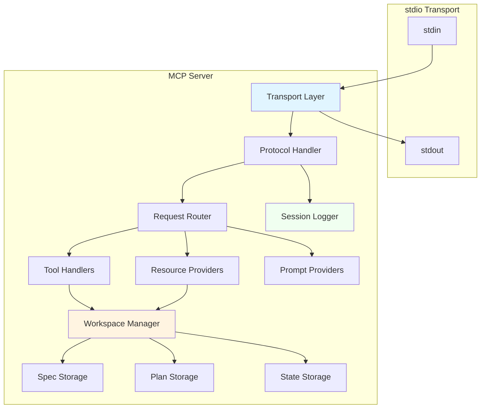

# AirsSpec MCP Server Implementation

**Version:** 1.0  
**Date:** 2026-01-24  
**Status:** Draft - Pending Review

---

## Overview

This document details the MCP server implementation using `airsprotocols-mcp`. The server exposes AirsSpec functionality through the Model Context Protocol via stdio transport.

---

## Server Architecture



---

## MCP Tools (12 Total)

### Tool Schema Summary

| Tool | Purpose | Category |
|------|---------|----------|
| `spec_create` | Create new specification | Spec |
| `spec_update` | Update spec content/metadata | Spec |
| `spec_transition` | Change lifecycle state | Spec |
| `spec_list` | List all specs with filtering | Spec |
| `spec_status` | Get current status | Spec |
| `spec_check_dependencies` | Validate dependencies | Spec |
| `plan_create` | Create implementation plan | Plan |
| `plan_update` | Update plan content | Plan |
| `plan_step_complete` | Mark step as done | Plan |
| `build_start` | Begin build phase | Build |
| `build_update` | Update build progress | Build |
| `build_complete` | Complete build phase | Build |

---

### Tool: `spec_create`

Creates a new specification document.

```json
{
  "name": "spec_create",
  "description": "Create a new specification with metadata",
  "inputSchema": {
    "type": "object",
    "properties": {
      "title": {
        "type": "string",
        "description": "Concise spec title (what to build)"
      },
      "description": {
        "type": "string",
        "description": "Detailed description including why this is needed"
      },
      "category": {
        "type": "string",
        "enum": ["feature", "bugfix", "refactor", "docs", "other"],
        "default": "feature",
        "description": "Type of change"
      },
      "content": {
        "type": "string",
        "description": "Optional: Initial markdown content for spec body"
      },
      "dependencies": {
        "type": "array",
        "items": {
          "type": "object",
          "properties": {
            "spec_id": { "type": "string" },
            "kind": { "type": "string", "enum": ["hard", "soft"] }
          }
        },
        "description": "Optional: Dependencies on other specs"
      }
    },
    "required": ["title", "description"]
  }
}
```

**Response:**
```json
{
  "spec_id": "1737734400-user-authentication",
  "created": true,
  "path": ".airsspec/specs/1737734400-user-authentication/"
}
```

---

### Tool: `spec_update`

Updates an existing specification.

```json
{
  "name": "spec_update",
  "description": "Update spec content or metadata",
  "inputSchema": {
    "type": "object",
    "properties": {
      "spec_id": {
        "type": "string",
        "description": "Spec identifier"
      },
      "title": {
        "type": "string",
        "description": "Optional: New title"
      },
      "description": {
        "type": "string",
        "description": "Optional: New description"
      },
      "content": {
        "type": "string",
        "description": "Optional: New markdown content"
      },
      "category": {
        "type": "string",
        "enum": ["feature", "bugfix", "refactor", "docs", "other"],
        "description": "Optional: New category"
      }
    },
    "required": ["spec_id"]
  }
}
```

**Response:**
```json
{
  "spec_id": "1737734400-user-authentication",
  "updated": true,
  "updated_at": "2026-01-24T14:30:00Z"
}
```

---

### Tool: `spec_transition`

Transitions spec to a different lifecycle state.

```json
{
  "name": "spec_transition",
  "description": "Move spec to a different lifecycle state",
  "inputSchema": {
    "type": "object",
    "properties": {
      "spec_id": {
        "type": "string",
        "description": "Spec identifier"
      },
      "to_state": {
        "type": "string",
        "enum": ["draft", "active", "done", "blocked", "cancelled", "archived"],
        "description": "Target state"
      },
      "reason": {
        "type": "string",
        "description": "Optional: Reason for transition"
      }
    },
    "required": ["spec_id", "to_state"]
  }
}
```

**Response:**
```json
{
  "spec_id": "1737734400-user-authentication",
  "from_state": "draft",
  "to_state": "active",
  "transitioned": true
}
```

**Error Response (invalid transition):**
```json
{
  "error": "invalid_transition",
  "message": "Cannot transition from 'done' to 'active'",
  "valid_transitions": ["archived"]
}
```

---

### Tool: `spec_list`

Lists all specs with optional filtering.

```json
{
  "name": "spec_list",
  "description": "List all specs with optional filtering",
  "inputSchema": {
    "type": "object",
    "properties": {
      "state": {
        "type": "string",
        "enum": ["draft", "active", "done", "blocked", "cancelled", "archived"],
        "description": "Optional: Filter by state"
      },
      "category": {
        "type": "string",
        "enum": ["feature", "bugfix", "refactor", "docs", "other"],
        "description": "Optional: Filter by category"
      }
    }
  }
}
```

**Response:**
```json
{
  "specs": [
    {
      "id": "1737734400-user-authentication",
      "title": "User Authentication System",
      "state": "active",
      "category": "feature",
      "created_at": "2026-01-24T10:00:00Z"
    },
    {
      "id": "1737820800-payment-integration",
      "title": "Payment Integration",
      "state": "draft",
      "category": "feature",
      "created_at": "2026-01-25T10:00:00Z"
    }
  ],
  "total": 2
}
```

---

### Tool: `spec_status`

Gets detailed status for a spec.

```json
{
  "name": "spec_status",
  "description": "Get current workflow status for a spec",
  "inputSchema": {
    "type": "object",
    "properties": {
      "spec_id": {
        "type": "string",
        "description": "Spec identifier"
      }
    },
    "required": ["spec_id"]
  }
}
```

**Response:**
```json
{
  "spec_id": "1737734400-user-authentication",
  "title": "User Authentication System",
  "lifecycle_state": "active",
  "phase": "build",
  "plan_progress": {
    "total_steps": 5,
    "completed_steps": 3,
    "percentage": 60
  },
  "build_progress": {
    "percentage": 40,
    "current_step": "Implement password hashing"
  },
  "dependencies": {
    "total": 1,
    "satisfied": 1,
    "blocked": 0
  },
  "updated_at": "2026-01-24T14:30:00Z"
}
```

---

### Tool: `spec_check_dependencies`

Checks if all dependencies are satisfied.

```json
{
  "name": "spec_check_dependencies",
  "description": "Check if spec dependencies are satisfied",
  "inputSchema": {
    "type": "object",
    "properties": {
      "spec_id": {
        "type": "string",
        "description": "Spec identifier"
      }
    },
    "required": ["spec_id"]
  }
}
```

**Response:**
```json
{
  "spec_id": "1737734400-user-authentication",
  "all_satisfied": false,
  "dependencies": [
    {
      "spec_id": "1737648000-database-setup",
      "kind": "hard",
      "state": "done",
      "satisfied": true
    },
    {
      "spec_id": "1737561600-api-design",
      "kind": "hard",
      "state": "active",
      "satisfied": false
    }
  ],
  "blocking": ["1737561600-api-design"]
}
```

---

### Tool: `plan_create`

Creates an implementation plan from a spec.

```json
{
  "name": "plan_create",
  "description": "Create an actionable plan from a spec",
  "inputSchema": {
    "type": "object",
    "properties": {
      "spec_id": {
        "type": "string",
        "description": "Spec to create plan for"
      },
      "approach": {
        "type": "string",
        "description": "High-level approach/strategy for implementation"
      },
      "steps": {
        "type": "array",
        "items": {
          "type": "object",
          "properties": {
            "title": { "type": "string" },
            "description": { "type": "string" },
            "complexity": {
              "type": "string",
              "enum": ["trivial", "simple", "moderate", "complex"]
            }
          },
          "required": ["title", "description"]
        },
        "description": "Ordered list of implementation steps"
      }
    },
    "required": ["spec_id", "approach", "steps"]
  }
}
```

**Response:**
```json
{
  "spec_id": "1737734400-user-authentication",
  "plan_created": true,
  "total_steps": 5,
  "path": ".airsspec/specs/1737734400-user-authentication/plan.md"
}
```

---

### Tool: `plan_update`

Updates an existing plan.

```json
{
  "name": "plan_update",
  "description": "Modify plan approach or steps",
  "inputSchema": {
    "type": "object",
    "properties": {
      "spec_id": {
        "type": "string",
        "description": "Spec ID whose plan to update"
      },
      "approach": {
        "type": "string",
        "description": "Optional: New approach"
      },
      "steps": {
        "type": "array",
        "description": "Optional: Replacement steps (replaces all)"
      }
    },
    "required": ["spec_id"]
  }
}
```

---

### Tool: `plan_step_complete`

Marks a plan step as completed.

```json
{
  "name": "plan_step_complete",
  "description": "Mark a plan step as completed",
  "inputSchema": {
    "type": "object",
    "properties": {
      "spec_id": {
        "type": "string",
        "description": "Spec ID"
      },
      "step_index": {
        "type": "number",
        "description": "0-based step index"
      },
      "notes": {
        "type": "string",
        "description": "Optional: Implementation notes"
      }
    },
    "required": ["spec_id", "step_index"]
  }
}
```

**Response:**
```json
{
  "spec_id": "1737734400-user-authentication",
  "step_index": 2,
  "step_title": "Implement password hashing",
  "completed": true,
  "plan_progress": {
    "total_steps": 5,
    "completed_steps": 3,
    "percentage": 60
  }
}
```

---

### Tool: `build_start`

Begins the build/implementation phase.

```json
{
  "name": "build_start",
  "description": "Begin implementation phase",
  "inputSchema": {
    "type": "object",
    "properties": {
      "spec_id": {
        "type": "string",
        "description": "Spec ID"
      },
      "plan_approved": {
        "type": "boolean",
        "description": "Confirm plan has been reviewed",
        "default": false
      }
    },
    "required": ["spec_id"]
  }
}
```

**Response:**
```json
{
  "spec_id": "1737734400-user-authentication",
  "build_started": true,
  "phase": "build",
  "plan_steps": 5
}
```

---

### Tool: `build_update`

Updates build progress.

```json
{
  "name": "build_update",
  "description": "Update build progress and notes",
  "inputSchema": {
    "type": "object",
    "properties": {
      "spec_id": {
        "type": "string",
        "description": "Spec ID"
      },
      "progress_percentage": {
        "type": "number",
        "minimum": 0,
        "maximum": 100,
        "description": "Overall progress percentage"
      },
      "current_step": {
        "type": "string",
        "description": "Current step being worked on"
      },
      "notes": {
        "type": "string",
        "description": "Build notes"
      }
    },
    "required": ["spec_id"]
  }
}
```

---

### Tool: `build_complete`

Completes the build phase and marks spec as done.

```json
{
  "name": "build_complete",
  "description": "Mark build phase as done",
  "inputSchema": {
    "type": "object",
    "properties": {
      "spec_id": {
        "type": "string",
        "description": "Spec ID"
      },
      "summary": {
        "type": "string",
        "description": "Summary of what was implemented"
      },
      "deviations": {
        "type": "string",
        "description": "Optional: How implementation differs from plan"
      }
    },
    "required": ["spec_id", "summary"]
  }
}
```

**Response:**
```json
{
  "spec_id": "1737734400-user-authentication",
  "build_completed": true,
  "lifecycle_state": "done",
  "completed_at": "2026-01-24T18:00:00Z"
}
```

---

## MCP Resources (6 Total)

### Resource URI Scheme

All resources use the `airsspec:///` URI scheme:

| URI Pattern | Description | MIME Type |
|-------------|-------------|-----------|
| `airsspec:///config` | Project configuration | `application/toml` |
| `airsspec:///specs` | Index of all specs | `application/json` |
| `airsspec:///{spec-id}` | Full spec bundle | `application/json` |
| `airsspec:///{spec-id}/spec` | Spec markdown | `text/markdown` |
| `airsspec:///{spec-id}/plan` | Plan markdown | `text/markdown` |
| `airsspec:///{spec-id}/state` | Workflow state | `application/toon` |

---

### Resource: `airsspec:///config`

Returns project configuration.

```toml
[project]
name = "my-project"
description = "My awesome project"

[defaults]
category = "feature"
```

---

### Resource: `airsspec:///specs`

Returns index of all specs.

```json
{
  "specs": [
    {
      "id": "1737734400-user-authentication",
      "title": "User Authentication System",
      "state": "active",
      "category": "feature",
      "phase": "build",
      "created_at": "2026-01-24T10:00:00Z",
      "updated_at": "2026-01-24T14:30:00Z"
    }
  ],
  "total": 1
}
```

---

### Resource: `airsspec:///{spec-id}`

Returns full spec bundle (all artifacts).

```json
{
  "id": "1737734400-user-authentication",
  "spec": {
    "metadata": { ... },
    "content": "# User Authentication\n\n..."
  },
  "plan": {
    "approach": "...",
    "steps": [ ... ]
  },
  "state": {
    "lifecycle": "active",
    "phase": "build",
    "build_progress": { ... }
  }
}
```

---

### Resource: `airsspec:///{spec-id}/spec`

Returns raw spec markdown with YAML frontmatter.

```markdown
---
title: User Authentication System
description: Implement secure user login/logout
category: feature
state: active
dependencies: []
created_at: 2026-01-24T10:00:00Z
updated_at: 2026-01-24T14:30:00Z
---

# User Authentication System

## Overview

This spec defines the requirements for implementing...

## Requirements

1. Users must be able to register with email/password
2. Users must be able to login securely
3. ...
```

---

### Resource: `airsspec:///{spec-id}/plan`

Returns raw plan markdown.

```markdown
---
spec_id: 1737734400-user-authentication
approach: Use JWT tokens with bcrypt password hashing
created_at: 2026-01-24T11:00:00Z
updated_at: 2026-01-24T14:30:00Z
---

# Implementation Plan

## Approach

Use JWT tokens with bcrypt password hashing...

## Steps

### Step 1: Set up auth database schema
- **Complexity:** simple
- **Status:** completed
- **Notes:** Created users table with email, password_hash columns

### Step 2: Implement password hashing
- **Complexity:** simple
- **Status:** completed

...
```

---

### Resource: `airsspec:///{spec-id}/state`

Returns workflow state in TOON format.

```toon
{
  spec_id: "1737734400-user-authentication"
  lifecycle: active
  phase: build
  build_progress: {
    percentage: 60
    current_step: "Implement JWT tokens"
    notes: null
  }
  updated_at: "2026-01-24T14:30:00Z"
}
```

---

## MCP Prompts (5 Total)

### Prompt: `write_spec`

Helps AI write a good specification.

```json
{
  "name": "write_spec",
  "description": "Guide for writing a comprehensive specification",
  "arguments": [
    {
      "name": "feature_description",
      "description": "Brief description of what to build",
      "required": true
    }
  ]
}
```

**Generated Prompt:**
```
You are helping write a specification for: {{feature_description}}

A good spec should answer:
1. WHAT: What exactly needs to be built?
2. WHY: Why is this needed? What problem does it solve?
3. SCOPE: What's included and what's explicitly NOT included?
4. SUCCESS: How do we know it's done correctly?
5. DEPENDENCIES: What must be in place before this can be built?

Please generate a well-structured specification with these sections:

## Overview
Brief summary of the feature.

## Problem Statement
What problem does this solve? Why is it needed?

## Requirements
Numbered list of specific requirements.

## Success Criteria
How do we know this is complete and correct?

## Out of Scope
What is explicitly NOT part of this spec?

## Dependencies
What specs or systems must be ready first?

Use the spec_create tool to save the specification when complete.
```

---

### Prompt: `create_plan`

Helps AI break down a spec into actionable steps.

```json
{
  "name": "create_plan",
  "description": "Guide for breaking down a spec into actionable steps",
  "arguments": [
    {
      "name": "spec_id",
      "description": "Spec to plan for",
      "required": true
    }
  ]
}
```

**Generated Prompt:**
```
You are creating an implementation plan for spec: {{spec_id}}

First, read the spec using the airsspec:///{{spec_id}}/spec resource.

Break down the implementation into:
1. APPROACH: High-level strategy (architecture, patterns, libraries)
2. STEPS: Ordered, actionable steps with clear completion criteria
3. COMPLEXITY: Estimate each step (trivial, simple, moderate, complex)

Each step should be:
- Specific and actionable (not vague)
- Independently verifiable (clear when done)
- Appropriately sized (2-4 hours of work ideally)
- Ordered logically (dependencies first)

After creating the plan, use the plan_create tool to save it.
```

---

### Prompt: `review_spec`

Reviews a spec for completeness.

```json
{
  "name": "review_spec",
  "description": "Check if a spec is complete and well-formed",
  "arguments": [
    {
      "name": "spec_id",
      "description": "Spec to review",
      "required": true
    }
  ]
}
```

**Generated Prompt:**
```
Review the spec at airsspec:///{{spec_id}}/spec

Check for:
- [ ] Clear problem statement (why is this needed?)
- [ ] Specific success criteria (how do we know it's done?)
- [ ] Scope boundaries (what's in/out)
- [ ] Dependencies identified (what must come first?)
- [ ] Non-functional requirements (performance, security, etc.)
- [ ] No ambiguous language ("should", "might", "could")

Provide feedback:
1. List any missing sections
2. Flag ambiguous requirements
3. Suggest improvements
4. Rate overall readiness (ready, needs work, incomplete)
```

---

### Prompt: `validate_plan`

Ensures plan adequately addresses spec.

```json
{
  "name": "validate_plan",
  "description": "Ensure plan adequately addresses spec requirements",
  "arguments": [
    {
      "name": "spec_id",
      "description": "Spec to validate plan against",
      "required": true
    }
  ]
}
```

**Generated Prompt:**
```
Compare the plan at airsspec:///{{spec_id}}/plan against the spec at airsspec:///{{spec_id}}/spec

Verify:
- [ ] All spec requirements are covered by plan steps
- [ ] Plan approach aligns with spec constraints
- [ ] Dependencies are accounted for in ordering
- [ ] Success criteria can be verified by plan completion
- [ ] No plan steps go beyond spec scope

Flag any:
1. Missing coverage (spec requirement without plan step)
2. Scope creep (plan step not in spec)
3. Ordering issues (step depends on later step)
4. Missing complexity estimates
```

---

### Prompt: `check_progress`

Assesses current progress on a spec.

```json
{
  "name": "check_progress",
  "description": "Assess current progress on a spec",
  "arguments": [
    {
      "name": "spec_id",
      "description": "Spec to check progress on",
      "required": true
    }
  ]
}
```

**Generated Prompt:**
```
Check progress on spec: {{spec_id}}

Use the spec_status tool to get current status.

Review:
1. Current lifecycle state
2. Current workflow phase
3. Completed plan steps
4. Build progress percentage

Summarize:
- What's been accomplished
- What's remaining
- Any blockers or dependencies
- Estimated time to completion
- Recommended next actions
```

---

## Logging System

### Log Entry Format (JSONL)

Each line is a complete JSON object:

```json
{"timestamp":"2026-01-24T14:30:00.123Z","type":"request","id":"req-001","method":"tools/call","params":{"name":"spec_create","arguments":{"title":"User Auth","description":"..."}}}
{"timestamp":"2026-01-24T14:30:00.456Z","type":"response","id":"req-001","result":{"spec_id":"1737734400-user-auth","created":true}}
```

### Log File Structure

```
.airsspec/logs/
├── 2026-01-24.jsonl              # Daily log (all sessions)
├── 2026-01-25.jsonl
└── session-abc123.jsonl          # Per-session log
```

### SessionLogger Implementation

```rust
use std::fs::{File, OpenOptions};
use std::io::{BufWriter, Write};
use std::path::PathBuf;
use chrono::{DateTime, Utc};
use serde::Serialize;

/// Manages JSONL logging for MCP sessions.
pub struct SessionLogger {
    session_id: String,
    daily_writer: BufWriter<File>,
    session_writer: BufWriter<File>,
}

#[derive(Serialize)]
struct LogEntry<T: Serialize> {
    timestamp: DateTime<Utc>,
    #[serde(rename = "type")]
    entry_type: &'static str,
    #[serde(flatten)]
    data: T,
}

impl SessionLogger {
    /// Creates a new session logger.
    pub fn new(logs_dir: PathBuf, session_id: String) -> std::io::Result<Self> {
        // Create logs directory if needed
        std::fs::create_dir_all(&logs_dir)?;
        
        // Open daily log file (append mode)
        let today = Utc::now().format("%Y-%m-%d").to_string();
        let daily_path = logs_dir.join(format!("{}.jsonl", today));
        let daily_file = OpenOptions::new()
            .create(true)
            .append(true)
            .open(daily_path)?;
        
        // Open session log file
        let session_path = logs_dir.join(format!("session-{}.jsonl", session_id));
        let session_file = OpenOptions::new()
            .create(true)
            .write(true)
            .truncate(true)
            .open(session_path)?;
        
        Ok(Self {
            session_id,
            daily_writer: BufWriter::new(daily_file),
            session_writer: BufWriter::new(session_file),
        })
    }
    
    /// Logs an MCP request.
    pub fn log_request(&mut self, request: &JsonRpcRequest) -> std::io::Result<()> {
        let entry = LogEntry {
            timestamp: Utc::now(),
            entry_type: "request",
            data: request,
        };
        self.write_entry(&entry)
    }
    
    /// Logs an MCP response.
    pub fn log_response(&mut self, response: &JsonRpcResponse) -> std::io::Result<()> {
        let entry = LogEntry {
            timestamp: Utc::now(),
            entry_type: "response",
            data: response,
        };
        self.write_entry(&entry)
    }
    
    fn write_entry<T: Serialize>(&mut self, entry: &T) -> std::io::Result<()> {
        let json = serde_json::to_string(entry)?;
        
        // Write to both logs
        writeln!(self.daily_writer, "{}", json)?;
        writeln!(self.session_writer, "{}", json)?;
        
        // Flush to ensure durability
        self.daily_writer.flush()?;
        self.session_writer.flush()?;
        
        Ok(())
    }
}
```

---

## Server Implementation

### McpServerBuilder

```rust
use std::path::PathBuf;
use std::sync::Arc;

/// Builder for constructing the MCP server.
pub struct McpServerBuilder {
    workspace_path: Option<PathBuf>,
    debug: bool,
    id_generator: Option<Arc<dyn IdGenerator>>,
}

impl McpServerBuilder {
    pub fn new() -> Self {
        Self {
            workspace_path: None,
            debug: false,
            id_generator: None,
        }
    }
    
    /// Sets the workspace path (defaults to current directory).
    pub fn with_workspace(mut self, path: PathBuf) -> Self {
        self.workspace_path = Some(path);
        self
    }
    
    /// Enables debug mode.
    pub fn with_debug(mut self, debug: bool) -> Self {
        self.debug = debug;
        self
    }
    
    /// Sets a custom ID generator (useful for testing).
    pub fn with_id_generator(mut self, gen: Arc<dyn IdGenerator>) -> Self {
        self.id_generator = Some(gen);
        self
    }
    
    /// Builds the MCP server.
    pub async fn build(self) -> Result<McpServer, ServerError> {
        // 1. Determine workspace path
        let workspace_path = self.workspace_path
            .unwrap_or_else(|| std::env::current_dir().unwrap());
        
        // 2. Discover workspace
        let workspace_provider = FileSystemWorkspaceProvider::new();
        let workspace = workspace_provider
            .discover(&workspace_path)
            .await?
            .ok_or(ServerError::WorkspaceNotFound)?;
        
        // 3. Create storage implementations
        let spec_storage = Arc::new(FileSystemSpecStorage::new(workspace.airsspec_path.clone()));
        let plan_storage = Arc::new(FileSystemPlanStorage::new(workspace.airsspec_path.clone()));
        let state_storage = Arc::new(ToonStateStorage::new(workspace.airsspec_path.clone()));
        
        // 4. Create session logger
        let session_id = uuid::Uuid::new_v4().to_string();
        let logger = SessionLogger::new(
            workspace.airsspec_path.join("logs"),
            session_id.clone(),
        )?;
        
        // 5. Create tool handlers
        let id_generator = self.id_generator
            .unwrap_or_else(|| Arc::new(TimestampIdGenerator));
        
        let tool_registry = ToolRegistry::new(
            Arc::clone(&spec_storage),
            Arc::clone(&plan_storage),
            Arc::clone(&state_storage),
            id_generator,
        );
        
        // 6. Create resource provider
        let resource_provider = ResourceProvider::new(
            Arc::clone(&spec_storage),
            Arc::clone(&plan_storage),
            Arc::clone(&state_storage),
            workspace.config.clone(),
        );
        
        // 7. Create prompt registry
        let prompt_registry = PromptRegistry::new();
        
        Ok(McpServer {
            workspace,
            session_id,
            debug: self.debug,
            logger,
            tool_registry,
            resource_provider,
            prompt_registry,
            state_machine: StateMachine::new(),
        })
    }
}
```

### McpServer

```rust
use airsprotocols_mcp::{StdioTransport, JsonRpcMessage, McpServer as McpServerTrait};

/// AirsSpec MCP server.
pub struct McpServer {
    workspace: WorkspaceInfo,
    session_id: String,
    debug: bool,
    logger: SessionLogger,
    tool_registry: ToolRegistry,
    resource_provider: ResourceProvider,
    prompt_registry: PromptRegistry,
    state_machine: StateMachine,
}

impl McpServer {
    /// Runs the MCP server on stdio.
    pub async fn run(mut self) -> Result<(), ServerError> {
        // Create stdio transport
        let transport = StdioTransport::new();
        
        // Server info
        let server_info = ServerInfo {
            name: "airsspec".to_string(),
            version: env!("CARGO_PKG_VERSION").to_string(),
        };
        
        // Main message loop
        loop {
            match transport.receive().await {
                Ok(message) => {
                    // Log request
                    if let JsonRpcMessage::Request(ref req) = message {
                        self.logger.log_request(req)?;
                    }
                    
                    // Handle message
                    let response = self.handle_message(message).await;
                    
                    // Log response
                    if let Some(ref resp) = response {
                        self.logger.log_response(resp)?;
                    }
                    
                    // Send response
                    if let Some(resp) = response {
                        transport.send(resp).await?;
                    }
                }
                Err(e) if e.is_eof() => {
                    // Clean shutdown on EOF
                    break;
                }
                Err(e) => {
                    tracing::error!("Transport error: {}", e);
                    break;
                }
            }
        }
        
        Ok(())
    }
    
    async fn handle_message(&mut self, message: JsonRpcMessage) -> Option<JsonRpcResponse> {
        match message {
            JsonRpcMessage::Request(req) => {
                let response = match req.method.as_str() {
                    "initialize" => self.handle_initialize(&req).await,
                    "tools/list" => self.handle_tools_list(&req).await,
                    "tools/call" => self.handle_tools_call(&req).await,
                    "resources/list" => self.handle_resources_list(&req).await,
                    "resources/read" => self.handle_resources_read(&req).await,
                    "prompts/list" => self.handle_prompts_list(&req).await,
                    "prompts/get" => self.handle_prompts_get(&req).await,
                    _ => self.handle_unknown(&req).await,
                };
                Some(response)
            }
            JsonRpcMessage::Notification(_) => {
                // Handle notifications (no response needed)
                None
            }
            _ => None,
        }
    }
}
```

---

## Error Handling

### Error Response Format

```json
{
  "jsonrpc": "2.0",
  "id": "req-001",
  "error": {
    "code": -32602,
    "message": "Invalid params: spec_id is required",
    "data": {
      "field": "spec_id",
      "expected": "string"
    }
  }
}
```

### Error Codes

| Code | Meaning |
|------|---------|
| -32700 | Parse error |
| -32600 | Invalid request |
| -32601 | Method not found |
| -32602 | Invalid params |
| -32603 | Internal error |
| -32000 | Workspace not found |
| -32001 | Spec not found |
| -32002 | Plan not found |
| -32003 | Invalid state transition |
| -32004 | Dependency not satisfied |
| -32005 | Validation failed |

---

## Verification Checklist

Before implementation, verify:

- [ ] All 12 tools have complete schemas
- [ ] All 6 resources have proper URI patterns
- [ ] All 5 prompts have useful templates
- [ ] Logging captures all requests/responses
- [ ] Error responses follow JSON-RPC 2.0
- [ ] Builder pattern used for server construction
- [ ] DI used for storage implementations
- [ ] All public types implement Debug

---

## Approval

- [ ] MCP server design approved by project owner
- [ ] Tool schemas are complete and useful
- [ ] Ready to proceed with implementation

**Reviewer:** _________________  
**Date:** _________________  
**Notes:** _________________
