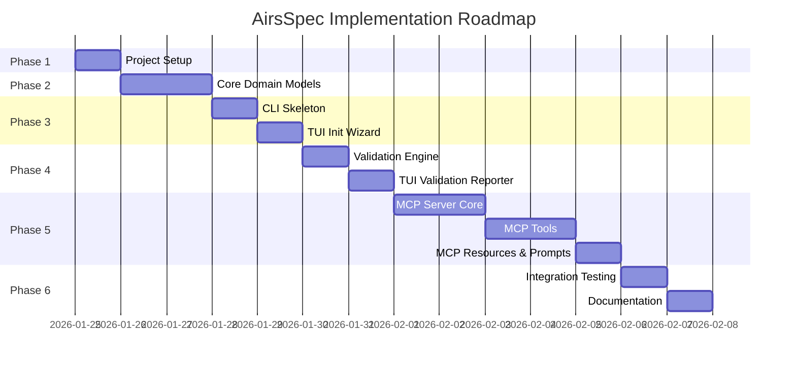
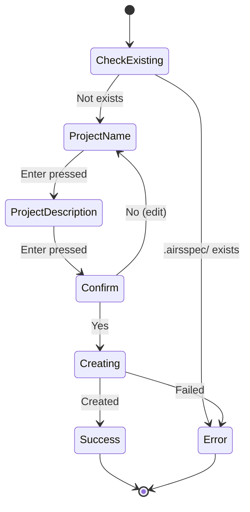
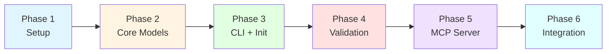
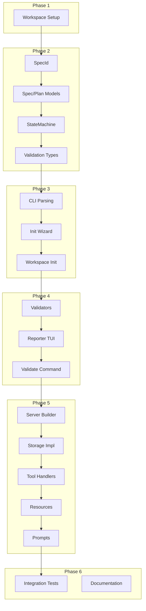

# AirsSpec Implementation Roadmap

**Version:** 1.0  
**Date:** 2026-01-24  
**Status:** Draft - Pending Review

---

## Overview

This document provides a phased implementation roadmap for AirsSpec. Each phase builds upon the previous, with clear milestones and verification checkpoints.

**Total Estimated Time:** 18-24 hours of focused development

---

## Implementation Phases



---

## Phase 1: Project Setup

**Duration:** 1-2 hours  
**Goal:** Establish Rust workspace with proper structure

### Tasks

| Task | Description | Time |
|------|-------------|------|
| 1.1 | Create workspace `Cargo.toml` | 15 min |
| 1.2 | Create `crates/airsspec-core/` skeleton | 15 min |
| 1.3 | Create `crates/airsspec-mcp/` skeleton | 15 min |
| 1.4 | Create `crates/airsspec-tui/` skeleton | 15 min |
| 1.5 | Create `crates/airsspec-cli/` skeleton | 15 min |
| 1.6 | Verify `cargo build` succeeds | 10 min |
| 1.7 | Setup lints in workspace | 10 min |

### Deliverables

```
airsspec/
├── Cargo.toml                  # Workspace config
├── Cargo.lock                  # Lock file (committed for apps)
└── crates/
    ├── airsspec-core/
    │   ├── Cargo.toml
    │   └── src/lib.rs          # Empty with module docs
    ├── airsspec-mcp/
    │   ├── Cargo.toml
    │   └── src/lib.rs
    ├── airsspec-tui/
    │   ├── Cargo.toml
    │   └── src/lib.rs
    └── airsspec-cli/
        ├── Cargo.toml
        └── src/main.rs         # Minimal main()
```

### Verification

```bash
# All must pass
cargo build --workspace
cargo clippy --workspace --all-targets
cargo test --workspace
```

---

## Phase 2: Core Domain Models

**Duration:** 3-4 hours  
**Goal:** Implement all domain types in `airsspec-core`

### Tasks

| Task | Description | Time |
|------|-------------|------|
| 2.1 | Implement `SpecId` with newtype pattern | 30 min |
| 2.2 | Implement `Category`, `LifecycleState` enums | 20 min |
| 2.3 | Implement `Dependency`, `DependencyKind` | 15 min |
| 2.4 | Implement `SpecMetadata`, `Spec` | 30 min |
| 2.5 | Implement `PlanStep`, `Plan` | 30 min |
| 2.6 | Implement `WorkflowState`, `Phase` | 20 min |
| 2.7 | Implement `ProjectConfig` | 15 min |
| 2.8 | Implement `StateMachine` | 30 min |
| 2.9 | Implement validation types and traits | 40 min |
| 2.10 | Implement slug generation utilities | 20 min |
| 2.11 | Write unit tests for all types | 45 min |

### Module Structure

```
crates/airsspec-core/src/
├── lib.rs
├── models/
│   ├── mod.rs
│   ├── spec.rs
│   ├── plan.rs
│   ├── state.rs
│   ├── config.rs
│   └── dependency.rs
├── traits/
│   ├── mod.rs
│   ├── storage.rs
│   ├── workspace.rs
│   ├── validation.rs
│   └── id_generator.rs
├── state/
│   ├── mod.rs
│   └── machine.rs
├── validation/
│   ├── mod.rs
│   ├── report.rs
│   ├── structure.rs
│   ├── content.rs
│   ├── dependencies.rs
│   └── state.rs
├── utils/
│   ├── mod.rs
│   └── slug.rs
└── error.rs
```

### Verification

```bash
cargo test -p airsspec-core
cargo clippy -p airsspec-core
cargo doc -p airsspec-core --no-deps
```

### Unit Tests Required

- `SpecId::new()` with valid inputs
- `SpecId::parse()` with valid/invalid inputs
- `SpecId` timestamp and slug extraction
- Slug generation with various titles
- `StateMachine::can_transition()` for all valid/invalid paths
- `StateMachine::transition()` success/failure cases
- `ValidationReport::merge()` behavior
- All enum `Display` implementations

---

## Phase 3: CLI Skeleton & Init Wizard

**Duration:** 2-3 hours  
**Goal:** Working `airsspec init` command with TUI wizard

### Tasks

| Task | Description | Time |
|------|-------------|------|
| 3.1 | Implement CLI argument parsing (clap) | 20 min |
| 3.2 | Implement basic command routing | 15 min |
| 3.3 | Create TUI wizard framework | 30 min |
| 3.4 | Implement project name input step | 20 min |
| 3.5 | Implement project description input step | 20 min |
| 3.6 | Implement confirmation step | 15 min |
| 3.7 | Implement workspace initialization | 30 min |
| 3.8 | Wire init command to wizard | 15 min |
| 3.9 | Test `airsspec init` end-to-end | 20 min |

### CLI Structure

```rust
// cli.rs
#[derive(Parser)]
#[command(name = "airsspec")]
#[command(about = "Lightweight Spec-Driven Development Framework")]
pub struct Cli {
    #[command(subcommand)]
    pub command: Commands,
}

#[derive(Subcommand)]
pub enum Commands {
    /// Initialize .airsspec/ in current directory
    Init,
    
    /// Start MCP server (stdio mode)
    Mcp {
        #[arg(long)]
        debug: bool,
    },
    
    /// Validate .airsspec/ artifacts
    Validate,
}
```

### Init Wizard Flow



### Deliverables

```bash
# User can run:
$ airsspec init
# TUI wizard appears, collects name/description
# Creates .airsspec/ directory with config.toml
```

### Verification

```bash
# Manual testing
cd /tmp && mkdir test-project && cd test-project
airsspec init
# Verify .airsspec/ structure created
cat .airsspec/config.toml
```

---

## Phase 4: Validation Engine

**Duration:** 2-3 hours  
**Goal:** Working `airsspec validate` command with TUI reporter

### Tasks

| Task | Description | Time |
|------|-------------|------|
| 4.1 | Implement `DirectoryStructureValidator` | 30 min |
| 4.2 | Implement `SpecContentValidator` | 30 min |
| 4.3 | Implement `DependencyValidator` | 30 min |
| 4.4 | Implement `StateTransitionValidator` | 20 min |
| 4.5 | Create composite validator runner | 20 min |
| 4.6 | Implement `ValidationReporter` TUI | 40 min |
| 4.7 | Wire validate command | 15 min |
| 4.8 | Test with valid/invalid workspaces | 30 min |

### Validation Report Display

```
┌─────────────────────────────────────────────────┐
│ AirsSpec Validation Report                      │
├─────────────────────────────────────────────────┤
│                                                 │
│ ✗ ERRORS (2)                                    │
│                                                 │
│   [structure] Missing directory: specs/         │
│   [deps] Broken dependency: auth-001 -> db-001  │
│                                                 │
│ ⚠ WARNINGS (1)                                  │
│                                                 │
│   [content] Empty spec content: auth-001        │
│                                                 │
├─────────────────────────────────────────────────┤
│ Status: FAILED                                  │
│ Errors: 2 | Warnings: 1                         │
└─────────────────────────────────────────────────┘
```

### Verification

```bash
# Test with valid workspace
airsspec validate  # Should pass

# Test with invalid workspace (manually break something)
rm .airsspec/config.toml
airsspec validate  # Should show errors

# Exit code
echo $?  # 1 for errors, 0 for success
```

---

## Phase 5: MCP Server

**Duration:** 6-8 hours  
**Goal:** Complete MCP server with all tools, resources, prompts

### Phase 5.1: Server Core (2 hours)

| Task | Description | Time |
|------|-------------|------|
| 5.1.1 | Implement `McpServerBuilder` | 30 min |
| 5.1.2 | Implement stdio transport setup | 20 min |
| 5.1.3 | Implement message handling loop | 30 min |
| 5.1.4 | Implement `SessionLogger` | 30 min |
| 5.1.5 | Wire mcp command | 10 min |

### Phase 5.2: Storage Implementations (1.5 hours)

| Task | Description | Time |
|------|-------------|------|
| 5.2.1 | Implement `FileSystemSpecStorage` | 30 min |
| 5.2.2 | Implement `FileSystemPlanStorage` | 20 min |
| 5.2.3 | Implement `ToonStateStorage` | 30 min |
| 5.2.4 | Implement `FileSystemWorkspaceProvider` | 20 min |

### Phase 5.3: MCP Tools (3 hours)

| Task | Description | Time |
|------|-------------|------|
| 5.3.1 | Implement `ToolRegistry` | 20 min |
| 5.3.2 | Implement `spec_create` | 20 min |
| 5.3.3 | Implement `spec_update` | 15 min |
| 5.3.4 | Implement `spec_transition` | 20 min |
| 5.3.5 | Implement `spec_list` | 15 min |
| 5.3.6 | Implement `spec_status` | 15 min |
| 5.3.7 | Implement `spec_check_dependencies` | 15 min |
| 5.3.8 | Implement `plan_create` | 20 min |
| 5.3.9 | Implement `plan_update` | 15 min |
| 5.3.10 | Implement `plan_step_complete` | 15 min |
| 5.3.11 | Implement `build_start` | 10 min |
| 5.3.12 | Implement `build_update` | 10 min |
| 5.3.13 | Implement `build_complete` | 10 min |

### Phase 5.4: MCP Resources & Prompts (1.5 hours)

| Task | Description | Time |
|------|-------------|------|
| 5.4.1 | Implement `ResourceProvider` | 20 min |
| 5.4.2 | Implement all resource URIs | 30 min |
| 5.4.3 | Implement `PromptRegistry` | 15 min |
| 5.4.4 | Implement all prompt templates | 25 min |

### Verification

```bash
# Start MCP server
echo '{"jsonrpc":"2.0","method":"initialize","params":{},"id":1}' | airsspec mcp

# Should respond with server info
```

---

## Phase 6: Integration & Documentation

**Duration:** 2-3 hours  
**Goal:** End-to-end testing and documentation

### Tasks

| Task | Description | Time |
|------|-------------|------|
| 6.1 | Write integration tests for full workflow | 45 min |
| 6.2 | Test with actual AI tool (OpenCode) | 30 min |
| 6.3 | Update README with usage examples | 30 min |
| 6.4 | Add MCP configuration examples | 20 min |
| 6.5 | Final code review and cleanup | 30 min |

### Integration Test Scenario

```rust
#[tokio::test]
async fn test_full_workflow() {
    // 1. Initialize workspace
    let temp_dir = tempfile::tempdir().unwrap();
    let config = ProjectConfig::new("test".into(), "Test project".into());
    
    let workspace = FileSystemWorkspaceProvider::new()
        .initialize(temp_dir.path(), &config)
        .await
        .unwrap();
    
    // 2. Create spec via MCP tool
    let server = McpServerBuilder::new()
        .with_workspace(temp_dir.path().to_path_buf())
        .build()
        .await
        .unwrap();
    
    let result = server.handle_tool_call("spec_create", json!({
        "title": "Test Feature",
        "description": "A test feature"
    })).await;
    
    assert!(result.is_ok());
    let spec_id = result["spec_id"].as_str().unwrap();
    
    // 3. Create plan
    let result = server.handle_tool_call("plan_create", json!({
        "spec_id": spec_id,
        "approach": "Simple approach",
        "steps": [{"title": "Step 1", "description": "Do thing"}]
    })).await;
    assert!(result.is_ok());
    
    // 4. Start build
    let result = server.handle_tool_call("build_start", json!({
        "spec_id": spec_id,
        "plan_approved": true
    })).await;
    assert!(result.is_ok());
    
    // 5. Complete build
    let result = server.handle_tool_call("build_complete", json!({
        "spec_id": spec_id,
        "summary": "Completed the feature"
    })).await;
    assert!(result.is_ok());
    
    // 6. Validate
    let report = validate_workspace(&workspace).await;
    assert!(report.is_valid());
}
```

---

## Implementation Order Summary



---

## Checkpoints

After each phase, verify:

### Phase 1 Checkpoint
- [ ] `cargo build --workspace` succeeds
- [ ] All crates have proper `Cargo.toml`
- [ ] Lints configured in workspace

### Phase 2 Checkpoint
- [ ] All domain types implemented
- [ ] All traits defined
- [ ] Unit tests pass
- [ ] Documentation generated

### Phase 3 Checkpoint
- [ ] `airsspec init` creates valid workspace
- [ ] TUI wizard works correctly
- [ ] `config.toml` has correct format

### Phase 4 Checkpoint
- [ ] `airsspec validate` runs all validators
- [ ] TUI reporter displays nicely
- [ ] Exit codes correct (0/1)
- [ ] All error types covered

### Phase 5 Checkpoint
- [ ] MCP server starts without errors
- [ ] All 12 tools work correctly
- [ ] All 6 resources return data
- [ ] All 5 prompts generate templates
- [ ] Logging works (JSONL)

### Phase 6 Checkpoint
- [ ] Integration tests pass
- [ ] Works with real AI tool
- [ ] README updated
- [ ] Code is clean and documented

---

## Risk Mitigation

### Technical Risks

| Risk | Mitigation |
|------|------------|
| TOON library unavailable | Fall back to JSON for state.toon |
| MCP library limitations | Work around or contribute fixes |
| TUI complexity | Start with simple forms, enhance later |

### Schedule Risks

| Risk | Mitigation |
|------|------------|
| Scope creep | Stick to MVP, defer plugins |
| Integration issues | Test early with mock MCP client |
| Documentation debt | Document as we go |

---

## Success Criteria

### MVP Complete When:

1. **User can initialize**: `airsspec init` creates valid workspace
2. **User can validate**: `airsspec validate` reports all issues
3. **AI can use MCP**: All tools/resources/prompts work
4. **Logs are captured**: JSONL logging works correctly
5. **Tests pass**: All unit and integration tests green
6. **Docs exist**: README has usage examples

### Quality Bar:

- Zero `cargo clippy` warnings
- Documentation on all public items
- 80%+ test coverage on core logic
- Works with at least one AI tool

---

## Next Steps After MVP

After completing the MVP, consider:

1. **Plugin System**: `before:*` and `after:*` hooks
2. **TOON Format**: Proper TOON serialization
3. **Additional Tools**: Spec templates, bulk operations
4. **AI Tool Integrations**: Auto-discovery mechanisms
5. **Performance**: Caching, lazy loading
6. **Observability**: Metrics, tracing

---

## Approval

- [ ] Implementation roadmap approved by project owner
- [ ] Timeline is realistic
- [ ] Ready to begin implementation

**Reviewer:** _________________  
**Date:** _________________  
**Notes:** _________________

---

## Appendix: Dependency Graph


