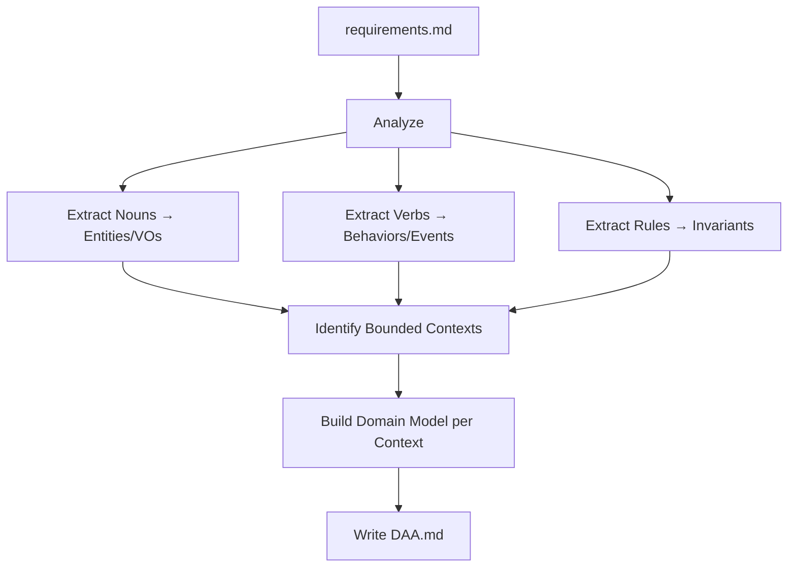

# Domain-Driven Design (DDD) Principles

**Date**: 2026-01-12
**Context**: Primary reference for DAA (Domain Architecture Analysis) generation
**Status**: Active Reference

---

## 1. Purpose

This document synthesizes Domain-Driven Design principles to serve as the **primary reference** for generating DAA documents in the AI-DLC workflow. The DAA is derived from `requirements.md` by applying these DDD concepts.

> [!IMPORTANT]
> **Mandatory Reference**: The Inception phase MUST read this document before generating any DAA.

---

## 2. Core Philosophy

DDD is an approach that:
1. **Centers on the domain** — The business problem is the primary focus
2. **Uses a shared language** — Technical and domain experts speak the same vocabulary
3. **Draws clear boundaries** — Separate contexts prevent ambiguity
4. **Models behavior** — Not just data structures, but what entities *do*

---

## 3. Strategic Patterns (High-Level)

### 3.1 Domain

The overall problem area the software aims to solve.

**Decomposition**:
- **Core Subdomain**: Critical business logic providing competitive advantage
- **Supporting Subdomain**: Necessary but ancillary functionality
- **Generic Subdomain**: Common features not unique to the business

### 3.2 Bounded Context

A clear boundary within the software where a specific domain model and its ubiquitous language are consistent and valid.

**Key Properties**:
- Terms have specific meanings inside the boundary
- Same term may mean different things in different contexts
- Contexts can evolve independently
- Communication between contexts goes through defined interfaces

**Example**:
In an e-commerce system:
- "Order" in Sales context = customer purchase intent
- "Order" in Logistics context = shipment to be dispatched

**How to Identify**:
1. Look for areas where language changes meaning
2. Find natural organizational boundaries
3. Identify areas that could evolve independently
4. Look for distinct teams or responsibility areas

### 3.3 Ubiquitous Language

A shared vocabulary used by all stakeholders within a Bounded Context.

**Rules**:
- Same terms in code, documentation, and conversation
- Defined in a glossary for each context
- Changes to language = changes to the model

### 3.4 Context Map

Visualizes relationships between Bounded Contexts.

**Relationship Types**:

| Relationship | Description |
|--------------|-------------|
| **Shared Kernel** | Two contexts share a common model subset |
| **Customer/Supplier** | One context consumes from another |
| **Upstream/Downstream** | One context provides, another receives |
| **Conformist** | Downstream conforms to upstream's model |
| **Anti-Corruption Layer** | Translation layer to protect from foreign models |
| **Open Host Service** | Published API for multiple consumers |
| **Published Language** | Shared interchange format |

---

## 4. Tactical Patterns (Implementation-Level)

> [!CAUTION]
> These patterns are **technology-agnostic concepts**. In DAA, describe WHAT they are, not HOW to implement them.

### 4.1 Entity

**Definition**: An object with a distinct identity that persists over time, even as attributes change.

**Characteristics**:
- Has a unique identifier (ID)
- Identity is what matters, not attribute values
- Two entities with same attributes but different IDs are different
- Has a lifecycle (created, modified, archived)
- Often mutable
- Contains business logic and invariants

**How to Identify**:
- Ask: "If all attributes changed, would this still be the same thing?"
- If YES → Entity

**Examples**:
- `Customer` (same customer even if name/email changes)
- `Order` (same order as status progresses)
- `Account` (same account across balance changes)

### 4.2 Value Object

**Definition**: An immutable object with no conceptual identity, defined solely by its attribute values.

**Characteristics**:
- No unique identifier
- Defined by the combination of all attributes
- Two value objects with same attributes are equal
- Immutable — changes create new instances
- Often self-validating
- Can contain behavior/methods

**How to Identify**:
- Ask: "Is this thing interchangeable with another identical thing?"
- If YES → Value Object

**Examples**:
- `Money` (amount + currency)
- `Address` (street, city, postal code)
- `DateRange` (start + end dates)
- `Email` (validated email string)
- `Temperature` (value + unit)

### 4.3 Aggregate

**Definition**: A cluster of Entities and Value Objects treated as a single unit for consistency.

**Characteristics**:
- Has an **Aggregate Root** (the entry point Entity)
- External objects can only reference the root
- Root enforces all invariants
- Defines a transactional boundary
- Changes to anything inside go through the root

**The Aggregate Root**:
- Single entry point for all modifications
- Responsible for ensuring consistency
- Controls access to internal objects
- Other entities cannot be referenced directly from outside

**How to Identify**:
- Look for objects that must change together
- Find invariants spanning multiple objects
- Identify what shouldn't exist without its parent

**Examples**:
- `Order` (root) + `OrderItems` (internal)
- `Account` (root) + `Transactions` (internal)
- `Thread` (root) + `Messages` (internal)

### 4.4 Domain Event

**Definition**: A record of something significant that happened in the domain.

**Characteristics**:
- Named in **past tense** (something already occurred)
- Immutable (historical fact)
- Contains relevant data about what happened
- Often includes timestamp
- Enables loose coupling between components
- Can trigger reactions in other contexts

**How to Identify**:
- Ask: "What important things happen that others care about?"
- Look for state transitions
- Find points where other systems react

**Examples**:
- `OrderPlaced`
- `PaymentReceived`
- `UserRegistered`
- `ItemShipped`
- `SubscriptionCancelled`

---

## 5. Applying DDD to Generate DAA

### 5.1 Input: requirements.md

The DAA is derived from analyzing the requirements document.

### 5.2 Process



### 5.3 Extraction Steps

1. **Read requirements.md carefully**
2. **List all nouns** — Candidates for Entities or Value Objects
3. **For each noun, ask**:
   - Does it have identity? → Entity
   - Is it defined by values? → Value Object
4. **List all verbs/actions** — Candidates for behaviors or events
5. **List all rules/constraints** — Domain invariants
6. **Group related concepts** — Identify Bounded Contexts
7. **Define aggregates** — What must change together?
8. **Map relationships** — How do contexts interact?
9. **Build glossary** — Define Ubiquitous Language

### 5.4 Output: DAA.md Structure

Per `templates/uow/DAA.md`:

```markdown
# DAA: [Feature Name]

## Overview
[Derived from problem statement in requirements.md]

## Bounded Contexts

### Context: [Name]
**Purpose**: [Derived from requirements scope]

**Entities**:
- `EntityName`: [Nouns with identity from requirements]

**Value Objects**:
- `ValueName`: [Nouns without identity from requirements]

**Aggregates**:
- `AggregateName`: [Root + associated objects]

**Domain Events**:
- `EventName`: [Actions/transitions from requirements]

## Context Map
[Mermaid diagram showing relationships]

## Ubiquitous Language
[Glossary of domain terms from requirements]

## Domain Rules
[Business invariants from requirements constraints]
```

---

## 6. Common Mistakes to Avoid

| Mistake | Why It's Wrong | Correct Approach |
|---------|----------------|------------------|
| Including technology | DAA is technology-agnostic | No databases, frameworks, libraries |
| Adding implementation code | DAA is conceptual | No Rust/Python/etc. |
| Skipping the template | Inconsistent output | Always use `templates/uow/DAA.md` |
| Using previous DAA as template | May have errors | Use official template |
| Not deriving from requirements | Missing traceability | Every element traces to requirements.md |

---

## 7. References

- Eric Evans, "Domain-Driven Design: Tackling Complexity in the Heart of Software" (2003)
- Vaughn Vernon, "Implementing Domain-Driven Design" (2013)
- Microsoft DDD Guide: https://docs.microsoft.com/en-us/dotnet/architecture/microservices/microservice-ddd-cqrs-patterns/
- DDD Community: https://www.domainlanguage.com/

---

**Usage**: This document is the primary reference for the Inception phase when generating DAA.md from requirements.md.
